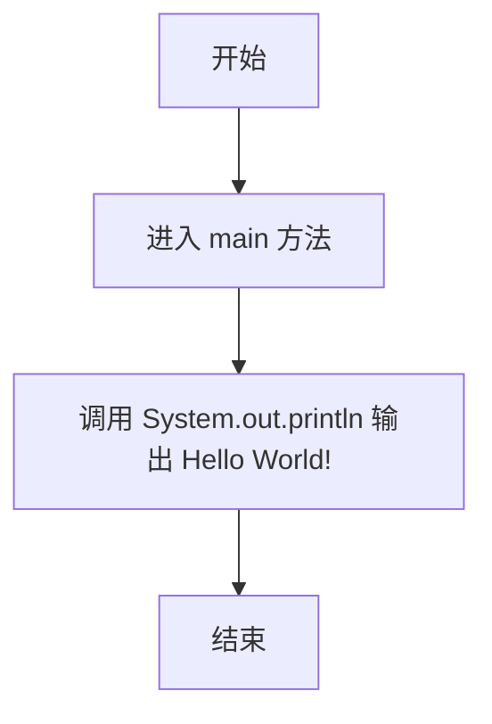
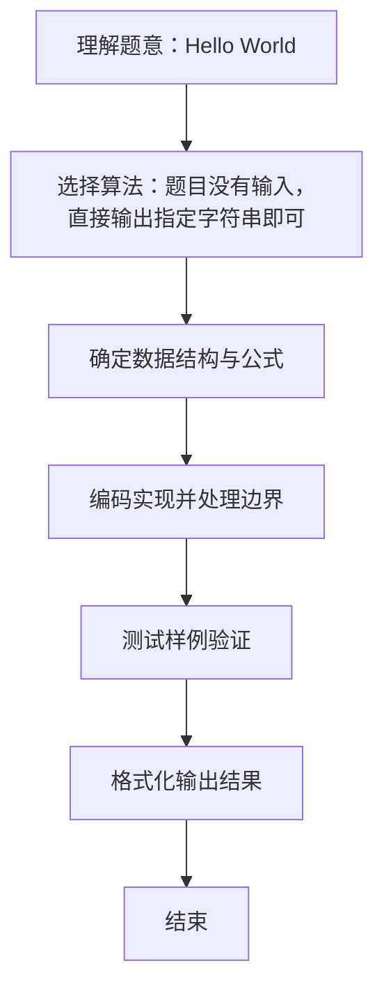

# L1-001 - Hello World（5 分）

- **时间限制**: 400 ms
- **内存限制**: 65536 KB
- **代码长度限制**: 16 KB

---

## 题目描述


这道超级简单的题目没有任何输入。

你只需要在一行中输出著名短句“Hello World!”就可以了。

### 输入样例:
```in
无
```

### 输出样例:
```out
Hello World!
```

## 示例

### 示例 1

**输入:**
```
无
```

**输出:**
```
Hello World!
```

### 解题思路
题目没有输入，直接输出指定字符串即可。 时间复杂度 O(1)，空间复杂度 O(1)。关键实现上，仅需基本变量与标准输入输出，无复杂数据结构。能够满足题目对时间与内存的限制。对于 L1 基础题，该方法以模拟与直接计算为主，逻辑清晰、边界处理简单，易于验证正确性。

### 代码流程说明
1. 启动程序，直接执行固定输出逻辑（无输入）
2. 按题目要求的格式输出最终结果
3. 程序结束，关闭输入流并退出

### 代码实现
```java
/**
 * L1-001 Hello World
 * 实现原理：题目没有输入，直接输出指定字符串即可。
 * 时间复杂度 O(1)，空间复杂度 O(1)。
 */
public class Main {
    public static void main(String[] args) {
        System.out.println("Hello World!");
    }
}
```

### 代码流程图


### 解题流程图

