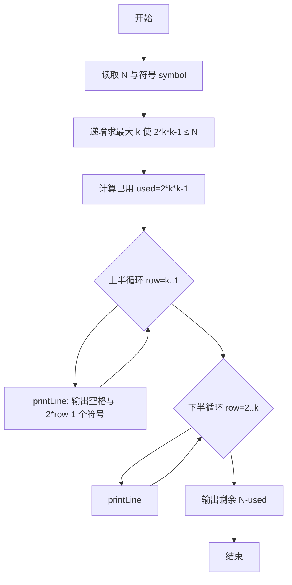
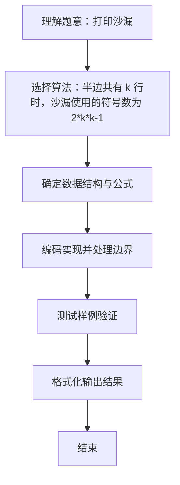

# L1-002 - 打印沙漏（20 分）

- **时间限制**: 400 ms
- **内存限制**: 65536 KB
- **代码长度限制**: 16 KB

---

## 题目描述


本题要求你写个程序把给定的符号打印成沙漏的形状。例如给定17个“*”，要求按下列格式打印
```
*****
 ***
  *
 ***
*****
```

所谓“沙漏形状”，是指每行输出奇数个符号；各行符号中心对齐；相邻两行符号数差2；符号数先从大到小顺序递减到1，再从小到大顺序递增；首尾符号数相等。

给定任意N个符号，不一定能正好组成一个沙漏。要求打印出的沙漏能用掉尽可能多的符号。

### 输入格式:

输入在一行给出1个正整数N（$$\le$$1000）和一个符号，中间以空格分隔。

### 输出格式:

首先打印出由给定符号组成的最大的沙漏形状，最后在一行中输出剩下没用掉的符号数。

### 输入样例:
```in
19 *
```

### 输出样例:
```out
*****
 ***
  *
 ***
*****
2
```

## 示例

### 示例 1

**输入:**
```
19 *
```

**输出:**
```
*****
 ***
  *
 ***
*****
2
```

### 解题思路
半边共有 k 行时，沙漏使用的符号数为 2*k*k-1。 先递增寻找满足该公式的最大 k，再依次输出上半部分和下半部分。 时间复杂度 O(N)，空间复杂度 O(1)。关键实现上，使用 Scanner 进行标准输入解析。能够满足题目对时间与内存的限制。对于 L1 基础题，该方法以模拟与直接计算为主，逻辑清晰、边界处理简单，易于验证正确性。

### 代码流程说明
1. 启动程序，创建 Scanner 读取标准输入
2. 读取输入参数：n, symbol 等，用于后续计算
3. 通过公式 2*k*k-1 递增试探最大半高 k，使 2*k*k-1 ≤ N，计算已用符号数 used
4. 分两段循环打印沙漏：上半部分 row=k..1，下半部分 row=2..k，每行调用 printLine 输出前导空格与符号数 2*row-1
5. 最后输出剩余符号数 N-used
6. 程序结束，关闭输入流并退出

### 代码实现
```java
import java.util.Scanner;

/**
 * L1-002 打印沙漏
 * 实现原理：半边共有 k 行时，沙漏使用的符号数为 2*k*k-1。
 * 先递增寻找满足该公式的最大 k，再依次输出上半部分和下半部分。
 * 时间复杂度 O(N)，空间复杂度 O(1)。
 */
public class Main {
    public static void main(String[] args) {
        Scanner scanner = new Scanner(System.in);
        int n = scanner.nextInt();
        char symbol = scanner.next().charAt(0);

        int k = 1;
        while (2 * (k + 1) * (k + 1) - 1 <= n) {
            k++;
        }
        int used = 2 * k * k - 1;

        // 上半部分（含中间仅有一个符号的行）。
        for (int row = k; row >= 1; row--) {
            printLine(k - row, 2 * row - 1, symbol);
        }
        // 下半部分不重复输出中间行。
        for (int row = 2; row <= k; row++) {
            printLine(k - row, 2 * row - 1, symbol);
        }
        System.out.println(n - used);
    }

    private static void printLine(int spaces, int count, char symbol) {
        for (int i = 0; i < spaces; i++) System.out.print(' ');
        for (int i = 0; i < count; i++) System.out.print(symbol);
        System.out.println();
    }
}
```

### 代码流程图


### 解题流程图

