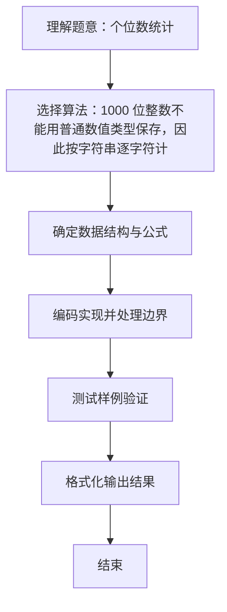

# L1-003 - 个位数统计（15 分）

- **时间限制**: 400 ms
- **内存限制**: 65536 KB
- **代码长度限制**: 16 KB

---

## 题目描述


给定一个 $$k$$ 位整数 $$N = d_{k-1}10^{k-1} + \cdots + d_1 10^1 + d_0$$ ($$0\le d_i \le 9$$, $$i=0,\cdots ,k-1$$, $$d_{k-1}>0$$)，请编写程序统计每种不同的个位数字出现的次数。例如：给定 $$N = 100311$$，则有 2 个 0，3 个 1，和 1 个 3。

### 输入格式:

每个输入包含 1 个测试用例，即一个不超过 1000 位的正整数 $$N$$。

### 输出格式:

对 $$N$$ 中每一种不同的个位数字，以 `D:M` 的格式在一行中输出该位数字 `D` 及其在 $$N$$ 中出现的次数 `M`。要求按 `D` 的升序输出。

### 输入样例:
```in
100311
```

### 输出样例:
```out
0:2
1:3
3:1
```

## 示例

### 示例 1

**输入:**
```
100311
```

**输出:**
```
0:2
1:3
3:1
```

### 解题思路
1000 位整数不能用普通数值类型保存，因此按字符串逐字符计数。 下标 0 到 9 分别记录对应数字出现次数，随后按升序输出非零计数。 时间复杂度 O(k)，空间复杂度 O(1)。关键实现上，使用整型数组按下标计数。能够满足题目对时间与内存的限制。对于 L1 基础题，该方法以模拟与直接计算为主，逻辑清晰、边界处理简单，易于验证正确性。

### 代码流程说明
1. 启动程序，创建 Scanner 读取标准输入
2. 读取输入参数：number 等，用于后续计算
3. 遍历输入数字字符串的每个字符，将其转换为数字下标对 count 数组累加计数
4. 按 0..9 升序遍历 count 数组，仅输出计数大于 0 的数字及其出现次数
5. 程序结束，关闭输入流并退出

### 代码实现
```java
import java.util.Scanner;

/**
 * L1-003 个位数统计
 * 实现原理：1000 位整数不能用普通数值类型保存，因此按字符串逐字符计数。
 * 下标 0 到 9 分别记录对应数字出现次数，随后按升序输出非零计数。
 * 时间复杂度 O(k)，空间复杂度 O(1)。
 */
public class Main {
    public static void main(String[] args) {
        Scanner scanner = new Scanner(System.in);
        String number = scanner.next();
        int[] count = new int[10];
        for (char digit : number.toCharArray()) {
            count[digit - '0']++;
        }
        for (int digit = 0; digit <= 9; digit++) {
            if (count[digit] > 0) {
                System.out.println(digit + ":" + count[digit]);
            }
        }
    }
}
```

### 代码流程图
```mermaid
flowchart TD
    A[开始] --> B[读取字符串 number]
    B --> C[初始化 count[10]=0]
    C --> D{遍历字符 digit in number}
    D --> E[count[digit-'0']++]
    E --> D
    D --> F{digit 0..9}
    F --> G{count>0?}
    G -->|是| H[输出 digit:count]
    G -->|否| F
    H --> F
    F --> I[结束]
```

### 解题流程图

