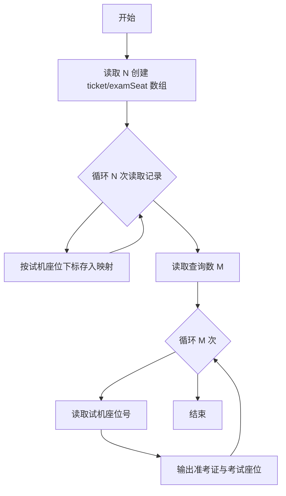
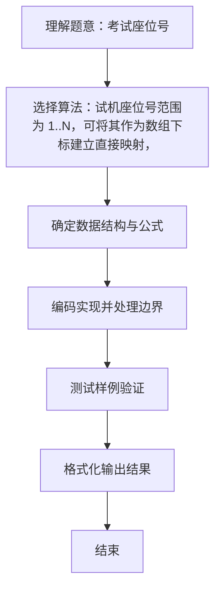

# L1-005 - 考试座位号（15 分）

- **时间限制**: 200 ms
- **内存限制**: 65536 KB
- **代码长度限制**: 16 KB

---

## 题目描述


每个 PAT 考生在参加考试时都会被分配两个座位号，一个是试机座位，一个是考试座位。正常情况下，考生在入场时先得到试机座位号码，入座进入试机状态后，系统会显示该考生的考试座位号码，考试时考生需要换到考试座位就座。但有些考生迟到了，试机已经结束，他们只能拿着领到的试机座位号码求助于你，从后台查出他们的考试座位号码。

### 输入格式:

输入第一行给出一个正整数 $$N$$（$$\le 1000$$），随后 $$N$$ 行，每行给出一个考生的信息：`准考证号 试机座位号 考试座位号`。其中`准考证号`由 16 位数字组成，座位从 1 到 $$N$$ 编号。输入保证每个人的准考证号都不同，并且任何时候都不会把两个人分配到同一个座位上。

考生信息之后，给出一个正整数 $$M$$（$$\le N$$），随后一行中给出 $$M$$ 个待查询的试机座位号码，以空格分隔。

### 输出格式:

对应每个需要查询的试机座位号码，在一行中输出对应考生的准考证号和考试座位号码，中间用 1 个空格分隔。

### 输入样例:
```in
4
3310120150912233 2 4
3310120150912119 4 1
3310120150912126 1 3
3310120150912002 3 2
2
3 4
```

### 输出样例:
```out
3310120150912002 2
3310120150912119 1
```

## 示例

### 示例 1

**输入:**
```
4
3310120150912233 2 4
3310120150912119 4 1
3310120150912126 1 3
3310120150912002 3 2
2
3 4
```

**输出:**
```
3310120150912002 2
3310120150912119 1
```

### 解题思路
试机座位号范围为 1..N，可将其作为数组下标建立直接映射， 查询时 O(1) 取出准考证号与考试座位号。 预处理时间 O(N)，查询时间 O(M)，空间复杂度 O(N)。关键实现上，使用 Scanner 进行标准输入解析。算法层面，时间复杂度 O(N)，预处理时间 O(N)，查询时间 O(M)，空间复杂度 O(N)。能够满足题目对时间与内存的限制。对于 L1 基础题，该方法以模拟与直接计算为主，逻辑清晰、边界处理简单，易于验证正确性。

### 代码流程说明
1. 启动程序，创建 Scanner 读取标准输入
2. 读取输入参数：n, id, testSeat, m 等，用于后续计算
3. 建立以试机座位号为下标的直接映射数组 ticket[] 与 examSeat[]，循环 N 次存入准考证号与考试座位
4. 循环 M 次查询，每次按试机座位号 O(1) 取出对应准考证与考试座位并输出
5. 程序结束，关闭输入流并退出

### 代码实现
```java
import java.util.Scanner;

/**
 * L1-005 考试座位号
 * 实现原理：试机座位号范围为 1..N，可将其作为数组下标建立直接映射，
 * 查询时 O(1) 取出准考证号与考试座位号。
 * 预处理时间 O(N)，查询时间 O(M)，空间复杂度 O(N)。
 */
public class Main {
    public static void main(String[] args) {
        Scanner scanner = new Scanner(System.in);
        int n = scanner.nextInt();
        String[] ticket = new String[n + 1];
        int[] examSeat = new int[n + 1];

        for (int i = 0; i < n; i++) {
            String id = scanner.next();
            int testSeat = scanner.nextInt();
            ticket[testSeat] = id;
            examSeat[testSeat] = scanner.nextInt();
        }

        int m = scanner.nextInt();
        for (int i = 0; i < m; i++) {
            int testSeat = scanner.nextInt();
            System.out.println(ticket[testSeat] + " " + examSeat[testSeat]);
        }
    }
}
```

### 代码流程图


### 解题流程图

