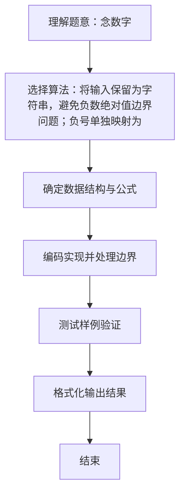

# L1-007 - 念数字（10 分）

- **时间限制**: 400 ms
- **内存限制**: 65536 KB
- **代码长度限制**: 16 KB

---

## 题目描述


输入一个整数，输出每个数字对应的拼音。当整数为负数时，先输出`fu`字。十个数字对应的拼音如下：
```
0: ling
1: yi
2: er
3: san
4: si
5: wu
6: liu
7: qi
8: ba
9: jiu
```

### 输入格式:

输入在一行中给出一个整数，如：`1234`。

<b>提示：整数包括负数、零和正数。</b>

### 输出格式:

在一行中输出这个整数对应的拼音，每个数字的拼音之间用空格分开，行末没有最后的空格。如
`yi er san si`。

### 输入样例:
```in
-600
```

### 输出样例:
```out
fu liu ling ling
```

## 示例

### 示例 1

**输入:**
```
-600
```

**输出:**
```
fu liu ling ling
```

### 解题思路
将输入保留为字符串，避免负数绝对值边界问题；负号单独映射为 fu， 其他字符利用字符与 '0' 的差值查表输出。 时间复杂度 O(k)，空间复杂度 O(1)。关键实现上，使用 StringBuilder 拼接输出提升效率。能够满足题目对时间与内存的限制。对于 L1 基础题，该方法以模拟与直接计算为主，逻辑清晰、边界处理简单，易于验证正确性。

### 代码流程说明
1. 启动程序，创建 Scanner 读取标准输入
2. 将输入保留为字符串遍历，若字符为 '-' 输出 fu，否则用字符减 '0' 查拼音表输出对应拼音
3. 用 StringBuilder 拼接，单词间以空格分隔后一次性输出
4. 程序结束，关闭输入流并退出

### 代码实现
```java
import java.util.Scanner;

/**
 * L1-007 念数字
 * 实现原理：将输入保留为字符串，避免负数绝对值边界问题；负号单独映射为 fu，
 * 其他字符利用字符与 '0' 的差值查表输出。
 * 时间复杂度 O(k)，空间复杂度 O(1)。
 */
public class Main {
    public static void main(String[] args) {
        String[] pinyin = {"ling", "yi", "er", "san", "si", "wu", "liu", "qi", "ba", "jiu"};
        String input = new Scanner(System.in).next();
        StringBuilder output = new StringBuilder();

        for (int i = 0; i < input.length(); i++) {
            String word = input.charAt(i) == '-' ? "fu" : pinyin[input.charAt(i) - '0'];
            if (output.length() > 0) output.append(' ');
            output.append(word);
        }
        System.out.println(output);
    }
}
```

### 代码流程图
```mermaid
flowchart TD
    A[开始] --> B[读取字符串 input]
    B --> C[准备拼音表 pinyin]
    C --> D{遍历每个字符}
    D --> E{是 '-'?}
    E -->|是| F[word=fu]
    E -->|否| G[word=pinyin[c-'0']]
    F --> H[拼接空格与 word]
    G --> H
    H --> D
    D --> I[输出结果]
    I --> J[结束]
```

### 解题流程图

