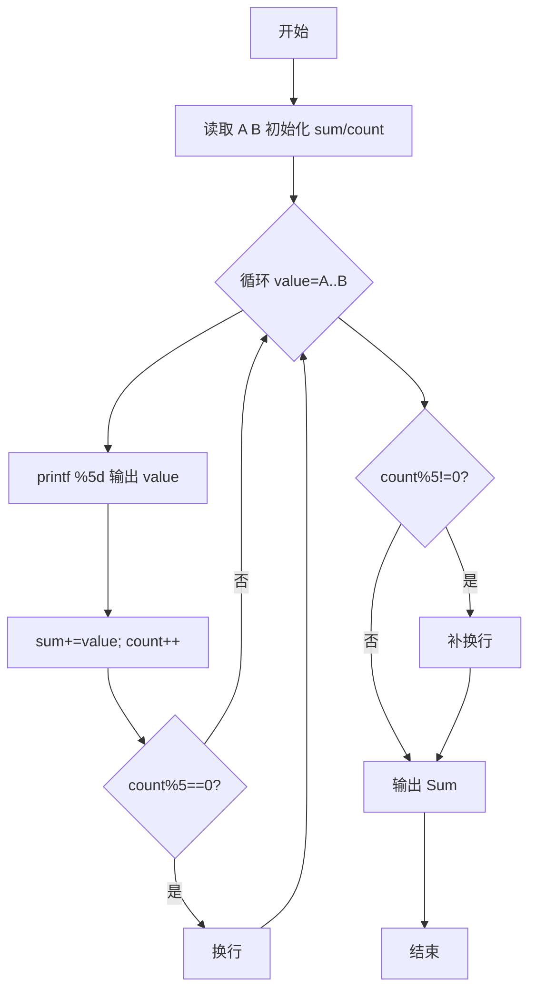
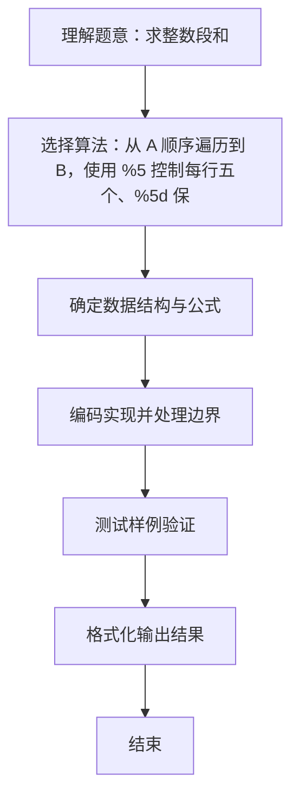

# L1-008 - 求整数段和（10 分）

- **时间限制**: 400 ms
- **内存限制**: 65536 KB
- **代码长度限制**: 16 KB

---

## 题目描述


给定两个整数$$A$$和$$B$$，输出从$$A$$到$$B$$的所有整数以及这些数的和。

### 输入格式:

输入在一行中给出2个整数$$A$$和$$B$$，其中$$-100\le A\le B\le 100$$，其间以空格分隔。

### 输出格式:

首先顺序输出从$$A$$到$$B$$的所有整数，每5个数字占一行，每个数字占5个字符宽度，向右对齐。最后在一行中按`Sum = X`的格式输出全部数字的和`X`。

### 输入样例:
```in
-3 8
```

### 输出样例:
```out
-3   -2   -1    0    1
    2    3    4    5    6
    7    8
Sum = 30
```

## 示例

### 示例 1

**输入:**
```
-3 8
```

**输出:**
```
-3   -2   -1    0    1
    2    3    4    5    6
    7    8
Sum = 30
```

### 解题思路
从 A 顺序遍历到 B，使用 %5 控制每行五个、%5d 保证字段宽度， 同时累加得到总和。 时间复杂度 O(B-A+1)，空间复杂度 O(1)。关键实现上，使用 Scanner 进行标准输入解析。能够满足题目对时间与内存的限制。对于 L1 基础题，该方法以模拟与直接计算为主，逻辑清晰、边界处理简单，易于验证正确性。

### 代码流程说明
1. 启动程序，创建 Scanner 读取标准输入
2. 读取输入参数：a, b 等，用于后续计算
3. 从 A 到 B 顺序遍历每个整数，按 %5d 格式输出并累计总和与计数，计数每达 5 输出换行
4. 遍历结束后若最后一行不满 5 个则补换行，再输出 Sum = 总和
5. 程序结束，关闭输入流并退出

### 代码实现
```java
import java.util.Scanner;

/**
 * L1-008 求整数段和
 * 实现原理：从 A 顺序遍历到 B，使用 %5 控制每行五个、%5d 保证字段宽度，
 * 同时累加得到总和。
 * 时间复杂度 O(B-A+1)，空间复杂度 O(1)。
 */
public class Main {
    public static void main(String[] args) {
        Scanner scanner = new Scanner(System.in);
        int a = scanner.nextInt();
        int b = scanner.nextInt();
        int sum = 0;
        int count = 0;

        for (int value = a; value <= b; value++) {
            System.out.printf("%5d", value);
            sum += value;
            count++;
            if (count % 5 == 0) System.out.println();
        }
        if (count % 5 != 0) System.out.println();
        System.out.println("Sum = " + sum);
    }
}
```

### 代码流程图


### 解题流程图

