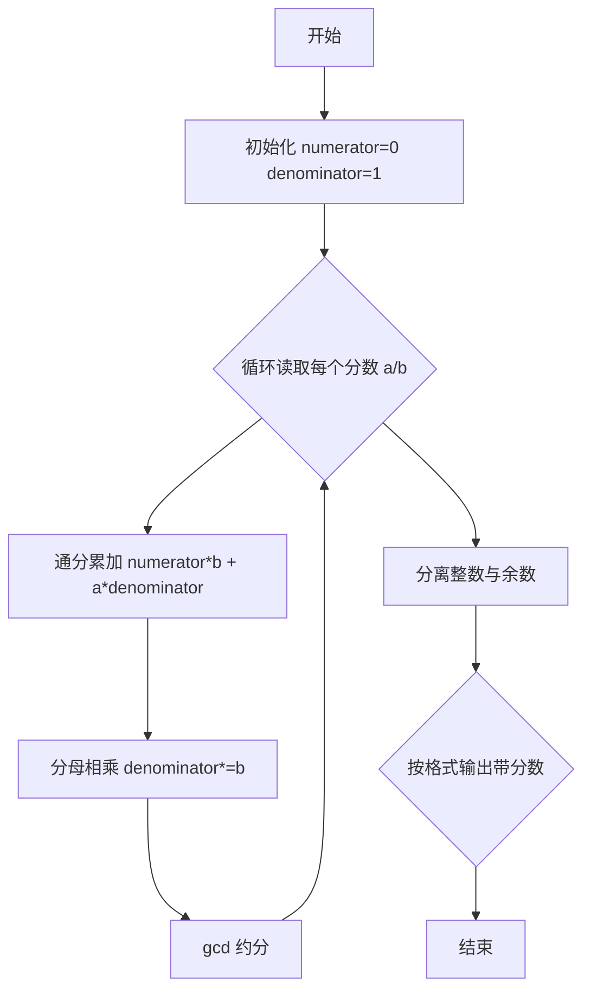
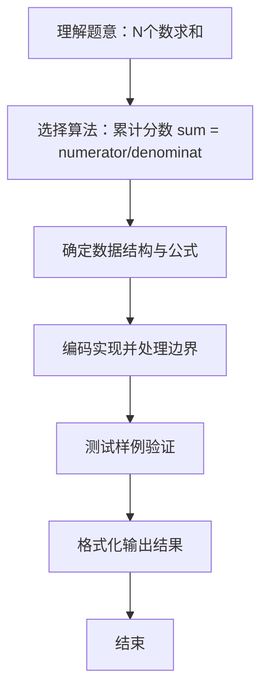

# L1-009 - N个数求和（20 分）

- **时间限制**: 400 ms
- **内存限制**: 65536 KB
- **代码长度限制**: 16 KB

---

## 题目描述


本题的要求很简单，就是求`N`个数字的和。麻烦的是，这些数字是以有理数`分子/分母`的形式给出的，你输出的和也必须是有理数的形式。

### 输入格式:

输入第一行给出一个正整数`N`（$$\le$$100）。随后一行按格式`a1/b1 a2/b2 ...`给出`N`个有理数。题目保证所有分子和分母都在长整型范围内。另外，负数的符号一定出现在分子前面。

### 输出格式:

输出上述数字和的最简形式 —— 即将结果写成`整数部分 分数部分`，其中分数部分写成`分子/分母`，要求分子小于分母，且它们没有公因子。如果结果的整数部分为0，则只输出分数部分。

### 输入样例 1：
```in
5
2/5 4/15 1/30 -2/60 8/3
```

### 输出样例 1：
```out
3 1/3
```

### 输入样例 2：
```in
2
4/3 2/3
```

### 输出样例 2：
```out
2
```

### 输入样例 3：
```in
3
1/3 -1/6 1/8
```

### 输出样例 3：
```out
7/24
```

## 示例

### 示例 1

**输入:**
```
5
2/5 4/15 1/30 -2/60 8/3
```

**输出:**
```
3 1/3
```

### 示例 2

**输入:**
```
2
4/3 2/3
```

**输出:**
```
2
```

### 示例 3

**输入:**
```
3
1/3 -1/6 1/8
```

**输出:**
```
7/24
```

### 解题思路
累计分数 sum = numerator/denominator，读入每个 a/b 后执行 sum = sum + a/b = (numerator*b + a*denominator)/(denominator*b)， 并用 gcd 约分以控制数值增长，使用 BigInteger 避免溢出。最后按题目要求的带分数格式输出： - 若分子为0输出0； - 否则分离整数部分 integer = numerator/denominator 与余数 remainder = |numerator| % denominator； - 若整数部分 !=0，输出整数，余数不为0时再输出 " 余数/分母"（余数恒为正）； - 若整数为0则只输出分数，需保留负号在分子上。 时间复杂度 O(N。

### 代码流程说明
1. 启动程序，创建 Scanner 读取标准输入
2. 读取输入参数：n, fraction 等，用于后续计算
3. 累计分数 sum=numerator/denominator，读入每个 a/b 后执行通分 sum=(num*b + a*den)/ (den*b) 并用 gcd 约分，BigInteger 防止溢出
4. 按带分数规则分离整数部分与余数，处理负号仅在分子上的格式后输出（整数为 0 时只输出分数，余数为 0 时只输出整数）
5. 程序结束，关闭输入流并退出

### 代码实现
```java
import java.math.BigInteger;
import java.util.Scanner;

/**
 * L1-009 N个数求和
 * 实现原理：累计分数 sum = numerator/denominator，读入每个 a/b 后执行 sum = sum + a/b = (numerator*b + a*denominator)/(denominator*b)，
 * 并用 gcd 约分以控制数值增长，使用 BigInteger 避免溢出。最后按题目要求的带分数格式输出：
 *  - 若分子为0输出0；
 *  - 否则分离整数部分 integer = numerator/denominator 与余数 remainder = |numerator| % denominator；
 *  - 若整数部分 !=0，输出整数，余数不为0时再输出 " 余数/分母"（余数恒为正）；
 *  - 若整数为0则只输出分数，需保留负号在分子上。
 * 时间复杂度 O(N * logM)，空间复杂度 O(大整数位数)。
 */
public class Main {
    public static void main(String[] args) {
        Scanner scanner = new Scanner(System.in);
        int n = scanner.nextInt();
        BigInteger numerator = BigInteger.ZERO;
        BigInteger denominator = BigInteger.ONE;

        for (int i = 0; i < n; i++) {
            String[] fraction = scanner.next().split("/");
            BigInteger a = new BigInteger(fraction[0]);
            BigInteger b = new BigInteger(fraction[1]);
            numerator = numerator.multiply(b).add(a.multiply(denominator));
            denominator = denominator.multiply(b);
            BigInteger gcd = numerator.gcd(denominator);
            // BigInteger.gcd 恒返回非负值，numerator 为0时 gcd=denominator
            if (!gcd.equals(BigInteger.ZERO)) {
                numerator = numerator.divide(gcd);
                denominator = denominator.divide(gcd);
            }
        }

        if (numerator.equals(BigInteger.ZERO)) {
            System.out.println(0);
            return;
        }
        BigInteger integer = numerator.divide(denominator);
        BigInteger remainder = numerator.abs().remainder(denominator);
        StringBuilder out = new StringBuilder();
        if (!integer.equals(BigInteger.ZERO)) {
            out.append(integer);
            if (!remainder.equals(BigInteger.ZERO)) {
                out.append(" ").append(remainder).append("/").append(denominator);
            }
        } else {
            if (numerator.signum() < 0) remainder = remainder.negate();
            out.append(remainder).append("/").append(denominator);
        }
        System.out.println(out.toString());
    }
}
```

### 代码流程图


### 解题流程图

