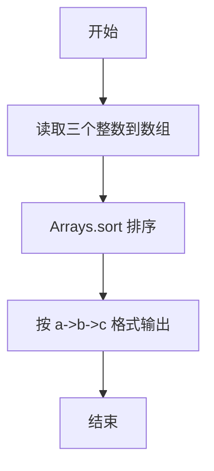
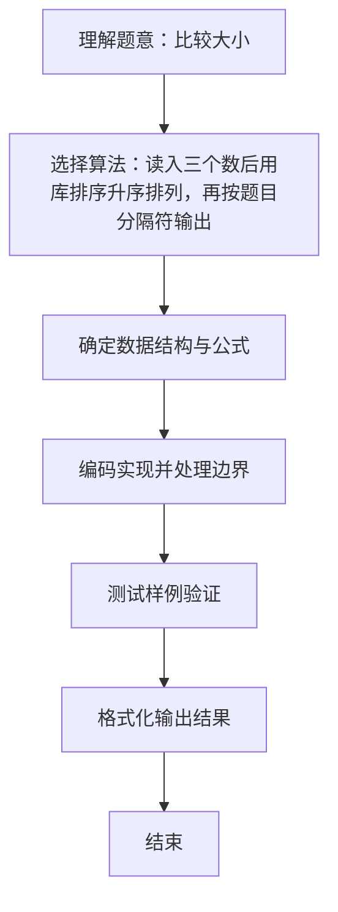

# L1-010 - 比较大小（10 分）

- **时间限制**: 400 ms
- **内存限制**: 65536 KB
- **代码长度限制**: 16 KB

---

## 题目描述


本题要求将输入的任意3个整数从小到大输出。

### 输入格式:

输入在一行中给出3个整数，其间以空格分隔。

### 输出格式:

在一行中将3个整数从小到大输出，其间以“->”相连。

### 输入样例:
```in
4 2 8
```

### 输出样例:
```out
2->4->8
```

## 示例

### 示例 1

**输入:**
```
4 2 8
```

**输出:**
```
2->4->8
```

### 解题思路
读入三个数后用库排序升序排列，再按题目分隔符输出。 时间复杂度 O(1)，空间复杂度 O(1)。关键实现上，使用 Arrays.sort 库函数排序。能够满足题目对时间与内存的限制。对于 L1 基础题，该方法以模拟与直接计算为主，逻辑清晰、边界处理简单，易于验证正确性。

### 代码流程说明
1. 启动程序，创建 Scanner 读取标准输入
2. 读取输入参数
3. 将三个整数存入数组并调用 Arrays.sort 升序排序，按 a->b->c 格式输出
4. 程序结束，关闭输入流并退出

### 代码实现
```java
import java.util.Arrays;
import java.util.Scanner;

/**
 * L1-010 比较大小
 * 实现原理：读入三个数后用库排序升序排列，再按题目分隔符输出。
 * 时间复杂度 O(1)，空间复杂度 O(1)。
 */
public class Main {
    public static void main(String[] args) {
        Scanner scanner = new Scanner(System.in);
        int[] values = {scanner.nextInt(), scanner.nextInt(), scanner.nextInt()};
        Arrays.sort(values);
        System.out.println(values[0] + "->" + values[1] + "->" + values[2]);
    }
}
```

### 代码流程图


### 解题流程图

