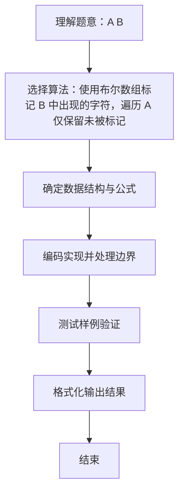

# L1-011 - A-B（20 分）

- **时间限制**: 150 ms
- **内存限制**: 65536 KB
- **代码长度限制**: 16 KB

---

## 题目描述


本题要求你计算$$A-B$$。不过麻烦的是，$$A$$和$$B$$都是字符串 —— 即从字符串$$A$$中把字符串$$B$$所包含的字符全删掉，剩下的字符组成的就是字符串$$A-B$$。

### 输入格式:

输入在2行中先后给出字符串$$A$$和$$B$$。两字符串的长度都不超过$$10^4$$，并且保证每个字符串都是由可见的ASCII码和空白字符组成，最后以换行符结束。

### 输出格式:

在一行中打印出$$A-B$$的结果字符串。

### 输入样例:
```in
I love GPLT!  It's a fun game!
aeiou
```

### 输出样例:
```out
I lv GPLT!  It's  fn gm!
```

## 示例

### 示例 1

**输入:**
```
I love GPLT!  It's a fun game!
aeiou
```

**输出:**
```
I lv GPLT!  It's  fn gm!
```

### 解题思路
使用布尔数组标记 B 中出现的字符，遍历 A 仅保留未被标记的字符。 A、B 可能包含空格，需用 BufferedReader.readLine 保留空白；B 可能为空行或缺失，需做 null 保护。 字符集按 Unicode BMP 处理（65536），兼容可见 ASCII 与空白字符。 时间复杂度 O(|A|+|B|)，空间复杂度 O(C) C=字符集大小。关键实现上，使用布尔数组标记字符出现情况，覆盖 BMP 字符集；使用 BufferedReader 保留空格与整行读取；使用 StringBuilder 拼接输出提升效率。时间复杂度 O(|A|+|B|)，空间复杂度 O(C) C=。

### 代码流程说明
1. 启动程序，创建 BufferedReader 包装 System.in 以支持按行读取（含空格）
2. 按行读取输入数据，必要时做空行与空格补齐处理（如福字图形行末空格截断）或按空格分割字段
3. 读取字符串 A 与 B（用 readLine 保留空格，处理 B 可能为空行的情况），用大小 65536 的布尔数组标记 B 中出现的字符
4. 遍历 A 仅保留未被标记的字符，拼接后输出结果字符串
5. 程序结束，关闭输入流并退出

### 代码实现
```java
import java.io.BufferedReader;
import java.io.IOException;
import java.io.InputStreamReader;

/**
 * L1-011 A-B
 * 实现原理：使用布尔数组标记 B 中出现的字符，遍历 A 仅保留未被标记的字符。
 * A、B 可能包含空格，需用 BufferedReader.readLine 保留空白；B 可能为空行或缺失，需做 null 保护。
 * 字符集按 Unicode BMP 处理（65536），兼容可见 ASCII 与空白字符。
 * 时间复杂度 O(|A|+|B|)，空间复杂度 O(C) C=字符集大小。
 */
public class Main {
    public static void main(String[] args) throws IOException {
        BufferedReader reader = new BufferedReader(new InputStreamReader(System.in));
        String a = reader.readLine();
        String b = reader.readLine();
        if (a == null) a = "";
        if (b == null) b = "";
        // 使用 65536 覆盖所有单 char，避免 128 越界（若 B 含扩展字符）
        boolean[] removed = new boolean[65536];
        for (int i = 0; i < b.length(); i++) {
            removed[b.charAt(i)] = true;
        }
        StringBuilder result = new StringBuilder();
        for (int i = 0; i < a.length(); i++) {
            char c = a.charAt(i);
            if (!removed[c]) result.append(c);
        }
        System.out.println(result.toString());
    }
}
```

### 代码流程图
```mermaid
flowchart TD
    A[开始] --> B[BufferedReader 读取 A/B 行]
    B --> C[处理 null 为空串]
    C --> D[初始化 removed[65536]=false]
    D --> E{遍历 B 字符标记 removed]
    E --> F{遍历 A 字符}
    F --> G{removed[c]?}
    G -->|否| H[追加到 result]
    G -->|是| F
    H --> F
    F --> I[输出 result]
    I --> J[结束]
```

### 解题流程图

