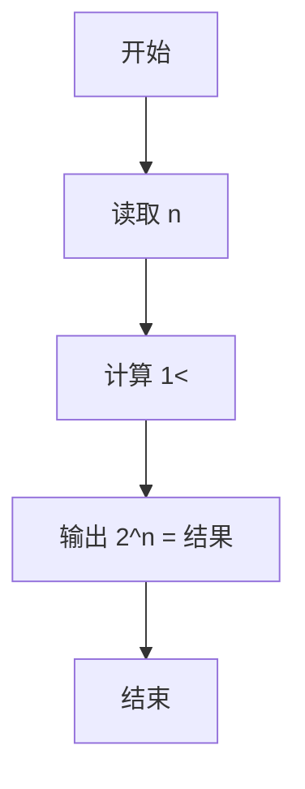
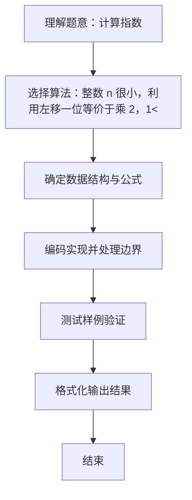

# L1-012 - 计算指数（5 分）

- **时间限制**: 400 ms
- **内存限制**: 65536 KB
- **代码长度限制**: 16 KB

---

## 题目描述


真的没骗你，这道才是简单题 —— 对任意给定的不超过 10 的正整数 $$n$$，要求你输出 $$2^n$$。不难吧？

### 输入格式:

输入在一行中给出一个不超过 10 的正整数 $$n$$。

### 输出格式:

在一行中按照格式  `2^n = 计算结果`  输出 $$2^n$$ 的值。

### 输入样例:
```in
5
```

### 输出样例:
```out
2^5 = 32
```

## 示例

### 示例 1

**输入:**
```
5
```

**输出:**
```
2^5 = 32
```

### 解题思路
整数 n 很小，利用左移一位等价于乘 2，1<<n 即为 2 的 n 次方。 时间复杂度 O(1)，空间复杂度 O(1)。关键实现上，使用 Scanner 进行标准输入解析。能够满足题目对时间与内存的限制。对于 L1 基础题，该方法以模拟与直接计算为主，逻辑清晰、边界处理简单，易于验证正确性。

### 代码流程说明
1. 启动程序，创建 Scanner 读取标准输入
2. 利用位运算 1<<n 计算 2^n（n 很小），按 "2^n = 结果" 格式输出
3. 程序结束，关闭输入流并退出

### 代码实现
```java
import java.util.Scanner;

/**
 * L1-012 计算指数
 * 实现原理：整数 n 很小，利用左移一位等价于乘 2，1<<n 即为 2 的 n 次方。
 * 时间复杂度 O(1)，空间复杂度 O(1)。
 */
public class Main {
    public static void main(String[] args) {
        int n = new Scanner(System.in).nextInt();
        System.out.println("2^" + n + " = " + (1 << n));
    }
}
```

### 代码流程图


### 解题流程图

