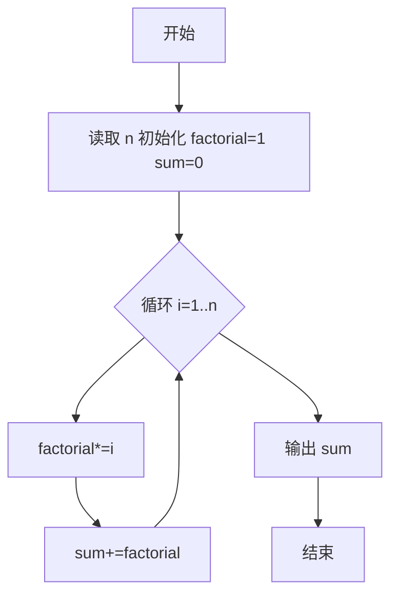
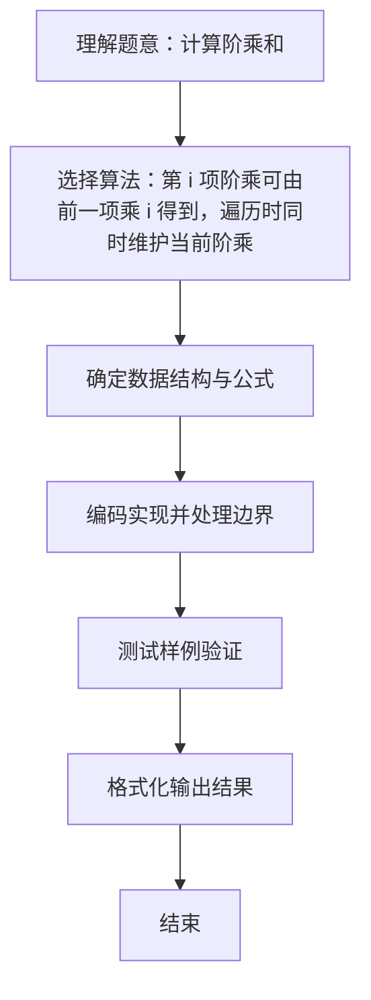

# L1-013 - 计算阶乘和（10 分）

- **时间限制**: 400 ms
- **内存限制**: 65536 KB
- **代码长度限制**: 16 KB

---

## 题目描述


对于给定的正整数$$N$$，需要你计算 $$S = 1! + 2! + 3! + ... + N!$$。

### 输入格式:

输入在一行中给出一个不超过10的正整数$$N$$。

### 输出格式:

在一行中输出$$S$$的值。

### 输入样例:
```in
3
```

### 输出样例:
```out
9
```

## 示例

### 示例 1

**输入:**
```
3
```

**输出:**
```
9
```

### 解题思路
第 i 项阶乘可由前一项乘 i 得到，遍历时同时维护当前阶乘与总和， 无需重复计算每一项阶乘。 时间复杂度 O(N)，空间复杂度 O(1)。关键实现上，使用 Scanner 进行标准输入解析。能够满足题目对时间与内存的限制。对于 L1 基础题，该方法以模拟与直接计算为主，逻辑清晰、边界处理简单，易于验证正确性。

### 代码流程说明
1. 启动程序，创建 Scanner 读取标准输入
2. 维护当前阶乘 factorial 与总和 sum，循环 i=1..N 执行 factorial*=i 并 sum+=factorial
3. 循环结束后输出总和
4. 程序结束，关闭输入流并退出

### 代码实现
```java
import java.util.Scanner;

/**
 * L1-013 计算阶乘和
 * 实现原理：第 i 项阶乘可由前一项乘 i 得到，遍历时同时维护当前阶乘与总和，
 * 无需重复计算每一项阶乘。
 * 时间复杂度 O(N)，空间复杂度 O(1)。
 */
public class Main {
    public static void main(String[] args) {
        int n = new Scanner(System.in).nextInt();
        int factorial = 1;
        int sum = 0;
        for (int i = 1; i <= n; i++) {
            factorial *= i;
            sum += factorial;
        }
        System.out.println(sum);
    }
}
```

### 代码流程图


### 解题流程图

