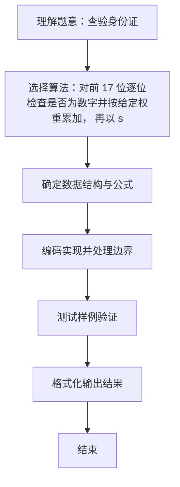

# L1-016 - 查验身份证（15 分）

- **时间限制**: 400 ms
- **内存限制**: 65536 KB
- **代码长度限制**: 16 KB

---

## 题目描述


一个合法的身份证号码由17位地区、日期编号和顺序编号加1位校验码组成。校验码的计算规则如下：

首先对前17位数字加权求和，权重分配为：{7，9，10，5，8，4，2，1，6，3，7，9，10，5，8，4，2}；然后将计算的和对11取模得到值`Z`；最后按照以下关系对应`Z`值与校验码`M`的值：
```
Z：0 1 2 3 4 5 6 7 8 9 10
M：1 0 X 9 8 7 6 5 4 3 2
```
现在给定一些身份证号码，请你验证校验码的有效性，并输出有问题的号码。

### 输入格式:

输入第一行给出正整数$$N$$（$$\le 100$$）是输入的身份证号码的个数。随后$$N$$行，每行给出1个18位身份证号码。

### 输出格式:

按照输入的顺序每行输出1个有问题的身份证号码。这里并不检验前17位是否合理，只检查前17位是否全为数字且最后1位校验码计算准确。如果所有号码都正常，则输出`All passed`。

### 输入样例 1：
```in
4
320124198808240056
12010X198901011234
110108196711301866
37070419881216001X
```

### 输出样例 1：
```out
12010X198901011234
110108196711301866
37070419881216001X
```

### 输入样例 2：
```in
2
320124198808240056
110108196711301862
```

### 输出样例 2：
```out
All passed
```

## 示例

### 示例 1

**输入:**
```
4
320124198808240056
12010X198901011234
110108196711301866
37070419881216001X
```

**输出:**
```
12010X198901011234
110108196711301866
37070419881216001X
```

### 示例 2

**输入:**
```
2
320124198808240056
110108196711301862
```

**输出:**
```
All passed
```

### 解题思路
对前 17 位逐位检查是否为数字并按给定权重累加， 再以 sum%11 在校验码映射表中取出应有的末位进行比较。 时间复杂度 O(N)，空间复杂度 O(1)。关键实现上，使用 Scanner 进行标准输入解析。能够满足题目对时间与内存的限制。对于 L1 基础题，该方法以模拟与直接计算为主，逻辑清晰、边界处理简单，易于验证正确性。

### 代码流程说明
1. 启动程序，创建 Scanner 读取标准输入
2. 读取输入参数：n, id 等，用于后续计算
3. 预定义权重 weight[] 与校验码表 check[]，对每张身份证前 17 位检查是否为数字并累加加权和
4. 若前 17 位含非数字或校验位不等于 check[sum%11] 则判定不合格并输出该号码，全部合格则输出 All passed
5. 程序结束，关闭输入流并退出

### 代码实现
```java
import java.util.Scanner;

/**
 * L1-016 查验身份证
 * 实现原理：对前 17 位逐位检查是否为数字并按给定权重累加，
 * 再以 sum%11 在校验码映射表中取出应有的末位进行比较。
 * 时间复杂度 O(N)，空间复杂度 O(1)。
 */
public class Main {
    public static void main(String[] args) {
        Scanner scanner = new Scanner(System.in);
        int[] weight = {7, 9, 10, 5, 8, 4, 2, 1, 6, 3, 7, 9, 10, 5, 8, 4, 2};
        char[] check = {'1', '0', 'X', '9', '8', '7', '6', '5', '4', '3', '2'};
        int n = scanner.nextInt();
        boolean allValid = true;

        for (int i = 0; i < n; i++) {
            String id = scanner.next();
            int sum = 0;
            boolean valid = true;
            for (int j = 0; j < 17; j++) {
                char c = id.charAt(j);
                if (!Character.isDigit(c)) {
                    valid = false;
                    break;
                }
                sum += (c - '0') * weight[j];
            }
            if (!valid || id.charAt(17) != check[sum % 11]) {
                System.out.println(id);
                allValid = false;
            }
        }
        if (allValid) System.out.println("All passed");
    }
}
```

### 代码流程图
```mermaid
flowchart TD
    A[开始] --> B[读取 N 定义 weight/check]
    B --> C{循环每张身份证}
    C --> D[检查前17位是否数字并累加 sum]
    D --> E{数字合法?}
    E -->|否| F[标记不合格]
    E -->|是| G{check[sum%11]==末位?}
    G -->|否| F
    G -->|是| H[合格跳过]
    F --> I[输出不合格号码]
    H --> C
    C --> J{是否全合格?}
    J -->|是| K[输出 All passed]
    J -->|否| L[结束]
    K --> L
```

### 解题流程图

