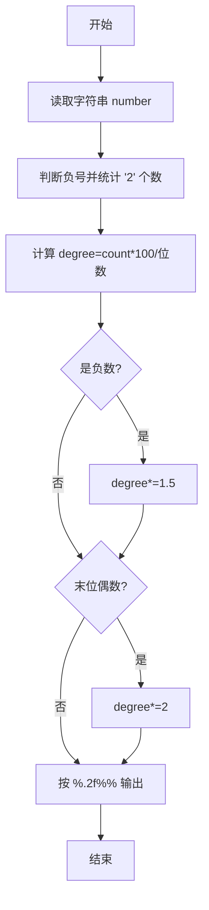
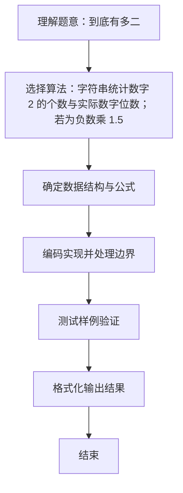

# L1-017 - 到底有多二（15 分）

- **时间限制**: 400 ms
- **内存限制**: 65536 KB
- **代码长度限制**: 16 KB

---

## 题目描述


一个整数“**犯二的程度**”定义为该数字中包含2的个数与其位数的比值。如果这个数是负数，则程度增加0.5倍；如果还是个偶数，则再增加1倍。例如数字`-13142223336`是个11位数，其中有3个2，并且是负数，也是偶数，则它的犯二程度计算为：$$3/11\times 1.5\times 2\times 100\%$$，约为81.82%。本题就请你计算一个给定整数到底有多二。

### 输入格式:

输入第一行给出一个不超过50位的整数`N`。

### 输出格式:

在一行中输出`N`犯二的程度，保留小数点后两位。

### 输入样例:
```in
-13142223336
```

### 输出样例:
```out
81.82%
```

## 示例

### 示例 1

**输入:**
```
-13142223336
```

**输出:**
```
81.82%
```


**鸣谢安阳师范学院段晓云老师和软件工程五班李富龙同学补充测试数据！**
### 解题思路
字符串统计数字 2 的个数与实际数字位数；若为负数乘 1.5， 若末位是偶数再乘 2，最后转换成百分数。 时间复杂度 O(k)，空间复杂度 O(1)。关键实现上，使用 Scanner 进行标准输入解析。能够满足题目对时间与内存的限制。对于 L1 基础题，该方法以模拟与直接计算为主，逻辑清晰、边界处理简单，易于验证正确性。

### 代码流程说明
1. 启动程序，创建 Scanner 读取标准输入
2. 统计字符串中字符 '2' 的个数与有效位数（负号不计入分母），按比例 count*100/位数 得到基础二程度
3. 若为负数乘 1.5，若末位为偶数再乘 2，最后按 %.2f%% 格式输出
4. 程序结束，关闭输入流并退出

### 代码实现
```java
import java.util.Scanner;

/**
 * L1-017 到底有多二
 * 实现原理：字符串统计数字 2 的个数与实际数字位数；若为负数乘 1.5，
 * 若末位是偶数再乘 2，最后转换成百分数。
 * 时间复杂度 O(k)，空间复杂度 O(1)。
 */
public class Main {
    public static void main(String[] args) {
        String number = new Scanner(System.in).next();
        boolean negative = number.charAt(0) == '-';
        int start = negative ? 1 : 0;
        int countTwo = 0;
        for (int i = start; i < number.length(); i++) {
            if (number.charAt(i) == '2') countTwo++;
        }
        double degree = countTwo * 100.0 / (number.length() - start);
        if (negative) degree *= 1.5;
        if ((number.charAt(number.length() - 1) - '0') % 2 == 0) degree *= 2;
        System.out.printf("%.2f%%", degree);
    }
}
```

### 代码流程图


### 解题流程图

