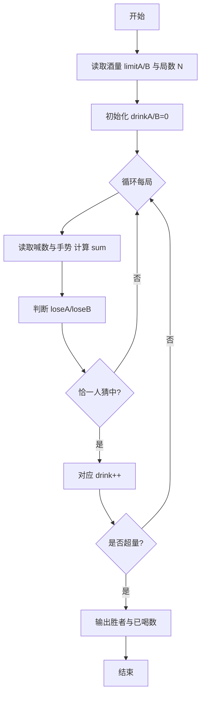
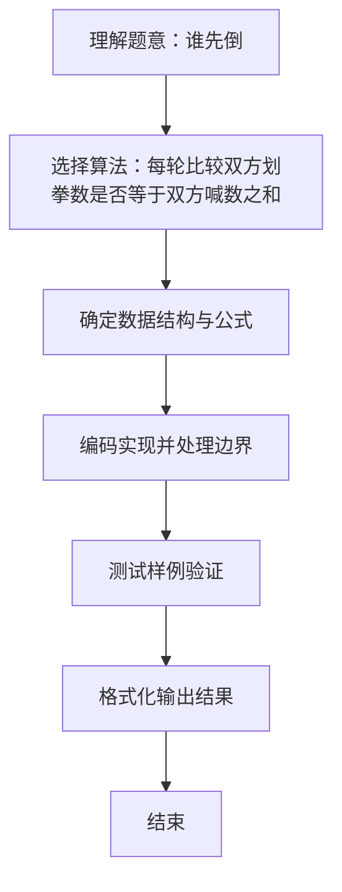

# L1-019 - 谁先倒（15 分）

- **时间限制**: 400 ms
- **内存限制**: 65536 KB
- **代码长度限制**: 16 KB

---

## 题目描述


划拳是古老中国酒文化的一个有趣的组成部分。酒桌上两人划拳的方法为：每人口中喊出一个数字，同时用手比划出一个数字。如果谁比划出的数字正好等于两人喊出的数字之和，谁就输了，输家罚一杯酒。两人同赢或两人同输则继续下一轮，直到唯一的赢家出现。

下面给出甲、乙两人的酒量（最多能喝多少杯不倒）和划拳记录，请你判断两个人谁先倒。

### 输入格式:

输入第一行先后给出甲、乙两人的酒量（不超过100的非负整数），以空格分隔。下一行给出一个正整数`N`（$$\le 100$$），随后`N`行，每行给出一轮划拳的记录，格式为：

```
甲喊 甲划 乙喊 乙划
```

其中`喊`是喊出的数字，`划`是划出的数字，均为不超过100的正整数（两只手一起划）。

### 输出格式:

在第一行中输出先倒下的那个人：`A`代表甲，`B`代表乙。第二行中输出没倒的那个人喝了多少杯。题目保证有一个人倒下。注意程序处理到有人倒下就终止，后面的数据不必处理。

### 输入样例:
```in
1 1
6
8 10 9 12
5 10 5 10
3 8 5 12
12 18 1 13
4 16 12 15
15 1 1 16
```

### 输出样例:
```out
A
1
```

## 示例

### 示例 1

**输入:**
```
1 1
6
8 10 9 12
5 10 5 10
3 8 5 12
12 18 1 13
4 16 12 15
15 1 1 16
```

**输出:**
```
A
1
```

### 解题思路
每轮比较双方划拳数是否等于双方喊数之和。恰有一方命中时， 命中者输一杯；其喝酒数超过酒量时立即输出另一方已喝酒数。 时间复杂度 O(N)，空间复杂度 O(1)。关键实现上，使用 Scanner 进行标准输入解析。能够满足题目对时间与内存的限制。对于 L1 基础题，该方法以模拟与直接计算为主，逻辑清晰、边界处理简单，易于验证正确性。

### 代码流程说明
1. 启动程序，创建 Scanner 读取标准输入
2. 读取输入参数：limitA, limitB, n, callA 等，用于后续计算
3. 记录两人酒量 limitA/B 与已喝 drinkA/B，循环每局读取喊数与手势，计算和 sum，判断是否恰有一方猜中
4. 猜中者喝一杯并检查是否超过酒量，超过则输出对应胜负结果并立即结束
5. 程序结束，关闭输入流并退出

### 代码实现
```java
import java.util.Scanner;

/**
 * L1-019 谁先倒
 * 实现原理：每轮比较双方划拳数是否等于双方喊数之和。恰有一方命中时，
 * 命中者输一杯；其喝酒数超过酒量时立即输出另一方已喝酒数。
 * 时间复杂度 O(N)，空间复杂度 O(1)。
 */
public class Main {
    public static void main(String[] args) {
        Scanner scanner = new Scanner(System.in);
        int limitA = scanner.nextInt();
        int limitB = scanner.nextInt();
        int n = scanner.nextInt();
        int drinkA = 0, drinkB = 0;

        for (int i = 0; i < n; i++) {
            int callA = scanner.nextInt();
            int gestureA = scanner.nextInt();
            int callB = scanner.nextInt();
            int gestureB = scanner.nextInt();
            int sum = callA + callB;
            boolean loseA = gestureA == sum;
            boolean loseB = gestureB == sum;
            if (loseA != loseB) {
                if (loseA) drinkA++;
                else drinkB++;
            }
            if (drinkA > limitA) {
                System.out.println("A\n" + drinkB);
                return;
            }
            if (drinkB > limitB) {
                System.out.println("B\n" + drinkA);
                return;
            }
        }
    }
}
```

### 代码流程图


### 解题流程图

