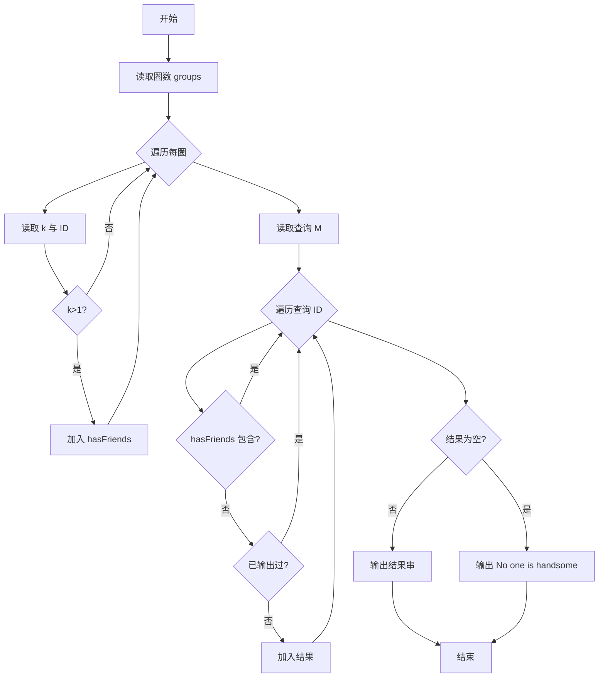
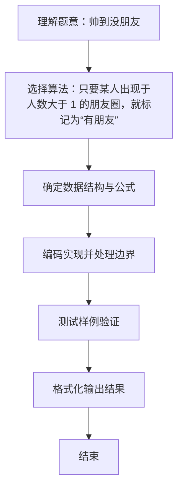

# L1-020 - 帅到没朋友（20 分）

- **时间限制**: 200 ms
- **内存限制**: 65536 KB
- **代码长度限制**: 16 KB

---

## 题目描述


当芸芸众生忙着在朋友圈中发照片的时候，总有一些人因为太帅而没有朋友。本题就要求你找出那些帅到没有朋友的人。

### 输入格式:

输入第一行给出一个正整数`N`（$$\le 100$$），是已知朋友圈的个数；随后`N`行，每行首先给出一个正整数`K`（$$\le 1000$$），为朋友圈中的人数，然后列出一个朋友圈内的所有人——为方便起见，每人对应一个ID号，为5位数字（从00000到99999），ID间以空格分隔；之后给出一个正整数`M`（$$\le 10000$$），为待查询的人数；随后一行中列出`M`个待查询的ID，以空格分隔。

注意：没有朋友的人可以是根本没安装“朋友圈”，也可以是只有自己一个人在朋友圈的人。虽然有个别自恋狂会自己把自己反复加进朋友圈，但题目保证所有`K`超过1的朋友圈里都至少有2个不同的人。

### 输出格式:

按输入的顺序输出那些帅到没朋友的人。ID间用1个空格分隔，行的首尾不得有多余空格。如果没有人太帅，则输出`No one is handsome`。

注意：同一个人可以被查询多次，但只输出一次。

### 输入样例 1：
```in
3
3 11111 22222 55555
2 33333 44444
4 55555 66666 99999 77777
8
55555 44444 10000 88888 22222 11111 23333 88888
```

### 输出样例 1：
```out
10000 88888 23333
```

### 输入样例 2：
```in
3
3 11111 22222 55555
2 33333 44444
4 55555 66666 99999 77777
4
55555 44444 22222 11111
```

### 输出样例 2：
```out
No one is handsome
```

## 示例

### 示例 1

**输入:**
```
3
3 11111 22222 55555
2 33333 44444
4 55555 66666 99999 77777
8
55555 44444 10000 88888 22222 11111 23333 88888
```

**输出:**
```
10000 88888 23333
```

### 示例 2

**输入:**
```
3
3 11111 22222 55555
2 33333 44444
4 55555 66666 99999 77777
4
55555 44444 22222 11111
```

**输出:**
```
No one is handsome
```

### 解题思路
只要某人出现于人数大于 1 的朋友圈，就标记为“有朋友”。 查询时以集合去重，输出尚未标记的 ID，并保持原查询顺序。 时间复杂度 O(朋友圈人数+M)，空间复杂度 O(不同 ID 数)。关键实现上，使用 HashSet 集合去重与快速查找；使用 StringBuilder 拼接输出提升效率。能够满足题目对时间与内存的限制。对于 L1 基础题，该方法以模拟与直接计算为主，逻辑清晰、边界处理简单，易于验证正确性。

### 代码流程说明
1. 启动程序，创建 Scanner 读取标准输入
2. 读取输入参数：groups, k, id, m 等，用于后续计算
3. 遍历朋友圈，若圈人数 k>1 则将圈内所有 ID 加入 hasFriends 集合标记为有朋友
4. 遍历查询列表，对未在 hasFriends 中且未重复输出的 ID 加入结果，保持查询顺序；若结果为空则输出 No one is handsome
5. 程序结束，关闭输入流并退出

### 代码实现
```java
import java.util.HashSet;
import java.util.Scanner;
import java.util.Set;

/**
 * L1-020 帅到没朋友
 * 实现原理：只要某人出现于人数大于 1 的朋友圈，就标记为“有朋友”。
 * 查询时以集合去重，输出尚未标记的 ID，并保持原查询顺序。
 * 时间复杂度 O(朋友圈人数+M)，空间复杂度 O(不同 ID 数)。
 */
public class Main {
    public static void main(String[] args) {
        Scanner scanner = new Scanner(System.in);
        Set<String> hasFriends = new HashSet<>();
        int groups = scanner.nextInt();
        for (int i = 0; i < groups; i++) {
            int k = scanner.nextInt();
            for (int j = 0; j < k; j++) {
                String id = scanner.next();
                if (k > 1) hasFriends.add(id);
            }
        }
        int m = scanner.nextInt();
        Set<String> printed = new HashSet<>();
        StringBuilder answer = new StringBuilder();
        for (int i = 0; i < m; i++) {
            String id = scanner.next();
            if (!hasFriends.contains(id) && printed.add(id)) {
                if (answer.length() > 0) answer.append(' ');
                answer.append(id);
            }
        }
        System.out.println(answer.length() == 0 ? "No one is handsome" : answer);
    }
}
```

### 代码流程图


### 解题流程图

