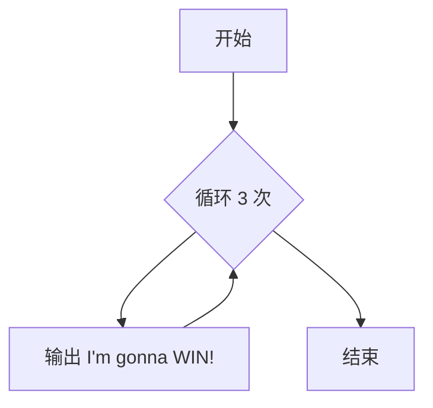
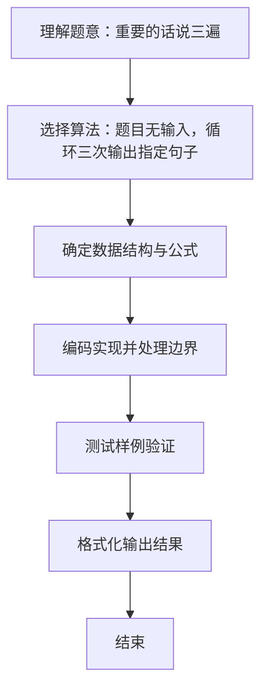

# L1-021 - 重要的话说三遍（5 分）

- **时间限制**: 400 ms
- **内存限制**: 65536 KB
- **代码长度限制**: 16 KB

---

## 题目描述


这道超级简单的题目没有任何输入。

你只需要把这句很重要的话 —— “I'm gonna WIN!”——连续输出三遍就可以了。

注意每遍占一行，除了每行的回车不能有任何多余字符。

### 输入样例:
```in
无
```

### 输出样例:
```out
I'm gonna WIN!
I'm gonna WIN!
I'm gonna WIN!
```

## 示例

### 示例 1

**输入:**
```
无
```

**输出:**
```
I'm gonna WIN!
I'm gonna WIN!
I'm gonna WIN!
```

### 解题思路
题目无输入，循环三次输出指定句子。 时间复杂度 O(1)，空间复杂度 O(1)。关键实现上，仅需基本变量与标准输入输出，无复杂数据结构。能够满足题目对时间与内存的限制。对于 L1 基础题，该方法以模拟与直接计算为主，逻辑清晰、边界处理简单，易于验证正确性。

### 代码流程说明
1. 启动程序，直接执行固定输出逻辑（无输入）
2. 循环 3 次输出固定句子 "I'm gonna WIN!"，每句独占一行
3. 程序结束，关闭输入流并退出

### 代码实现
```java
/**
 * L1-021 重要的话说三遍
 * 实现原理：题目无输入，循环三次输出指定句子。
 * 时间复杂度 O(1)，空间复杂度 O(1)。
 */
public class Main {
    public static void main(String[] args) {
        for (int i = 0; i < 3; i++) System.out.println("I'm gonna WIN!");
    }
}
```

### 代码流程图


### 解题流程图

