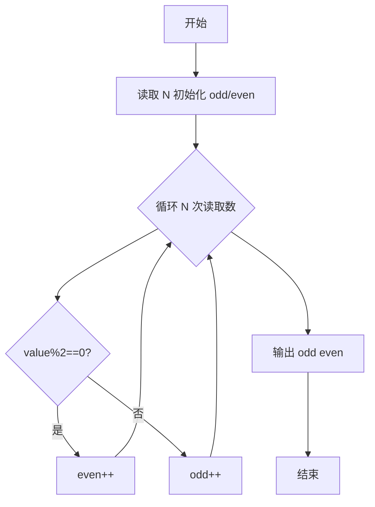
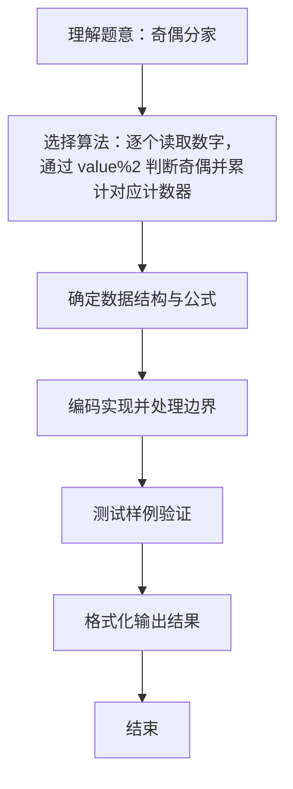

# L1-022 - 奇偶分家（10 分）

- **时间限制**: 400 ms
- **内存限制**: 65536 KB
- **代码长度限制**: 16 KB

---

## 题目描述


给定`N`个正整数，请统计奇数和偶数各有多少个？

### 输入格式:

输入第一行给出一个正整`N`（$$\le 1000$$）；第2行给出`N`个非负整数，以空格分隔。

### 输出格式:

在一行中先后输出奇数的个数、偶数的个数。中间以1个空格分隔。

### 输入样例:
```in
9
88 74 101 26 15 0 34 22 77
```

### 输出样例:
```out
3 6
```

## 示例

### 示例 1

**输入:**
```
9
88 74 101 26 15 0 34 22 77
```

**输出:**
```
3 6
```

### 解题思路
逐个读取数字，通过 value%2 判断奇偶并累计对应计数器。 时间复杂度 O(N)，空间复杂度 O(1)。关键实现上，使用 Scanner 进行标准输入解析。能够满足题目对时间与内存的限制。对于 L1 基础题，该方法以模拟与直接计算为主，逻辑清晰、边界处理简单，易于验证正确性。

### 代码流程说明
1. 启动程序，创建 Scanner 读取标准输入
2. 读取输入参数：n 等，用于后续计算
3. 循环读取 N 个整数，用 %2 判断奇偶分别累计 odd/even 计数器
4. 输出 odd 与 even 的计数值
5. 程序结束，关闭输入流并退出

### 代码实现
```java
import java.util.Scanner;

/**
 * L1-022 奇偶分家
 * 实现原理：逐个读取数字，通过 value%2 判断奇偶并累计对应计数器。
 * 时间复杂度 O(N)，空间复杂度 O(1)。
 */
public class Main {
    public static void main(String[] args) {
        Scanner scanner = new Scanner(System.in);
        int n = scanner.nextInt();
        int odd = 0, even = 0;
        for (int i = 0; i < n; i++) {
            if (scanner.nextInt() % 2 == 0) even++;
            else odd++;
        }
        System.out.println(odd + " " + even);
    }
}
```

### 代码流程图


### 解题流程图

