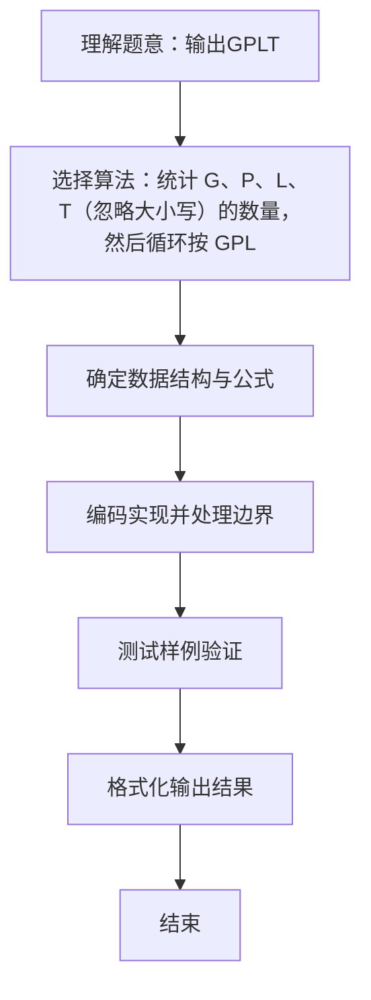

# L1-023 - 输出GPLT（20 分）

- **时间限制**: 150 ms
- **内存限制**: 65536 KB
- **代码长度限制**: 16 KB

---

## 题目描述


给定一个长度不超过10000的、仅由英文字母构成的字符串。请将字符重新调整顺序，按`GPLTGPLT....`这样的顺序输出，并忽略其它字符。当然，四种字符（不区分大小写）的个数不一定是一样多的，若某种字符已经输出完，则余下的字符仍按`GPLT`的顺序打印，直到所有字符都被输出。

### 输入格式:

输入在一行中给出一个长度不超过10000的、仅由英文字母构成的非空字符串。

### 输出格式:

在一行中按题目要求输出排序后的字符串。题目保证输出非空。

### 输入样例:
```in
pcTclnGloRgLrtLhgljkLhGFauPewSKgt
```

### 输出样例:
```out
GPLTGPLTGLTGLGLL
```

## 示例

### 示例 1

**输入:**
```
pcTclnGloRgLrtLhgljkLhGFauPewSKgt
```

**输出:**
```
GPLTGPLTGLTGLGLL
```

### 解题思路
统计 G、P、L、T（忽略大小写）的数量，然后循环按 GPLT 顺序 每轮各输出一个仍有剩余的字符，直到所有计数归零。 时间复杂度 O(n)，空间复杂度 O(1)。关键实现上，使用整型数组按下标计数；使用 StringBuilder 拼接输出提升效率。能够满足题目对时间与内存的限制。对于 L1 基础题，该方法以模拟与直接计算为主，逻辑清晰、边界处理简单，易于验证正确性。

### 代码流程说明
1. 启动程序，创建 Scanner 读取标准输入
2. 统计输入字符串中 G、P、L、T（忽略大小写）的出现次数到 count[4]
3. 循环按 GPLT 顺序每轮各输出一个仍有剩余的字符，直到全部计数归零，拼接后输出
4. 程序结束，关闭输入流并退出

### 代码实现
```java
import java.util.Scanner;

/**
 * L1-023 输出GPLT
 * 实现原理：统计 G、P、L、T（忽略大小写）的数量，然后循环按 GPLT 顺序
 * 每轮各输出一个仍有剩余的字符，直到所有计数归零。
 * 时间复杂度 O(n)，空间复杂度 O(1)。
 */
public class Main {
    public static void main(String[] args) {
        String input = new Scanner(System.in).next().toUpperCase();
        char[] order = {'G', 'P', 'L', 'T'};
        int[] count = new int[4];
        for (char c : input.toCharArray()) {
            for (int i = 0; i < 4; i++) {
                if (c == order[i]) count[i]++;
            }
        }
        StringBuilder answer = new StringBuilder();
        boolean remaining = true;
        while (remaining) {
            remaining = false;
            for (int i = 0; i < 4; i++) {
                if (count[i] > 0) {
                    answer.append(order[i]);
                    count[i]--;
                    remaining = true;
                }
            }
        }
        System.out.println(answer);
    }
}
```

### 代码流程图
```mermaid
flowchart TD
    A[开始] --> B[读取字符串转大写]
    B --> C[统计 G P L T 计数]
    C --> D{仍有剩余?}
    D -->|是| E{按 GPLT 顺序}
    E --> F{count[i]>0?}
    F -->|是| G[追加字符并 count--]
    F -->|否| E
    G --> E
    E --> D
    D -->|否| H[输出结果]
    H --> I[结束]
```

### 解题流程图

