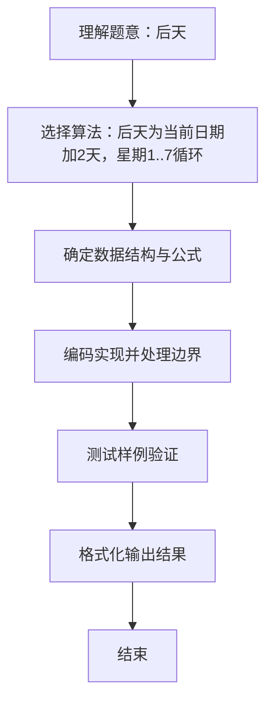

# L1-024 - 后天（5 分）

- **时间限制**: 400 ms
- **内存限制**: 65536 KB
- **代码长度限制**: 16 KB

---

## 题目描述


如果今天是星期三，后天就是星期五；如果今天是星期六，后天就是星期一。我们用数字1到7对应星期一到星期日。给定某一天，请你输出那天的“后天”是星期几。

### 输入格式:

输入第一行给出一个正整数`D`（1 $$\le$$ `D` $$\le$$ 7），代表星期里的某一天。

### 输出格式:

在一行中输出`D`天的后天是星期几。

### 输入样例:
```in
3
```

### 输出样例:
```out
5
```

## 示例

### 示例 1

**输入:**
```
3
```

**输出:**
```
5
```

### 解题思路
后天为当前日期加2天，星期1..7循环。 公式为 ((D-1+2)%7)+1 等价于 (D+1)%7+1，将7进制环绕映射回1..7。 时间复杂度 O(1)，空间复杂度 O(1)。关键实现上，使用 Scanner 进行标准输入解析。能够满足题目对时间与内存的限制。对于 L1 基础题，该方法以模拟与直接计算为主，逻辑清晰、边界处理简单，易于验证正确性。

### 代码流程说明
1. 启动程序，创建 Scanner 读取标准输入
2. 读取输入参数：d 等，用于后续计算
3. 读取星期 D，按公式 (D+1)%7+1 计算后天星期（将 1..7 循环加 2 天）
4. 输出计算结果
5. 程序结束，关闭输入流并退出

### 代码实现
```java
import java.util.Scanner;

/**
 * L1-024 后天
 * 实现原理：后天为当前日期加2天，星期1..7循环。
 * 公式为 ((D-1+2)%7)+1 等价于 (D+1)%7+1，将7进制环绕映射回1..7。
 * 时间复杂度 O(1)，空间复杂度 O(1)。
 */
public class Main {
    public static void main(String[] args) {
        Scanner scanner = new Scanner(System.in);
        int d = scanner.nextInt();
        int ans = (d + 1) % 7 + 1; // D+2 在 1..7 循环
        System.out.println(ans);
    }
}
```

### 代码流程图
```mermaid
flowchart TD
    A[开始] --> B[读取 D]
    B --> C[计算 ans=(D+1)%7+1]
    C --> D[输出 ans]
    D --> E[结束]
```

### 解题流程图

