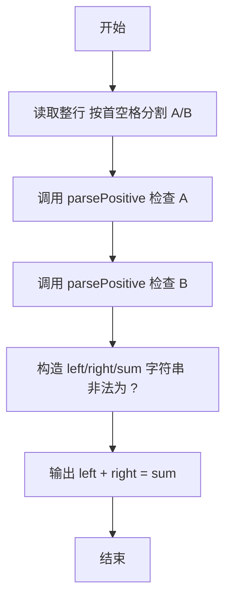
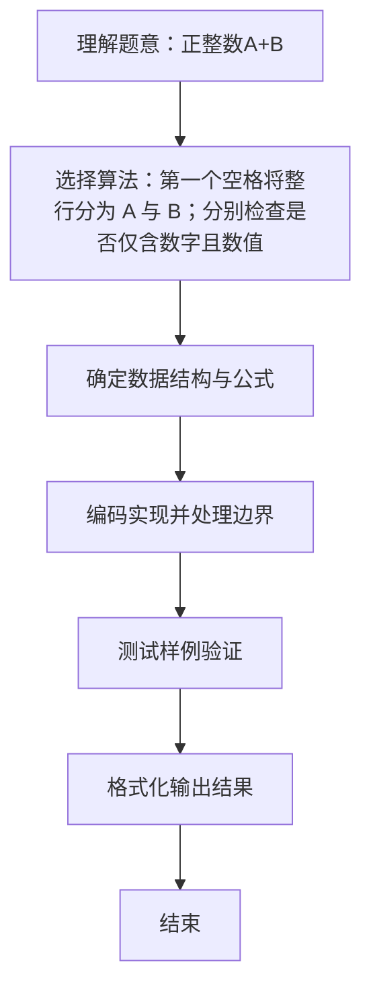

# L1-025 - 正整数A+B（15 分）

- **时间限制**: 400 ms
- **内存限制**: 65536 KB
- **代码长度限制**: 16 KB

---

## 题目描述


题的目标很简单，就是求两个正整数`A`和`B`的和，其中`A`和`B`都在区间[1,1000]。稍微有点麻烦的是，输入并不保证是两个正整数。

### 输入格式:

输入在一行给出`A`和`B`，其间以空格分开。问题是`A`和`B`不一定是满足要求的正整数，有时候可能是超出范围的数字、负数、带小数点的实数、甚至是一堆乱码。

注意：我们把输入中出现的第1个空格认为是`A`和`B`的分隔。题目保证至少存在一个空格，并且`B`不是一个空字符串。

### 输出格式:

如果输入的确是两个正整数，则按格式`A + B = 和`输出。如果某个输入不合要求，则在相应位置输出`?`，显然此时和也是`?`。

### 输入样例 1：
```in
123 456
```

### 输出样例 1：
```out
123 + 456 = 579
```

### 输入样例 2：
```in
22. 18
```

### 输出样例 2：
```out
? + 18 = ?
```

### 输入样例 3：
```in
-100 blabla bla...33
```

### 输出样例 3：
```out
? + ? = ?
```

## 示例

### 示例 1

**输入:**
```
123 456
```

**输出:**
```
123 + 456 = 579
```

### 示例 2

**输入:**
```
22. 18
```

**输出:**
```
? + 18 = ?
```

### 示例 3

**输入:**
```
-100 blabla bla...33
```

**输出:**
```
? + ? = ?
```

### 解题思路
第一个空格将整行分为 A 与 B；分别检查是否仅含数字且数值在 1..1000。 两者合法才计算和，否则把非法位置和结果替换为问号。 时间复杂度 O(|A|+|B|)，空间复杂度 O(1)。关键实现上，使用 BufferedReader 保留空格与整行读取。能够满足题目对时间与内存的限制。对于 L1 基础题，该方法以模拟与直接计算为主，逻辑清晰、边界处理简单，易于验证正确性。

### 代码流程说明
1. 启动程序，创建 BufferedReader 包装 System.in 以支持按行读取（含空格）
2. 按行读取输入数据，必要时做空行与空格补齐处理（如福字图形行末空格截断）或按空格分割字段
3. 按首个空格分割整行得到 A 文本与 B 文本，分别调用检查函数判断是否全为数字且在 1..1000 范围内
4. 根据是否合法构造左、右与和的字符串（非法用 ? 表示），按 "A + B = sum" 格式输出
5. 程序结束，关闭输入流并退出

### 代码实现
```java
import java.io.BufferedReader;
import java.io.IOException;
import java.io.InputStreamReader;

/**
 * L1-025 正整数A+B
 * 实现原理：第一个空格将整行分为 A 与 B；分别检查是否仅含数字且数值在 1..1000。
 * 两者合法才计算和，否则把非法位置和结果替换为问号。
 * 时间复杂度 O(|A|+|B|)，空间复杂度 O(1)。
 */
public class Main {
    public static void main(String[] args) throws IOException {
        String line = new BufferedReader(new InputStreamReader(System.in)).readLine();
        int split = line.indexOf(' ');
        String aText = line.substring(0, split);
        String bText = line.substring(split + 1);
        Integer a = parsePositive(aText);
        Integer b = parsePositive(bText);
        String left = a == null ? "?" : String.valueOf(a);
        String right = b == null ? "?" : String.valueOf(b);
        String sum = a == null || b == null ? "?" : String.valueOf(a + b);
        System.out.println(left + " + " + right + " = " + sum);
    }

    private static Integer parsePositive(String text) {
        if (text.isEmpty()) return null;
        for (int i = 0; i < text.length(); i++) {
            if (!Character.isDigit(text.charAt(i))) return null;
        }
        try {
            int value = Integer.parseInt(text);
            return value >= 1 && value <= 1000 ? value : null;
        } catch (NumberFormatException e) {
            return null;
        }
    }
}
```

### 代码流程图


### 解题流程图

