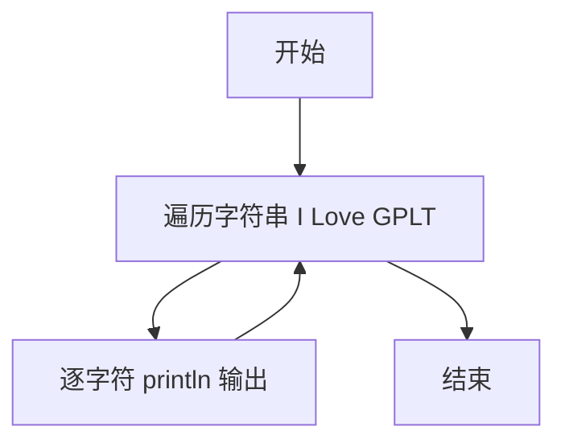
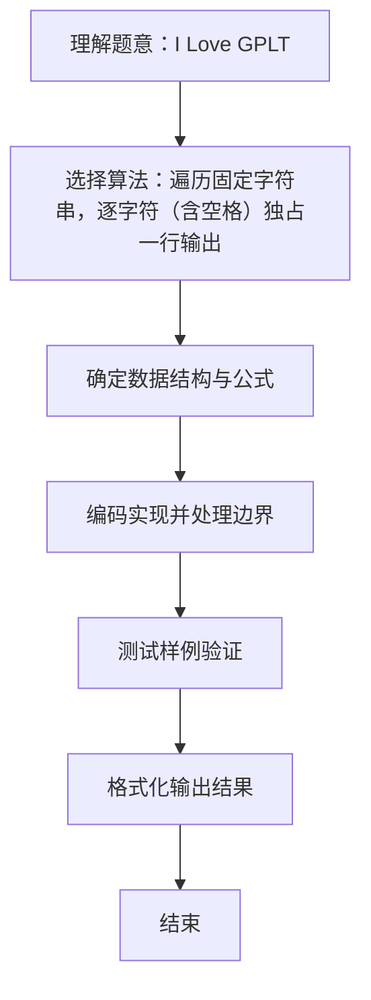

# L1-026 - I Love GPLT（5 分）

- **时间限制**: 400 ms
- **内存限制**: 65536 KB
- **代码长度限制**: 16 KB

---

## 题目描述


这道超级简单的题目没有任何输入。

你只需要把这句很重要的话 —— “I Love GPLT”——竖着输出就可以了。

所谓“竖着输出”，是指每个字符占一行（包括空格），即每行只能有1个字符和回车。

### 输入样例:
```in
无
```

### 输出样例:
```out
I
 
L
o
v
e
 
G
P
L
T
```

## 示例

### 示例 1

**输入:**
```
无
```

**输出:**
```
I
 
L
o
v
e
 
G
P
L
T
```

### 解题思路
遍历固定字符串，逐字符（含空格）独占一行输出。 时间复杂度 O(1)，空间复杂度 O(1)。关键实现上，仅需基本变量与标准输入输出，无复杂数据结构。能够满足题目对时间与内存的限制。对于 L1 基础题，该方法以模拟与直接计算为主，逻辑清晰、边界处理简单，易于验证正确性。

### 代码流程说明
1. 启动程序，直接执行固定输出逻辑（无输入）
2. 进入循环/遍历阶段，对输入集合逐项处理并执行核心算法逻辑（如计数、匹配或计算）
3. 按题目要求的格式输出最终结果
4. 程序结束，关闭输入流并退出

### 代码实现
```java
/**
 * L1-026 I Love GPLT
 * 实现原理：遍历固定字符串，逐字符（含空格）独占一行输出。
 * 时间复杂度 O(1)，空间复杂度 O(1)。
 */
public class Main {
    public static void main(String[] args) {
        String text = "I Love GPLT";
        for (char c : text.toCharArray()) System.out.println(c);
    }
}
```

### 代码流程图


### 解题流程图

