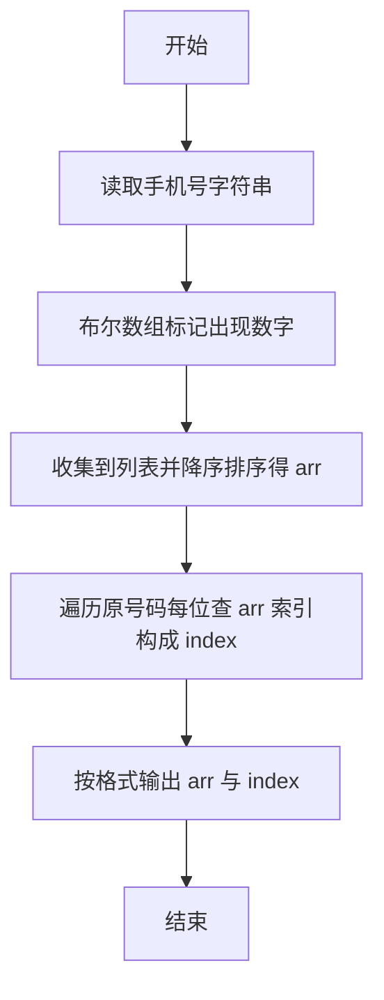
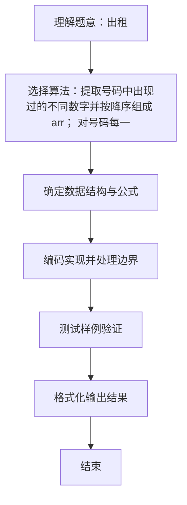

# L1-027 - 出租（20 分）

- **时间限制**: 400 ms
- **内存限制**: 65536 KB
- **代码长度限制**: 16 KB

---

## 题目描述


下面是新浪微博上曾经很火的一张图：


一时间网上一片求救声，急问这个怎么破。其实这段代码很简单，`index`数组就是`arr`数组的下标，`index[0]=2` 对应 `arr[2]=1`，`index[1]=0` 对应 `arr[0]=8`，`index[2]=3` 对应 `arr[3]=0`，以此类推…… 很容易得到电话号码是`18013820100`。

本题要求你编写一个程序，为任何一个电话号码生成这段代码 —— 事实上，只要生成最前面两行就可以了，后面内容是不变的。

### 输入格式:

输入在一行中给出一个由11位数字组成的手机号码。

### 输出格式:

为输入的号码生成代码的前两行，其中`arr`中的数字必须按递减顺序给出。

### 输入样例:
```in
18013820100
```

### 输出样例:
```out
int[] arr = new int[]{8,3,2,1,0};
int[] index = new int[]{3,0,4,3,1,0,2,4,3,4,4};
```

## 示例

### 示例 1

**输入:**
```
18013820100
```

**输出:**
```
int[] arr = new int[]{8,3,2,1,0};
int[] index = new int[]{3,0,4,3,1,0,2,4,3,4,4};
```

### 解题思路
提取号码中出现过的不同数字并按降序组成 arr； 对号码每一位，在 arr 中查找其位置，依序组成 index。 时间复杂度 O(11*10)，空间复杂度 O(1)。关键实现上，使用 StringBuilder 拼接输出提升效率。能够满足题目对时间与内存的限制。对于 L1 基础题，该方法以模拟与直接计算为主，逻辑清晰、边界处理简单，易于验证正确性。

### 代码流程说明
1. 启动程序，创建 Scanner 读取标准输入
2. 用布尔数组标记电话号码中出现过的数字，收集到列表后按降序排序得到 arr
3. 遍历原号码每位数字，在 arr 中查找其索引依次构成 index，最后按格式输出 arr 与 index
4. 程序结束，关闭输入流并退出

### 代码实现
```java
import java.util.ArrayList;
import java.util.Collections;
import java.util.List;
import java.util.Scanner;

/**
 * L1-027 出租
 * 实现原理：提取号码中出现过的不同数字并按降序组成 arr；
 * 对号码每一位，在 arr 中查找其位置，依序组成 index。
 * 时间复杂度 O(11*10)，空间复杂度 O(1)。
 */
public class Main {
    public static void main(String[] args) {
        String phone = new Scanner(System.in).next();
        boolean[] used = new boolean[10];
        for (char c : phone.toCharArray()) used[c - '0'] = true;
        List<Integer> digits = new ArrayList<>();
        for (int i = 0; i <= 9; i++) if (used[i]) digits.add(i);
        digits.sort(Collections.reverseOrder());

        StringBuilder arr = new StringBuilder();
        StringBuilder index = new StringBuilder();
        for (int i = 0; i < digits.size(); i++) {
            if (i > 0) arr.append(',');
            arr.append(digits.get(i));
        }
        for (int i = 0; i < phone.length(); i++) {
            if (i > 0) index.append(',');
            index.append(digits.indexOf(phone.charAt(i) - '0'));
        }
        System.out.println("int[] arr = new int[]{" + arr + "};");
        System.out.println("int[] index = new int[]{" + index + "};");
    }
}
```

### 代码流程图


### 解题流程图

