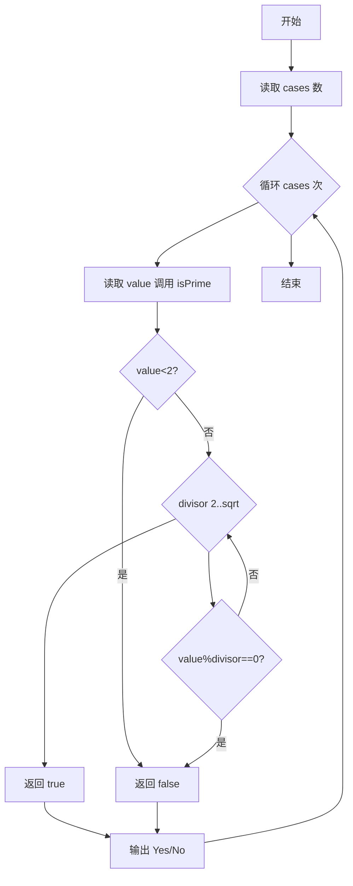

# L1-028 - 判断素数（10 分）

- **时间限制**: 400 ms
- **内存限制**: 65536 KB
- **代码长度限制**: 16 KB

---

## 题目描述


本题的目标很简单，就是判断一个给定的正整数是否素数。

### 输入格式:

输入在第一行给出一个正整数`N`（$$\le$$ 10），随后`N`行，每行给出一个小于$$2^{31}$$的需要判断的正整数。

### 输出格式:

对每个需要判断的正整数，如果它是素数，则在一行中输出`Yes`，否则输出`No`。

### 输入样例:
```in
2
11
111
```

### 输出样例:
```out
Yes
No
```

## 示例

### 示例 1

**输入:**
```
2
11
111
```

**输出:**
```
Yes
No
```

### 解题思路
大于 1 的数只需尝试 2 到 sqrt(n) 的因子；若存在整除因子则非素数。 时间复杂度 O(N*sqrt(M))，空间复杂度 O(1)。关键实现上，使用 Scanner 进行标准输入解析。能够满足题目对时间与内存的限制。对于 L1 基础题，该方法以模拟与直接计算为主，逻辑清晰、边界处理简单，易于验证正确性。

### 代码流程说明
1. 启动程序，创建 Scanner 读取标准输入
2. 读取输入参数：cases 等，用于后续计算
3. 对每个查询数执行 isPrime 判断：小于 2 返回 false，否则试验除数 divisor 从 2 到 sqrt(value) 检查整除
4. 根据结果输出 Yes 或 No
5. 程序结束，关闭输入流并退出

### 代码实现
```java
import java.util.Scanner;

/**
 * L1-028 判断素数
 * 实现原理：大于 1 的数只需尝试 2 到 sqrt(n) 的因子；若存在整除因子则非素数。
 * 时间复杂度 O(N*sqrt(M))，空间复杂度 O(1)。
 */
public class Main {
    public static void main(String[] args) {
        Scanner scanner = new Scanner(System.in);
        int cases = scanner.nextInt();
        while (cases-- > 0) System.out.println(isPrime(scanner.nextLong()) ? "Yes" : "No");
    }

    private static boolean isPrime(long value) {
        if (value < 2) return false;
        for (long divisor = 2; divisor * divisor <= value; divisor++) {
            if (value % divisor == 0) return false;
        }
        return true;
    }
}
```

### 代码流程图


### 解题流程图
```mermaid
flowchart TD
    A[理解题意：判断素数] --> B[选择算法：大于 1 的数只需尝试 2 到 sqrt(n) 的因子；若存]
    B --> C[确定数据结构与公式]
    C --> D[编码实现并处理边界]
    D --> E[测试样例验证]
    E --> F[格式化输出结果]
    F --> Z[结束]
```
