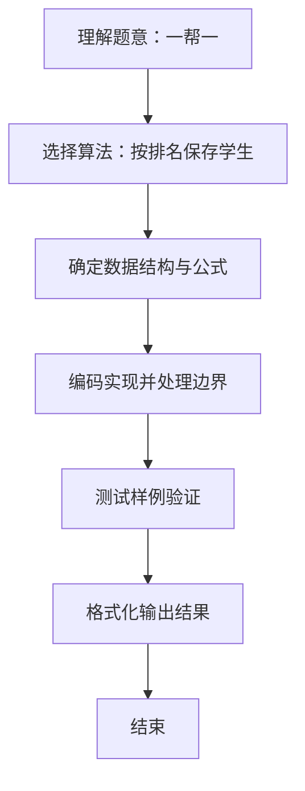

# L1-030 - 一帮一（15 分）

- **时间限制**: 400 ms
- **内存限制**: 65536 KB
- **代码长度限制**: 16 KB

---

## 题目描述


“一帮一学习小组”是中小学中常见的学习组织方式，老师把学习成绩靠前的学生跟学习成绩靠后的学生排在一组。本题就请你编写程序帮助老师自动完成这个分配工作，即在得到全班学生的排名后，在当前尚未分组的学生中，将名次最靠前的学生与名次最靠后的**异性**学生分为一组。

### 输入格式:

输入第一行给出正偶数`N`（$$\le$$50），即全班学生的人数。此后`N`行，按照名次从高到低的顺序给出每个学生的性别（0代表女生，1代表男生）和姓名（不超过8个英文字母的非空字符串），其间以1个空格分隔。这里保证本班男女比例是1:1，并且没有并列名次。

### 输出格式:

每行输出一组两个学生的姓名，其间以1个空格分隔。名次高的学生在前，名次低的学生在后。小组的输出顺序按照前面学生的名次从高到低排列。

### 输入样例:
```in
8
0 Amy
1 Tom
1 Bill
0 Cindy
0 Maya
1 John
1 Jack
0 Linda
```

### 输出样例:
```out
Amy Jack
Tom Linda
Bill Maya
Cindy John
```

## 示例

### 示例 1

**输入:**
```
8
0 Amy
1 Tom
1 Bill
0 Cindy
0 Maya
1 John
1 Jack
0 Linda
```

**输出:**
```
Amy Jack
Tom Linda
Bill Maya
Cindy John
```

### 解题思路
按排名保存学生。依次从前向后选取尚未分组的最高排名学生， 从末尾反向寻找第一位异性且未分组的学生，即当前可选的最低排名异性。 时间复杂度 O(N^2)，空间复杂度 O(N)。关键实现上，使用 Scanner 进行标准输入解析。能够满足题目对时间与内存的限制。对于 L1 基础题，该方法以模拟与直接计算为主，逻辑清晰、边界处理简单，易于验证正确性。

### 代码流程说明
1. 启动程序，创建 Scanner 读取标准输入
2. 读取输入参数：n 等，用于后续计算
3. 保存所有学生的性别与姓名及配对标记，循环从前向后选取未配对的最高排名者，从末尾向前寻找首个异性未配对者
4. 将该对标记为已配对并输出姓名对，直到全部配对完成
5. 程序结束，关闭输入流并退出

### 代码实现
```java
import java.util.Scanner;

/**
 * L1-030 一帮一
 * 实现原理：按排名保存学生。依次从前向后选取尚未分组的最高排名学生，
 * 从末尾反向寻找第一位异性且未分组的学生，即当前可选的最低排名异性。
 * 时间复杂度 O(N^2)，空间复杂度 O(N)。
 */
public class Main {
    public static void main(String[] args) {
        Scanner scanner = new Scanner(System.in);
        int n = scanner.nextInt();
        int[] gender = new int[n];
        String[] name = new String[n];
        boolean[] paired = new boolean[n];
        for (int i = 0; i < n; i++) {
            gender[i] = scanner.nextInt();
            name[i] = scanner.next();
        }
        for (int i = 0; i < n; i++) {
            if (paired[i]) continue;
            for (int j = n - 1; j > i; j--) {
                if (!paired[j] && gender[i] != gender[j]) {
                    paired[i] = paired[j] = true;
                    System.out.println(name[i] + " " + name[j]);
                    break;
                }
            }
        }
    }
}
```

### 代码流程图
```mermaid
flowchart TD
    A[开始] --> B[读取 N 保存性别姓名]
    B --> C{从前向后 i}
    C --> D{paired[i]? 跳过}
    D --> E{从后向前 j 找异性未配对}
    E --> F[标记配对 输出姓名对]
    F --> C
    C --> G[结束]
```

### 解题流程图

