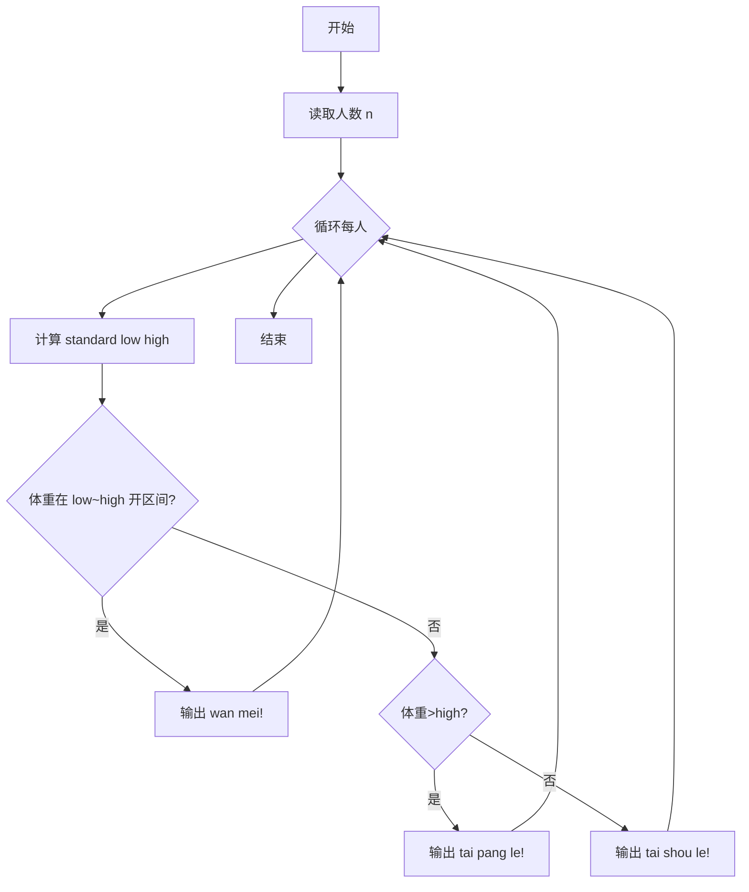

# L1-031 - 到底是不是太胖了（10 分）

- **时间限制**: 400 ms
- **内存限制**: 65536 KB
- **代码长度限制**: 16 KB

---

## 题目描述


据说一个人的标准体重应该是其身高（单位：厘米）减去100、再乘以0.9所得到的公斤数。真实体重与标准体重误差在10%以内都是完美身材（即 | 真实体重 $$-$$ 标准体重 | $$<$$ 标准体重$$\times 10\%$$）。已知 1 公斤等于 2 市斤。现给定一群人的身高和实际体重，请你告诉他们是否太胖或太瘦了。

### 输入格式:

输入第一行给出一个正整数`N`（$$\le$$ 20）。随后`N`行，每行给出两个整数，分别是一个人的身高`H`（120 $$<$$ `H` $$<$$ 200；单位：厘米）和真实体重`W`（50 $$<$$ `W` $$\le$$ 300；单位：市斤），其间以空格分隔。

### 输出格式:

为每个人输出一行结论：如果是完美身材，输出`You are wan mei!`；如果太胖了，输出`You are tai pang le!`；否则输出`You are tai shou le!`。

### 输入样例:
```in
3
169 136
150 81
178 155
```

### 输出样例:
```out
You are wan mei!
You are tai shou le!
You are tai pang le!
```

## 示例

### 示例 1

**输入:**
```
3
169 136
150 81
178 155
```

**输出:**
```
You are wan mei!
You are tai shou le!
You are tai pang le!
```

### 解题思路
标准体重(市斤) = (身高-100)*0.9*2 = (身高-100)*1.8。 完美身材需满足 |W-标准| < 标准*10% ，即 标准*0.9 < W < 标准*1.1， 边界相等时不算完美（严格小于）。因此： W > 1.1*标准 => 太胖 W < 0.9*标准（含等于边界时按题目“误差在10%以内”不含等于，应判太瘦/太胖） 为避免浮点误差，使用 1e-9 容差比较。 时间复杂度 O(N)，空间复杂度 O(1)。关键实现上，使用 Scanner 进行标准输入解析。能够满足题目对时间与内存的限制。对于 L1 基础题，该方法以模拟与直接计算为主，逻辑清晰、边界处。

### 代码流程说明
1. 启动程序，创建 Scanner 读取标准输入
2. 读取输入参数：n, h, w 等，用于后续计算
3. 读取身高 height，按公式 (height-100)*1.8 计算标准体重并按 %.1f 输出
4. 程序结束，关闭输入流并退出

### 代码实现
```java
import java.util.Scanner;

/**
 * L1-031 到底是不是太胖了
 * 实现原理：标准体重(市斤) = (身高-100)*0.9*2 = (身高-100)*1.8。
 * 完美身材需满足 |W-标准| < 标准*10% ，即 标准*0.9 < W < 标准*1.1，
 * 边界相等时不算完美（严格小于）。因此：
 *   W > 1.1*标准 => 太胖
 *   W < 0.9*标准（含等于边界时按题目“误差在10%以内”不含等于，应判太瘦/太胖）
 * 为避免浮点误差，使用 1e-9 容差比较。
 * 时间复杂度 O(N)，空间复杂度 O(1)。
 */
public class Main {
    public static void main(String[] args) {
        Scanner scanner = new Scanner(System.in);
        int n = scanner.nextInt();
        while (n-- > 0) {
            int h = scanner.nextInt();
            int w = scanner.nextInt();
            double standard = (h - 100) * 1.8;
            double low = standard * 0.9;
            double high = standard * 1.1;
            final double EPS = 1e-9;
            // 完美区间为 (low, high) 严格开区间
            if (w > low + EPS && w < high - EPS) {
                System.out.println("You are wan mei!");
            } else if (w <= low + EPS) {
                System.out.println("You are tai shou le!");
            } else {
                System.out.println("You are tai pang le!");
            }
        }
    }
}
```

### 代码流程图


### 解题流程图
```mermaid
flowchart TD
    A[理解题意：到底是不是太胖了] --> B[选择算法：标准体重(市斤) = (身高-100)*0.9*2 = (身]
    B --> C[确定数据结构与公式]
    C --> D[编码实现并处理边界]
    D --> E[测试样例验证]
    E --> F[格式化输出结果]
    F --> Z[结束]
```
