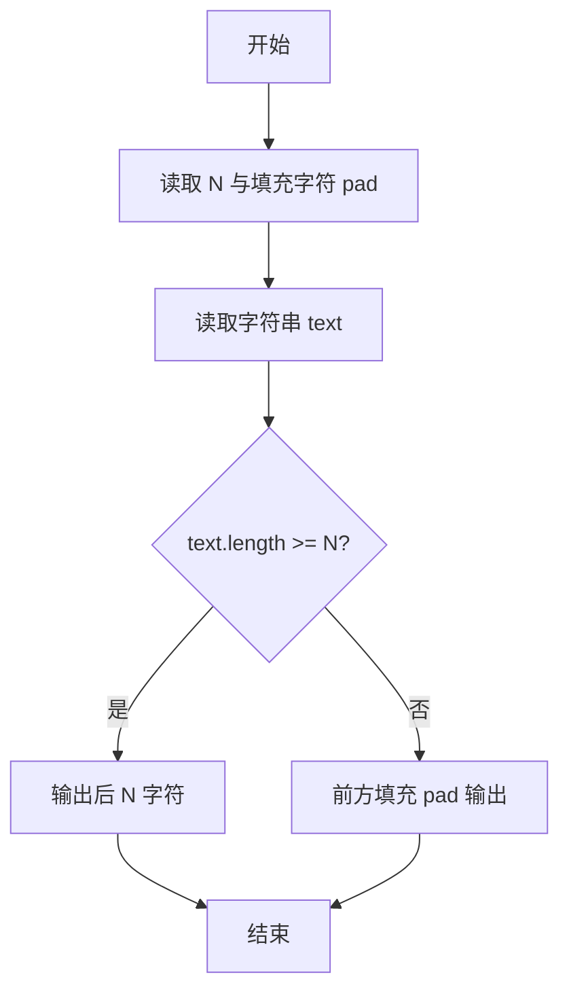
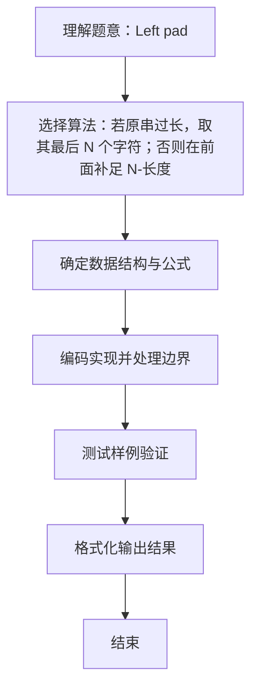

# L1-032 - Left-pad（20 分）

- **时间限制**: 400 ms
- **内存限制**: 65536 KB
- **代码长度限制**: 16 KB

---

## 题目描述


根据新浪微博上的消息，有一位开发者不满NPM（Node Package Manager）的做法，收回了自己的开源代码，其中包括一个叫left-pad的模块，就是这个模块把javascript里面的React/Babel干瘫痪了。这是个什么样的模块？就是在字符串前填充一些东西到一定的长度。例如用`*`去填充字符串`GPLT`，使之长度为10，调用left-pad的结果就应该是`******GPLT`。Node社区曾经对left-pad紧急发布了一个替代，被严重吐槽。下面就请你来实现一下这个模块。

### 输入格式:

输入在第一行给出一个正整数`N`（$$\le 10^4$$）和一个字符，分别是填充结果字符串的长度和用于填充的字符，中间以1个空格分开。第二行给出原始的非空字符串，以回车结束。

### 输出格式:

在一行中输出结果字符串。

### 输入样例 1：
```in
15 _
I love GPLT
```

### 输出样例 1：
```out
____I love GPLT
```

### 输入样例 2：
```in
4 *
this is a sample for cut
```

### 输出样例 2：
```out
cut
```

## 示例

### 示例 1

**输入:**
```
15 _
I love GPLT
```

**输出:**
```
____I love GPLT
```

### 示例 2

**输入:**
```
4 *
this is a sample for cut
```

**输出:**
```
cut
```

### 解题思路
若原串过长，取其最后 N 个字符；否则在前面补足 N-长度 个填充字符。 用 BufferedReader 读取第二行，确保原串内空格被保留。 时间复杂度 O(N)，空间复杂度 O(N)。关键实现上，使用 BufferedReader 保留空格与整行读取。能够满足题目对时间与内存的限制。对于 L1 基础题，该方法以模拟与直接计算为主，逻辑清晰、边界处理简单，易于验证正确性。

### 代码流程说明
1. 启动程序，创建 BufferedReader 包装 System.in 以支持按行读取（含空格）
2. 按行读取输入数据，必要时做空行与空格补齐处理（如福字图形行末空格截断）或按空格分割字段
3. 读取目标长度 N 与填充字符 pad，再读取待处理字符串 text（保留空格）
4. 若 text 长度 ≥N 则截取最后 N 字符输出，否则在前方填充 N-len 个 pad 字符后输出
5. 程序结束，关闭输入流并退出

### 代码实现
```java
import java.io.BufferedReader;
import java.io.IOException;
import java.io.InputStreamReader;
import java.util.StringTokenizer;

/**
 * L1-032 Left-pad
 * 实现原理：若原串过长，取其最后 N 个字符；否则在前面补足 N-长度 个填充字符。
 * 用 BufferedReader 读取第二行，确保原串内空格被保留。
 * 时间复杂度 O(N)，空间复杂度 O(N)。
 */
public class Main {
    public static void main(String[] args) throws IOException {
        BufferedReader reader = new BufferedReader(new InputStreamReader(System.in));
        StringTokenizer tokenizer = new StringTokenizer(reader.readLine());
        int n = Integer.parseInt(tokenizer.nextToken());
        char pad = tokenizer.nextToken().charAt(0);
        String text = reader.readLine();
        if (text.length() >= n) System.out.println(text.substring(text.length() - n));
        else System.out.println(String.valueOf(pad).repeat(n - text.length()) + text);
    }
}
```

### 代码流程图


### 解题流程图

