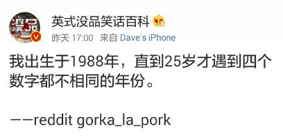
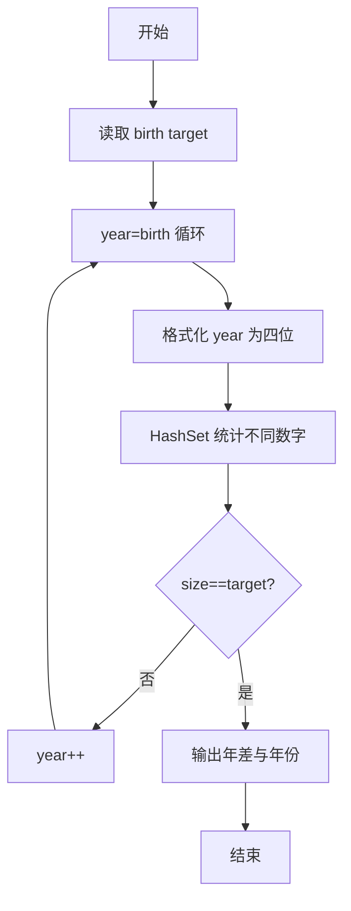
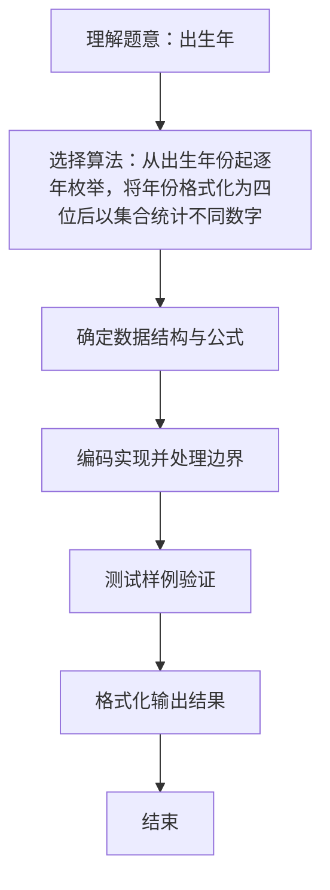

# L1-033 - 出生年（15 分）

- **时间限制**: 400 ms
- **内存限制**: 65536 KB
- **代码长度限制**: 16 KB

---

## 题目描述




以上是新浪微博中一奇葩贴：“我出生于1988年，直到25岁才遇到4个数字都不相同的年份。”也就是说，直到2013年才达到“4个数字都不相同”的要求。本题请你根据要求，自动填充“我出生于`y`年，直到`x`岁才遇到`n`个数字都不相同的年份”这句话。

### 输入格式:

输入在一行中给出出生年份`y`和目标年份中不同数字的个数`n`，其中`y`在[1, 3000]之间，`n`可以是2、或3、或4。注意不足4位的年份要在前面补零，例如公元1年被认为是0001年，有2个不同的数字0和1。

### 输出格式:

根据输入，输出`x`和能达到要求的年份。数字间以1个空格分隔，行首尾不得有多余空格。年份要按4位输出。注意：所谓“`n`个数字都不相同”是指不同的数字正好是`n`个。如“2013”被视为满足“4位数字都不同”的条件，但不被视为满足2位或3位数字不同的条件。

### 输入样例 1：
```in
1988 4
```

### 输出样例 1：
```out
25 2013
```

### 输入样例 2：
```in
1 2
```

### 输出样例 2：
```out
0 0001
```

## 示例

### 示例 1

**输入:**
```
1988 4
```

**输出:**
```
25 2013
```

### 示例 2

**输入:**
```
1 2
```

**输出:**
```
0 0001
```

### 解题思路
从出生年份起逐年枚举，将年份格式化为四位后以集合统计不同数字数， 首次恰好等于目标值时输出年龄差和该年份。 时间复杂度 O(答案年份-出生年份)，空间复杂度 O(1)。关键实现上，使用 HashSet 集合去重与快速查找。能够满足题目对时间与内存的限制。对于 L1 基础题，该方法以模拟与直接计算为主，逻辑清晰、边界处理简单，易于验证正确性。

### 代码流程说明
1. 启动程序，创建 Scanner 读取标准输入
2. 读取输入参数：birth, target 等，用于后续计算
3. 从出生年 birth 开始逐年递增，将年份按 %04d 格式化为四位字符串后用 HashSet 统计不同数字个数
4. 首次满足不同数字数等于 target 时输出年差与该年份并结束
5. 程序结束，关闭输入流并退出

### 代码实现
```java
import java.util.HashSet;
import java.util.Scanner;
import java.util.Set;

/**
 * L1-033 出生年
 * 实现原理：从出生年份起逐年枚举，将年份格式化为四位后以集合统计不同数字数，
 * 首次恰好等于目标值时输出年龄差和该年份。
 * 时间复杂度 O(答案年份-出生年份)，空间复杂度 O(1)。
 */
public class Main {
    public static void main(String[] args) {
        Scanner scanner = new Scanner(System.in);
        int birth = scanner.nextInt();
        int target = scanner.nextInt();
        for (int year = birth; ; year++) {
            String text = String.format("%04d", year);
            Set<Character> digits = new HashSet<>();
            for (char c : text.toCharArray()) digits.add(c);
            if (digits.size() == target) {
                System.out.printf("%d %s", year - birth, text);
                return;
            }
        }
    }
}
```

### 代码流程图


### 解题流程图

