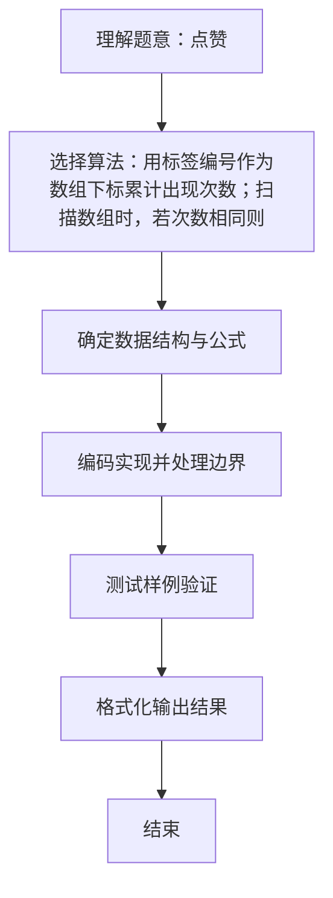

# L1-034 - 点赞（20 分）

- **时间限制**: 200 ms
- **内存限制**: 65536 KB
- **代码长度限制**: 16 KB

---

## 题目描述


微博上有个“点赞”功能，你可以为你喜欢的博文点个赞表示支持。每篇博文都有一些刻画其特性的标签，而你点赞的博文的类型，也间接刻画了你的特性。本题就要求你写个程序，通过统计一个人点赞的纪录，分析这个人的特性。

### 输入格式:

输入在第一行给出一个正整数$$N$$（$$\le 1000$$），是该用户点赞的博文数量。随后$$N$$行，每行给出一篇被其点赞的博文的特性描述，格式为“$$K$$ $$F_1\cdots F_K$$”，其中$$1\le K\le 10$$，$$F_i$$（$$i=1, \cdots , K$$）是特性标签的编号，我们将所有特性标签从1到1000编号。数字间以空格分隔。

### 输出格式:

统计所有被点赞的博文中最常出现的那个特性标签，在一行中输出它的编号和出现次数，数字间隔1个空格。如果有并列，则输出编号最大的那个。

### 输入样例:
```in
4
3 889 233 2
5 100 3 233 2 73
4 3 73 889 2
2 233 123
```

### 输出样例:
```out
233 3
```

## 示例

### 示例 1

**输入:**
```
4
3 889 233 2
5 100 3 233 2 73
4 3 73 889 2
2 233 123
```

**输出:**
```
233 3
```

### 解题思路
用标签编号作为数组下标累计出现次数；扫描数组时，若次数相同则用较大 编号覆盖答案，即可满足并列时选择最大编号的规则。 时间复杂度 O(总标签数)，空间复杂度 O(1)。关键实现上，使用整型数组按下标计数。能够满足题目对时间与内存的限制。对于 L1 基础题，该方法以模拟与直接计算为主，逻辑清晰、边界处理简单，易于验证正确性。

### 代码流程说明
1. 启动程序，创建 Scanner 读取标准输入
2. 读取输入参数：n, k 等，用于后续计算
3. 用大小 1001 的数组 count 按标签编号累计出现次数，遍历所有用户的标签列表累加
4. 扫描 count 数组，取最大计数对应的标签（计数相等时较大编号覆盖），输出标签与计数
5. 程序结束，关闭输入流并退出

### 代码实现
```java
import java.util.Scanner;

/**
 * L1-034 点赞
 * 实现原理：用标签编号作为数组下标累计出现次数；扫描数组时，若次数相同则用较大
 * 编号覆盖答案，即可满足并列时选择最大编号的规则。
 * 时间复杂度 O(总标签数)，空间复杂度 O(1)。
 */
public class Main {
    public static void main(String[] args) {
        Scanner scanner = new Scanner(System.in);
        int[] count = new int[1001];
        int n = scanner.nextInt();
        while (n-- > 0) {
            int k = scanner.nextInt();
            while (k-- > 0) count[scanner.nextInt()]++;
        }
        int bestTag = 0;
        for (int tag = 1; tag <= 1000; tag++) {
            if (count[tag] >= count[bestTag]) bestTag = tag;
        }
        System.out.println(bestTag + " " + count[bestTag]);
    }
}
```

### 代码流程图
```mermaid
flowchart TD
    A[开始] --> B[初始化 count[1001]]
    B --> C[读取 N 循环读取标签累加]
    C --> D[bestTag=0 扫描 1..1000]
    D --> E{count[tag]>=count[best]?}
    E -->|是| F[更新 best]
    E -->|否| D
    F --> D
    D --> G[输出 best 与计数]
    G --> H[结束]
```

### 解题流程图

