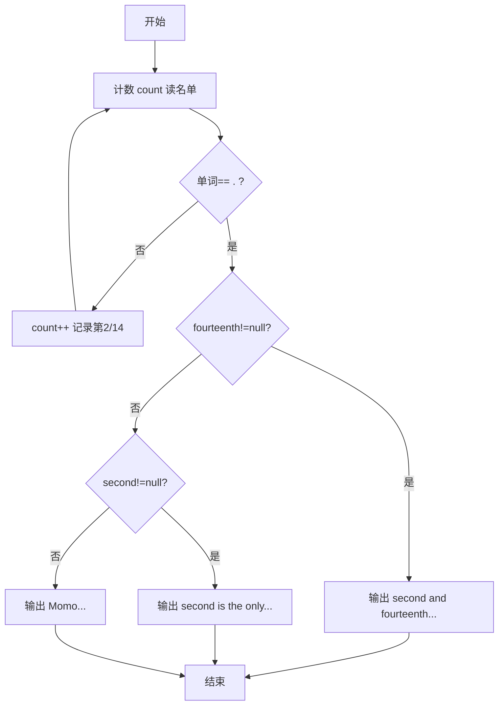
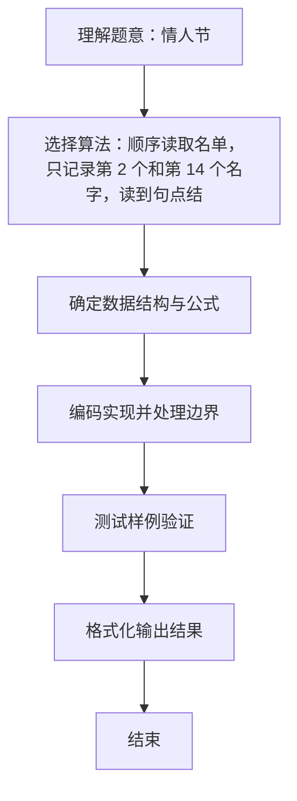

# L1-035 - 情人节（15 分）

- **时间限制**: 400 ms
- **内存限制**: 65536 KB
- **代码长度限制**: 16 KB

---

## 题目描述


以上是朋友圈中一奇葩贴：“2月14情人节了，我决定造福大家。第2个赞和第14个赞的，我介绍你俩认识…………咱三吃饭…你俩请…”。现给出此贴下点赞的朋友名单，请你找出那两位要请客的倒霉蛋。

### 输入格式:

输入按照点赞的先后顺序给出不知道多少个点赞的人名，每个人名占一行，为不超过10个英文字母的非空单词，以回车结束。一个英文句点`.`标志输入的结束，这个符号不算在点赞名单里。

### 输出格式:

根据点赞情况在一行中输出结论：若存在第2个人A和第14个人B，则输出“A and B are inviting you to dinner...”；若只有A没有B，则输出“A is the only one for you...”；若连A都没有，则输出“Momo... No one is for you ...”。

### 输入样例 1：
```in
GaoXZh
Magi
Einst
Quark
LaoLao
FatMouse
ZhaShen
fantacy
latesum
SenSen
QuanQuan
whatever
whenever
Potaty
hahaha
.
```

### 输出样例 1：
```out
Magi and Potaty are inviting you to dinner...
```

### 输入样例 2：
```in
LaoLao
FatMouse
whoever
.
```

### 输出样例 2：
```out
FatMouse is the only one for you...
```

### 输入样例 3：
```in
LaoLao
.
```

### 输出样例 3：
```out
Momo... No one is for you ...
```

## 示例

### 示例 1

**输入:**
```
GaoXZh
Magi
Einst
Quark
LaoLao
FatMouse
ZhaShen
fantacy
latesum
SenSen
QuanQuan
whatever
whenever
Potaty
hahaha
.
```

**输出:**
```
Magi and Potaty are inviting you to dinner...
```

### 示例 2

**输入:**
```
LaoLao
FatMouse
whoever
.
```

**输出:**
```
FatMouse is the only one for you...
```

### 示例 3

**输入:**
```
LaoLao
.
```

**输出:**
```
Momo... No one is for you ...
```

### 解题思路
顺序读取名单，只记录第 2 个和第 14 个名字，读到句点结束后按记录情况 输出对应文案。 时间复杂度 O(N)，空间复杂度 O(1)。关键实现上，使用 Scanner 进行标准输入解析。能够满足题目对时间与内存的限制。对于 L1 基础题，该方法以模拟与直接计算为主，逻辑清晰、边界处理简单，易于验证正确性。

### 代码流程说明
1. 启动程序，创建 Scanner 读取标准输入
2. 读取输入参数：name 等，用于后续计算
3. 顺序读取名单单词计数，记录第 2 与第 14 个名字，遇 "." 结束
4. 按是否记录到第 14/第 2 个名字分三种文案输出
5. 程序结束，关闭输入流并退出

### 代码实现
```java
import java.util.Scanner;

/**
 * L1-035 情人节
 * 实现原理：顺序读取名单，只记录第 2 个和第 14 个名字，读到句点结束后按记录情况
 * 输出对应文案。
 * 时间复杂度 O(N)，空间复杂度 O(1)。
 */
public class Main {
    public static void main(String[] args) {
        Scanner scanner = new Scanner(System.in);
        String second = null, fourteenth = null;
        int count = 0;
        while (scanner.hasNext()) {
            String name = scanner.next();
            if (name.equals(".")) break;
            count++;
            if (count == 2) second = name;
            if (count == 14) fourteenth = name;
        }
        if (fourteenth != null) System.out.println(second + " and " + fourteenth + " are inviting you to dinner...");
        else if (second != null) System.out.println(second + " is the only one for you...");
        else System.out.println("Momo... No one is for you ...");
    }
}
```

### 代码流程图


### 解题流程图

