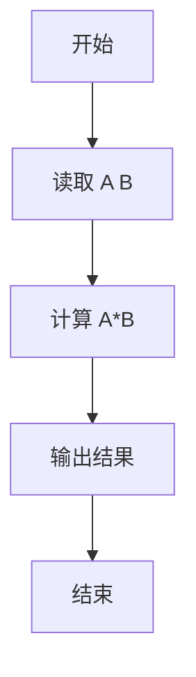
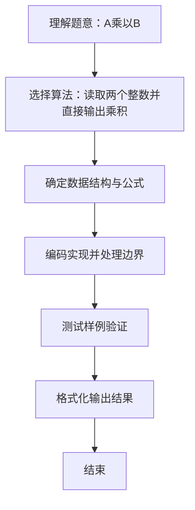

# L1-036 - A乘以B（5 分）

- **时间限制**: 400 ms
- **内存限制**: 65536 KB
- **代码长度限制**: 16 KB

---

## 题目描述


看我没骗你吧 —— 这是一道你可以在 10 秒内完成的题：给定两个绝对值不超过 100 的整数 $$A$$ 和 $$B$$，输出 $$A$$ 乘以 $$B$$ 的值。

### 输入格式:

输入在第一行给出两个整数 $$A$$ 和 $$B$$（$$-100 \le A, B \le 100$$），数字间以空格分隔。

### 输出格式:

在一行中输出 $$A$$ 乘以 $$B$$ 的值。

### 输入样例:
```in
-8 13
```

### 输出样例:
```out
-104
```

## 示例

### 示例 1

**输入:**
```
-8 13
```

**输出:**
```
-104
```

### 解题思路
读取两个整数并直接输出乘积。 时间复杂度 O(1)，空间复杂度 O(1)。关键实现上，使用 Scanner 进行标准输入解析。能够满足题目对时间与内存的限制。对于 L1 基础题，该方法以模拟与直接计算为主，逻辑清晰、边界处理简单，易于验证正确性。

### 代码流程说明
1. 启动程序，创建 Scanner 读取标准输入
2. 读取输入参数
3. 读取两个整数 A、B，直接输出其乘积
4. 程序结束，关闭输入流并退出

### 代码实现
```java
import java.util.Scanner;

/**
 * L1-036 A乘以B
 * 实现原理：读取两个整数并直接输出乘积。
 * 时间复杂度 O(1)，空间复杂度 O(1)。
 */
public class Main {
    public static void main(String[] args) {
        Scanner scanner = new Scanner(System.in);
        System.out.println(scanner.nextInt() * scanner.nextInt());
    }
}
```

### 代码流程图


### 解题流程图

