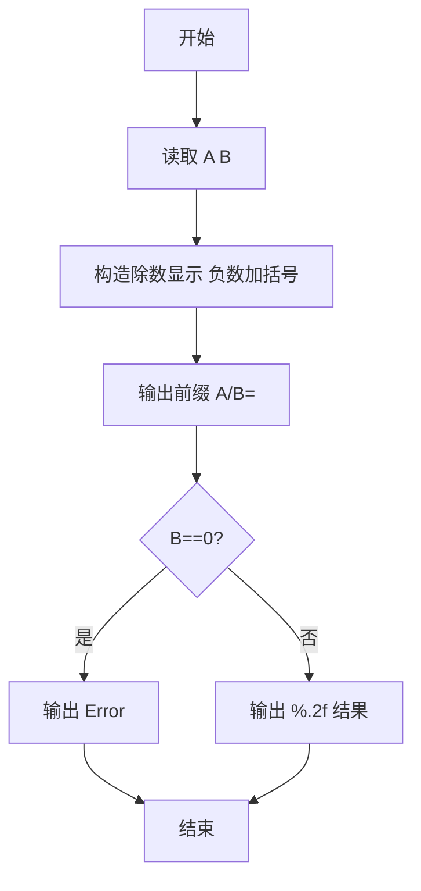
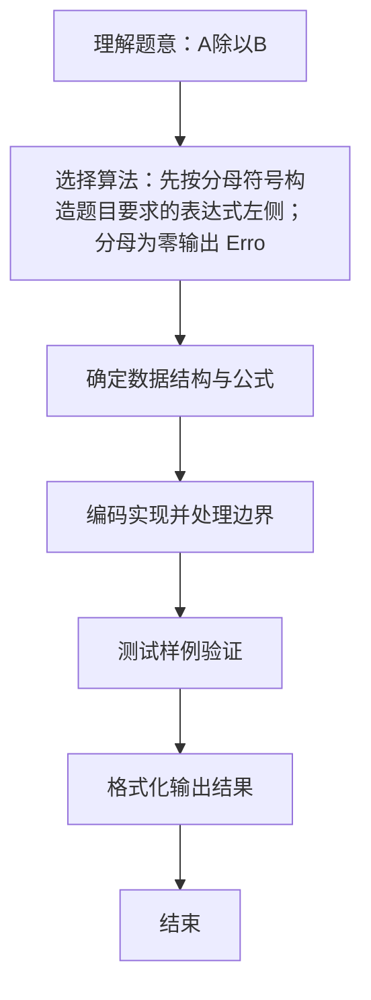

# L1-037 - A除以B（10 分）

- **时间限制**: 400 ms
- **内存限制**: 65536 KB
- **代码长度限制**: 16 KB

---

## 题目描述


真的是简单题哈 —— 给定两个绝对值不超过100的整数$$A$$和$$B$$，要求你按照“$$A/B=$$商”的格式输出结果。

### 输入格式:

输入在第一行给出两个整数$$A$$和$$B$$（$$-100 \le A, B \le 100$$），数字间以空格分隔。

### 输出格式:

在一行中输出结果：如果分母是正数，则输出“$$A/B=$$商”；如果分母是负数，则要用括号把分母括起来输出；如果分母为零，则输出的商应为`Error`。输出的商应保留小数点后2位。

### 输入样例 1：
```in
-1 2
```

### 输出样例 1：
```out
-1/2=-0.50
```

### 输入样例 2：
```in
1 -3
```

### 输出样例 2：
```out
1/(-3)=-0.33
```

### 输入样例 3：
```in
5 0
```

### 输出样例 3：
```out
5/0=Error
```

## 示例

### 示例 1

**输入:**
```
-1 2
```

**输出:**
```
-1/2=-0.50
```

### 示例 2

**输入:**
```
1 -3
```

**输出:**
```
1/(-3)=-0.33
```

### 示例 3

**输入:**
```
5 0
```

**输出:**
```
5/0=Error
```

### 解题思路
先按分母符号构造题目要求的表达式左侧；分母为零输出 Error， 否则以 double 相除并保留两位小数。 时间复杂度 O(1)，空间复杂度 O(1)。关键实现上，使用 Scanner 进行标准输入解析。能够满足题目对时间与内存的限制。对于 L1 基础题，该方法以模拟与直接计算为主，逻辑清晰、边界处理简单，易于验证正确性。

### 代码流程说明
1. 启动程序，创建 Scanner 读取标准输入
2. 读取输入参数：a, b 等，用于后续计算
3. 读取整数 A、B，构造除数显示字符串（负数加括号），输出前缀 "A/B="
4. 若 B==0 输出 Error，否则按 %.2f 输出浮点除法结果
5. 程序结束，关闭输入流并退出

### 代码实现
```java
import java.util.Scanner;

/**
 * L1-037 A除以B
 * 实现原理：先按分母符号构造题目要求的表达式左侧；分母为零输出 Error，
 * 否则以 double 相除并保留两位小数。
 * 时间复杂度 O(1)，空间复杂度 O(1)。
 */
public class Main {
    public static void main(String[] args) {
        Scanner scanner = new Scanner(System.in);
        int a = scanner.nextInt(), b = scanner.nextInt();
        String divisor = b < 0 ? "(" + b + ")" : String.valueOf(b);
        System.out.print(a + "/" + divisor + "=");
        if (b == 0) System.out.println("Error");
        else System.out.printf("%.2f", a * 1.0 / b);
    }
}
```

### 代码流程图


### 解题流程图

