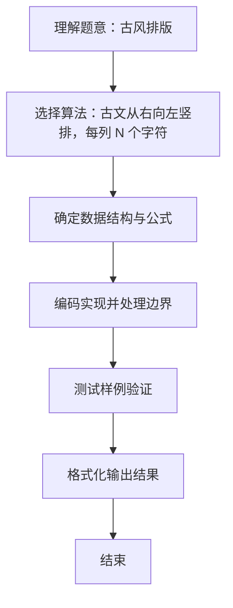

# L1-039 - 古风排版（20 分）

- **时间限制**: 400 ms
- **内存限制**: 65536 KB
- **代码长度限制**: 16 KB

---

## 题目描述


中国的古人写文字，是从右向左竖向排版的。本题就请你编写程序，把一段文字按古风排版。

### 输入格式:

输入在第一行给出一个正整数$$N$$（$$<100$$），是每一列的字符数。第二行给出一个长度不超过1000的非空字符串，以回车结束。

### 输出格式:

按古风格式排版给定的字符串，每列$$N$$个字符（除了最后一列可能不足$$N$$个）。

### 输入样例:
```in
4
This is a test case
```

### 输出样例:
```out
asa T
st ih
e tsi
 ce s
```

## 示例

### 示例 1

**输入:**
```
4
This is a test case
```

**输出:**
```
asa T
st ih
e tsi
 ce s
```

### 解题思路
古文从右向左竖排，每列 N 个字符。 设文本长 len，列数 cols = ceil(len / N)，总容量 rows*cols， 不足部分在末尾（最左列的下方）补空格，即 padded = text + 空格。 然后按从右列到左列、每列从上到下依次填入 padded 的字符， 最后逐行输出。 时间复杂度 O(rows*cols)，空间复杂度 O(rows*cols)。关键实现上，使用 BufferedReader 保留空格与整行读取；使用 StringBuilder 拼接输出提升效率。能够满足题目对时间与。

### 代码流程说明
1. 启动程序，创建 BufferedReader 包装 System.in 以支持按行读取（含空格）
2. 按行读取输入数据，必要时做空行与空格补齐处理（如福字图形行末空格截断）或按空格分割字段
3. 读取行数 rows 与文本 text，计算列数 cols=ceil(len/rows)，总容量 rows*cols，不足末尾补空格
4. 按从右列到左列、每列从上到下填入补齐后的字符矩阵，随后逐行输出
5. 程序结束，关闭输入流并退出

### 代码实现
```java
import java.io.BufferedReader;
import java.io.IOException;
import java.io.InputStreamReader;

/**
 * L1-039 古风排版
 * 实现原理：
 * 古文从右向左竖排，每列 N 个字符。
 * 设文本长 len，列数 cols = ceil(len / N)，总容量 rows*cols，
 * 不足部分在末尾（最左列的下方）补空格，即 padded = text + 空格。
 * 然后按从右列到左列、每列从上到下依次填入 padded 的字符，
 * 最后逐行输出。
 * 时间复杂度 O(rows*cols)，空间复杂度 O(rows*cols)。
 */
public class Main {
    public static void main(String[] args) throws IOException {
        BufferedReader reader = new BufferedReader(new InputStreamReader(System.in));
        String first = reader.readLine();
        if (first == null || first.trim().isEmpty()) return;
        int rows = Integer.parseInt(first.trim());
        String text = reader.readLine();
        if (text == null) text = "";
        int len = text.length();
        int cols = (len + rows - 1) / rows;
        if (cols == 0) cols = 1;
        int total = rows * cols;
        // 末尾补空格至 total 长度（而非开头补）
        StringBuilder sb = new StringBuilder(text);
        while (sb.length() < total) sb.append(' ');
        String padded = sb.toString();

        char[][] page = new char[rows][cols];
        int idx = 0;
        for (int c = cols - 1; c >= 0; c--) {
            for (int r = 0; r < rows; r++) {
                page[r][c] = padded.charAt(idx++);
            }
        }
        for (int r = 0; r < rows; r++) {
            System.out.println(new String(page[r]));
        }
    }
}
```

### 代码流程图
```mermaid
flowchart TD
    A[开始] --> B[读取行数 rows 与文本]
    B --> C[计算 cols=ceil(len/rows)]
    C --> D[补空格至 rows*cols]
    D --> E[按右到左列填矩阵]
    E --> F[逐行输出]
    F --> G[结束]
```

### 解题流程图

