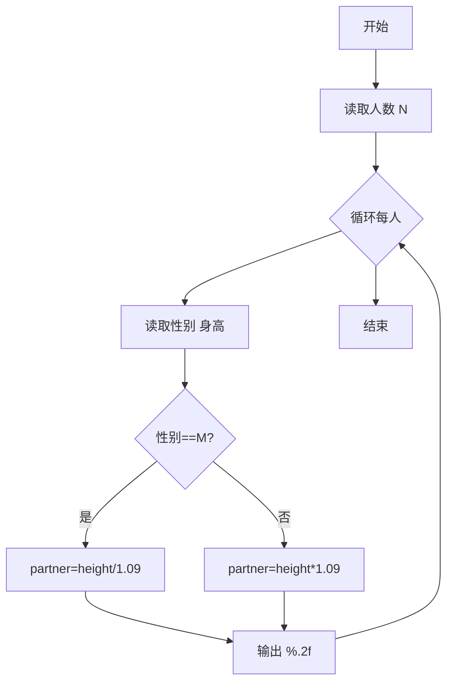
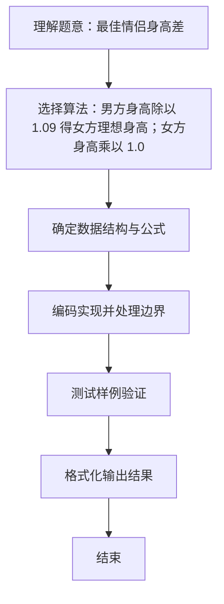

# L1-040 - 最佳情侣身高差（10 分）

- **时间限制**: 400 ms
- **内存限制**: 65536 KB
- **代码长度限制**: 16 KB

---

## 题目描述


专家通过多组情侣研究数据发现，最佳的情侣身高差遵循着一个公式：（女方的身高）$$\times$$1.09 =（男方的身高）。如果符合，你俩的身高差不管是牵手、拥抱、接吻，都是最和谐的差度。

下面就请你写个程序，为任意一位用户计算他/她的情侣的最佳身高。

### 输入格式:

输入第一行给出正整数$$N$$（$$\le 10$$），为前来查询的用户数。随后$$N$$行，每行按照“性别 身高”的格式给出前来查询的用户的性别和身高，其中“性别”为“F”表示女性、“M”表示男性；“身高”为区间 [1.0, 3.0] 之间的实数。

### 输出格式:

对每一个查询，在一行中为该用户计算出其情侣的最佳身高，保留小数点后2位。

### 输入样例:
```in
2
M 1.75
F 1.8
```

### 输出样例:
```out
1.61
1.96
```

## 示例

### 示例 1

**输入:**
```
2
M 1.75
F 1.8
```

**输出:**
```
1.61
1.96
```

### 解题思路
男方身高除以 1.09 得女方理想身高；女方身高乘以 1.09 得男方理想身高。 时间复杂度 O(N)，空间复杂度 O(1)。关键实现上，使用 Scanner 进行标准输入解析。能够满足题目对时间与内存的限制。对于 L1 基础题，该方法以模拟与直接计算为主，逻辑清晰、边界处理简单，易于验证正确性。

### 代码流程说明
1. 启动程序，创建 Scanner 读取标准输入
2. 读取输入参数：n, gender, height 等，用于后续计算
3. 循环读取性别与身高，若为 M 则 partner=height/1.09，否则 partner=height*1.09，按 %.2f 输出
4. 程序结束，关闭输入流并退出

### 代码实现
```java
import java.util.Scanner;

/**
 * L1-040 最佳情侣身高差
 * 实现原理：男方身高除以 1.09 得女方理想身高；女方身高乘以 1.09 得男方理想身高。
 * 时间复杂度 O(N)，空间复杂度 O(1)。
 */
public class Main {
    public static void main(String[] args) {
        Scanner scanner = new Scanner(System.in);
        int n = scanner.nextInt();
        while (n-- > 0) {
            String gender = scanner.next();
            double height = scanner.nextDouble();
            double partner = gender.equals("M") ? height / 1.09 : height * 1.09;
            System.out.printf("%.2f%n", partner);
        }
    }
}
```

### 代码流程图


### 解题流程图

