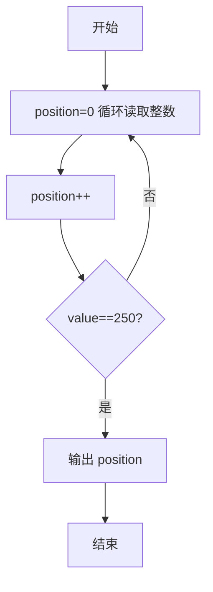
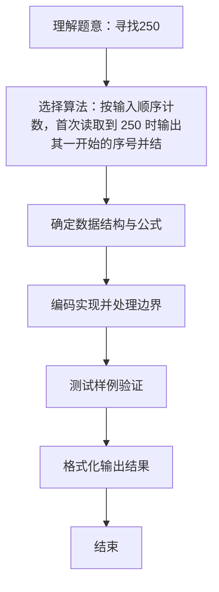

# L1-041 - 寻找250（10 分）

- **时间限制**: 400 ms
- **内存限制**: 65536 KB
- **代码长度限制**: 16 KB

---

## 题目描述


对方不想和你说话，并向你扔了一串数…… 而你必须从这一串数字中找到“250”这个高大上的感人数字。

### 输入格式:

输入在一行中给出不知道多少个绝对值不超过1000的整数，其中保证至少存在一个“250”。

### 输出格式:

在一行中输出第一次出现的“250”是对方扔过来的第几个数字（计数从1开始）。题目保证输出的数字在整型范围内。

### 输入样例:
```in
888 666 123 -233 250 13 250 -222
```

### 输出样例:
```out
5
```

## 示例

### 示例 1

**输入:**
```
888 666 123 -233 250 13 250 -222
```

**输出:**
```
5
```

### 解题思路
按输入顺序计数，首次读取到 250 时输出其一开始的序号并结束。 时间复杂度 O(首次出现位置)，空间复杂度 O(1)。关键实现上，使用 Scanner 进行标准输入解析。能够满足题目对时间与内存的限制。对于 L1 基础题，该方法以模拟与直接计算为主，逻辑清晰、边界处理简单，易于验证正确性。

### 代码流程说明
1. 启动程序，创建 Scanner 读取标准输入
2. 读取输入参数
3. 顺序读取整数并计数 position，首次遇到 250 时输出其序号并结束程序
4. 程序结束，关闭输入流并退出

### 代码实现
```java
import java.util.Scanner;

/**
 * L1-041 寻找250
 * 实现原理：按输入顺序计数，首次读取到 250 时输出其一开始的序号并结束。
 * 时间复杂度 O(首次出现位置)，空间复杂度 O(1)。
 */
public class Main {
    public static void main(String[] args) {
        Scanner scanner = new Scanner(System.in);
        int position = 0;
        while (scanner.hasNextInt()) {
            position++;
            if (scanner.nextInt() == 250) {
                System.out.println(position);
                return;
            }
        }
    }
}
```

### 代码流程图


### 解题流程图

