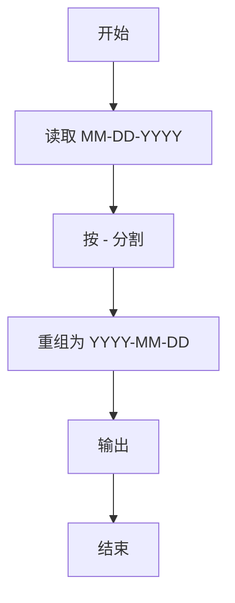
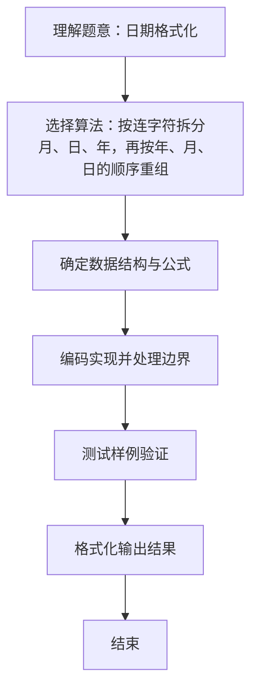

# L1-042 - 日期格式化（5 分）

- **时间限制**: 400 ms
- **内存限制**: 65536 KB
- **代码长度限制**: 16 KB

---

## 题目描述


世界上不同国家有不同的写日期的习惯。比如美国人习惯写成“月-日-年”，而中国人习惯写成“年-月-日”。下面请你写个程序，自动把读入的美国格式的日期改写成中国习惯的日期。

### 输入格式:

输入在一行中按照“mm-dd-yyyy”的格式给出月、日、年。题目保证给出的日期是1900年元旦至今合法的日期。

### 输出格式:

在一行中按照“yyyy-mm-dd”的格式给出年、月、日。

### 输入样例:
```in
03-15-2017
```

### 输出样例:
```out
2017-03-15
```

## 示例

### 示例 1

**输入:**
```
03-15-2017
```

**输出:**
```
2017-03-15
```

### 解题思路
按连字符拆分月、日、年，再按年、月、日的顺序重组。 时间复杂度 O(1)，空间复杂度 O(1)。关键实现上，使用 Scanner 进行标准输入解析。能够满足题目对时间与内存的限制。对于 L1 基础题，该方法以模拟与直接计算为主，逻辑清晰、边界处理简单，易于验证正确性。

### 代码流程说明
1. 启动程序，创建 Scanner 读取标准输入
2. 按 "-" 分割输入的 MM-DD-YYYY，取 date[2]-date[0]-date[1] 重组为 YYYY-MM-DD 输出
3. 程序结束，关闭输入流并退出

### 代码实现
```java
import java.util.Scanner;

/**
 * L1-042 日期格式化
 * 实现原理：按连字符拆分月、日、年，再按年、月、日的顺序重组。
 * 时间复杂度 O(1)，空间复杂度 O(1)。
 */
public class Main {
    public static void main(String[] args) {
        String[] date = new Scanner(System.in).next().split("-");
        System.out.println(date[2] + "-" + date[0] + "-" + date[1]);
    }
}
```

### 代码流程图


### 解题流程图

