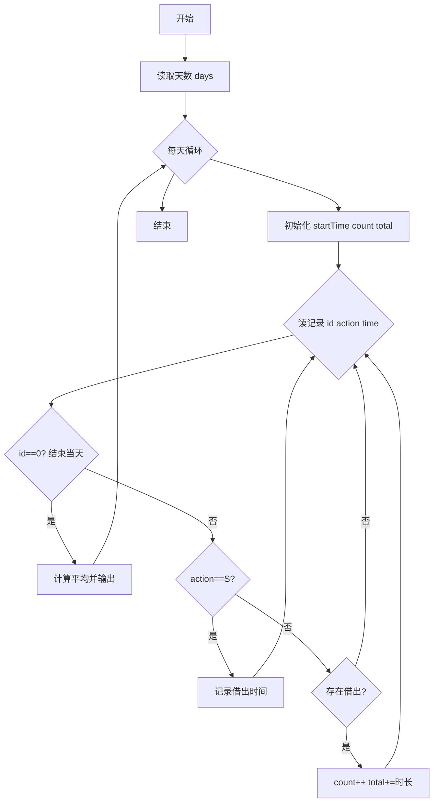
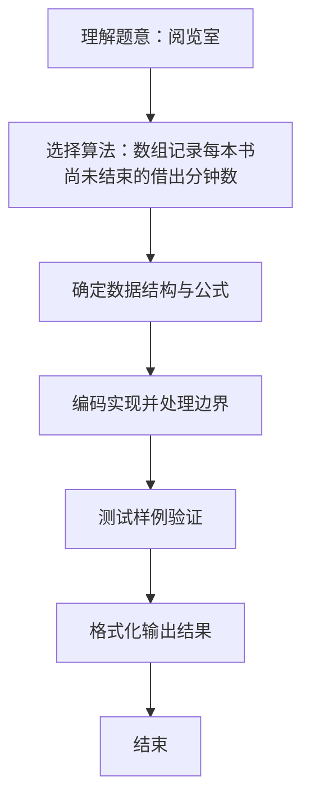

# L1-043 - 阅览室（20 分）

- **时间限制**: 400 ms
- **内存限制**: 65536 KB
- **代码长度限制**: 16 KB

---

## 题目描述


天梯图书阅览室请你编写一个简单的图书借阅统计程序。当读者借书时，管理员输入书号并按下`S`键，程序开始计时；当读者还书时，管理员输入书号并按下`E`键，程序结束计时。书号为不超过1000的正整数。当管理员将0作为书号输入时，表示一天工作结束，你的程序应输出当天的读者借书次数和平均阅读时间。

注意：由于线路偶尔会有故障，可能出现不完整的纪录，即只有`S`没有`E`，或者只有`E`没有`S`的纪录，系统应能自动忽略这种无效纪录。另外，题目保证书号是书的唯一标识，同一本书在任何时间区间内只可能被一位读者借阅。

### 输入格式:

输入在第一行给出一个正整数$$N$$（$$\le 10$$），随后给出$$N$$天的纪录。每天的纪录由若干次借阅操作组成，每次操作占一行，格式为：

`书号`（[1, 1000]内的整数） `键值`（`S`或`E`） `发生时间`（`hh:mm`，其中`hh`是[0,23]内的整数，`mm`是[0, 59]内整数）

每一天的纪录保证按时间递增的顺序给出。

### 输出格式:

对每天的纪录，在一行中输出当天的读者借书次数和平均阅读时间（以分钟为单位的精确到个位的整数时间）。

### 输入样例:
```in
3
1 S 08:10
2 S 08:35
1 E 10:00
2 E 13:16
0 S 17:00
0 S 17:00
3 E 08:10
1 S 08:20
2 S 09:00
1 E 09:20
0 E 17:00
```

### 输出样例:
```out
2 196
0 0
1 60
```

## 示例

### 示例 1

**输入:**
```
3
1 S 08:10
2 S 08:35
1 E 10:00
2 E 13:16
0 S 17:00
0 S 17:00
3 E 08:10
1 S 08:20
2 S 09:00
1 E 09:20
0 E 17:00
```

**输出:**
```
2 196
0 0
1 60
```

### 解题思路
数组记录每本书尚未结束的借出分钟数。读到 E 时只有存在对应 S 才累计 一次有效借阅及其时长；每天书号为 0 的记录仅作结束标志。 时间复杂度 O(总记录数)，空间复杂度 O(1000)。关键实现上，使用 Scanner 进行标准输入解析。能够满足题目对时间与内存的限制。对于 L1 基础题，该方法以模拟与直接计算为主，逻辑清晰、边界处理简单，易于验证正确性。

### 代码流程说明
1. 启动程序，创建 Scanner 读取标准输入
2. 读取输入参数：days, id, action, time 等，用于后续计算
3. 对每一天用数组 startTime 记录每本书借出时的分钟数（存 minute+1 以区分未借出），读到 id==0 结束当天
4. 遇 S 记录借出时间，遇 E 若存在对应 S 则累计一次有效借阅数与借阅时长（分钟差），最后计算平均时长并输出，无有效记录则输出 0 0
5. 程序结束，关闭输入流并退出

### 代码实现
```java
import java.util.Scanner;

/**
 * L1-043 阅览室
 * 实现原理：数组记录每本书尚未结束的借出分钟数。读到 E 时只有存在对应 S 才累计
 * 一次有效借阅及其时长；每天书号为 0 的记录仅作结束标志。
 * 时间复杂度 O(总记录数)，空间复杂度 O(1000)。
 */
public class Main {
    public static void main(String[] args) {
        Scanner scanner = new Scanner(System.in);
        int days = scanner.nextInt();
        while (days-- > 0) {
            int[] startTime = new int[1001];
            int count = 0, totalMinutes = 0;
            while (true) {
                int id = scanner.nextInt();
                String action = scanner.next();
                String[] time = scanner.next().split(":");
                int minute = Integer.parseInt(time[0]) * 60 + Integer.parseInt(time[1]);
                if (id == 0) break;
                if (action.equals("S")) {
                    startTime[id] = minute + 1; // 0 表示没有有效的借出记录。
                } else if (startTime[id] != 0) {
                    totalMinutes += minute - (startTime[id] - 1);
                    count++;
                    startTime[id] = 0;
                }
            }
            int average = count == 0 ? 0 : (int) Math.round(totalMinutes * 1.0 / count);
            System.out.println(count + " " + average);
        }
    }
}
```

### 代码流程图


### 解题流程图

