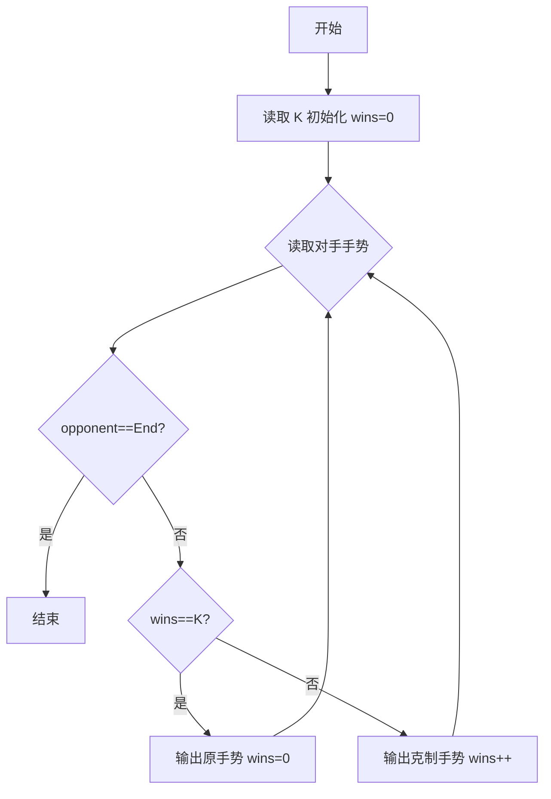
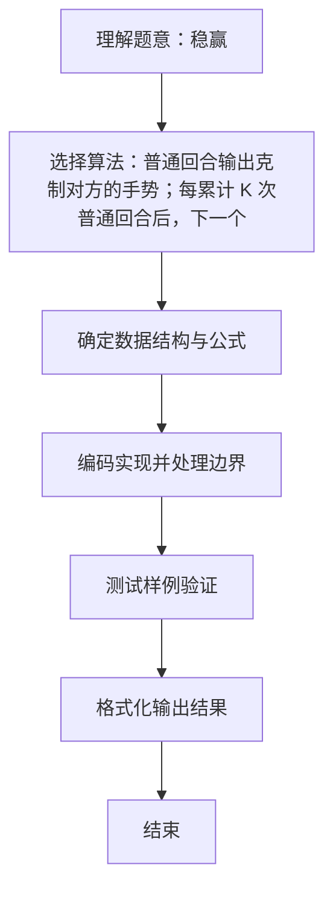

# L1-044 - 稳赢（15 分）

- **时间限制**: 400 ms
- **内存限制**: 65536 KB
- **代码长度限制**: 16 KB

---

## 题目描述


大家应该都会玩“锤子剪刀布”的游戏：两人同时给出手势，胜负规则如图所示：


现要求你编写一个稳赢不输的程序，根据对方的出招，给出对应的赢招。但是！为了不让对方输得太惨，你需要每隔$$K$$次就让一个平局。

### 输入格式:

输入首先在第一行给出正整数$$K$$（$$\le 10$$），即平局间隔的次数。随后每行给出对方的一次出招：`ChuiZi`代表“锤子”、`JianDao`代表“剪刀”、`Bu`代表“布”。`End`代表输入结束，这一行不要作为出招处理。

### 输出格式:

对每一个输入的出招，按要求输出稳赢或平局的招式。每招占一行。

### 输入样例:
```in
2
ChuiZi
JianDao
Bu
JianDao
Bu
ChuiZi
ChuiZi
End
```

### 输出样例:
```out
Bu
ChuiZi
Bu
ChuiZi
JianDao
ChuiZi
Bu
```

## 示例

### 示例 1

**输入:**
```
2
ChuiZi
JianDao
Bu
JianDao
Bu
ChuiZi
ChuiZi
End
```

**输出:**
```
Bu
ChuiZi
Bu
ChuiZi
JianDao
ChuiZi
Bu
```

### 解题思路
普通回合输出克制对方的手势；每累计 K 次普通回合后，下一个回合原样输出 对方手势以形成平局，然后重新计数。 时间复杂度 O(N)，空间复杂度 O(1)。关键实现上，使用 Scanner 进行标准输入解析。能够满足题目对时间与内存的限制。对于 L1 基础题，该方法以模拟与直接计算为主，逻辑清晰、边界处理简单，易于验证正确性。

### 代码流程说明
1. 启动程序，创建 Scanner 读取标准输入
2. 读取输入参数：k, opponent 等，用于后续计算
3. 读取控制阈值 K，维护连胜计数 winsSinceDraw，循环读取对手手势遇 End 结束
4. 若 winsSinceDraw==K 则平局局输出对手原手势并重置计数，否则输出克制手势（ChuiZi→Bu，JianDao→ChuiZi，Bu→JianDao）并计数加一
5. 程序结束，关闭输入流并退出

### 代码实现
```java
import java.util.Scanner;

/**
 * L1-044 稳赢
 * 实现原理：普通回合输出克制对方的手势；每累计 K 次普通回合后，下一个回合原样输出
 * 对方手势以形成平局，然后重新计数。
 * 时间复杂度 O(N)，空间复杂度 O(1)。
 */
public class Main {
    public static void main(String[] args) {
        Scanner scanner = new Scanner(System.in);
        int k = scanner.nextInt();
        int winsSinceDraw = 0;
        while (scanner.hasNext()) {
            String opponent = scanner.next();
            if (opponent.equals("End")) break;
            if (winsSinceDraw == k) {
                System.out.println(opponent);
                winsSinceDraw = 0;
            } else {
                if (opponent.equals("ChuiZi")) System.out.println("Bu");
                else if (opponent.equals("JianDao")) System.out.println("ChuiZi");
                else System.out.println("JianDao");
                winsSinceDraw++;
            }
        }
    }
}
```

### 代码流程图


### 解题流程图

