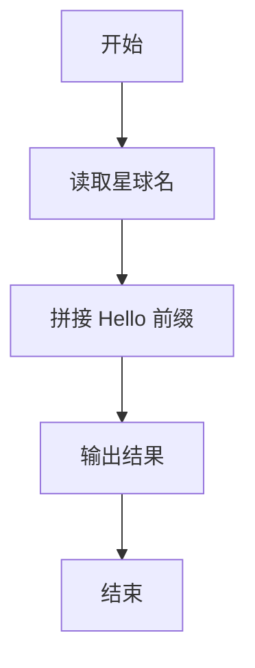
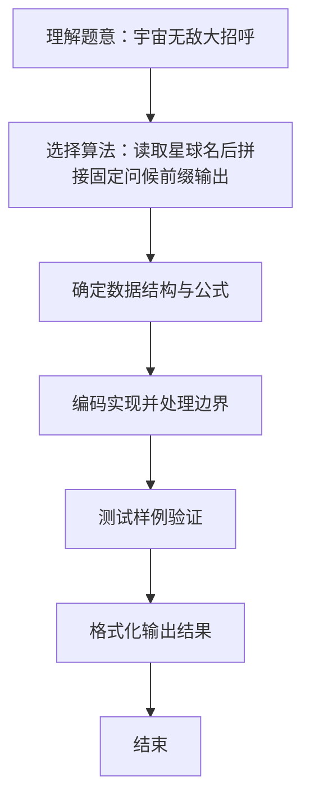

# L1-045 - 宇宙无敌大招呼（5 分）

- **时间限制**: 400 ms
- **内存限制**: 65536 KB
- **代码长度限制**: 16 KB

---

## 题目描述


据说所有程序员学习的第一个程序都是在屏幕上输出一句“Hello World”，跟这个世界打个招呼。作为天梯赛中的程序员，你写的程序得高级一点，要能跟任意指定的星球打招呼。

### 输入格式:

输入在第一行给出一个星球的名字`S`，是一个由不超过7个英文字母组成的单词，以回车结束。

### 输出格式:

在一行中输出`Hello S`，跟输入的`S`星球打个招呼。

### 输入样例:
```in
Mars
```

### 输出样例:
```out
Hello Mars
```

## 示例

### 示例 1

**输入:**
```
Mars
```

**输出:**
```
Hello Mars
```

### 解题思路
读取星球名后拼接固定问候前缀输出。 时间复杂度 O(|S|)，空间复杂度 O(1)。关键实现上，使用 Scanner 进行标准输入解析。能够满足题目对时间与内存的限制。对于 L1 基础题，该方法以模拟与直接计算为主，逻辑清晰、边界处理简单，易于验证正确性。

### 代码流程说明
1. 启动程序，创建 Scanner 读取标准输入
2. 读取星球名字符串，拼接前缀 "Hello " 后输出
3. 程序结束，关闭输入流并退出

### 代码实现
```java
import java.util.Scanner;

/**
 * L1-045 宇宙无敌大招呼
 * 实现原理：读取星球名后拼接固定问候前缀输出。
 * 时间复杂度 O(|S|)，空间复杂度 O(1)。
 */
public class Main {
    public static void main(String[] args) {
        System.out.println("Hello " + new Scanner(System.in).next());
    }
}
```

### 代码流程图


### 解题流程图

