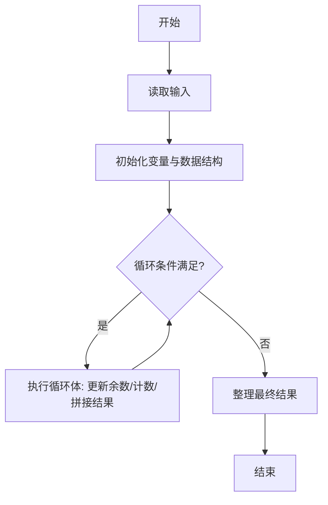
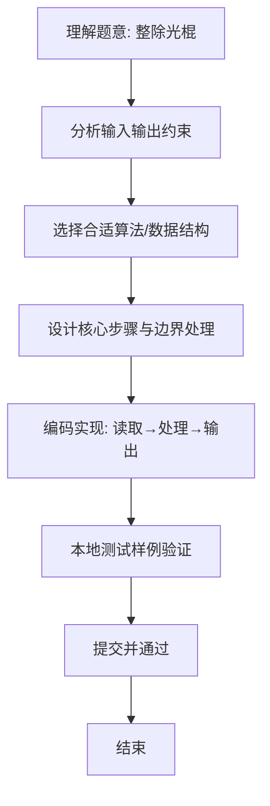

# L1-046 - 整除光棍（20 分）

- **时间限制**: 400 ms
- **内存限制**: 65536 KB
- **代码长度限制**: 16 KB

---

## 题目描述


这里所谓的“光棍”，并不是指单身汪啦~ 说的是全部由1组成的数字，比如1、11、111、1111等。传说任何一个光棍都能被一个不以5结尾的奇数整除。比如，111111就可以被13整除。 现在，你的程序要读入一个整数`x`，这个整数一定是奇数并且不以5结尾。然后，经过计算，输出两个数字：第一个数字`s`，表示`x`乘以`s`是一个光棍，第二个数字`n`是这个光棍的位数。这样的解当然不是唯一的,题目要求你输出最小的解。

提示：一个显然的办法是逐渐增加光棍的位数，直到可以整除`x`为止。但难点在于，`s`可能是个非常大的数 —— 比如，程序输入31，那么就输出3584229390681和15，因为31乘以3584229390681的结果是111111111111111，一共15个1。

### 输入格式:

输入在一行中给出一个不以5结尾的正奇数`x`（$$< 1000$$）。

### 输出格式:

在一行中输出相应的最小的`s`和`n`，其间以1个空格分隔。

### 输入样例:
```in
31
```

### 输出样例:
```out
3584229390681 15
```

## 示例

### 示例 1

**输入:**
```
31
```

**输出:**
```
3584229390681 15
```

### 解题思路
本题“整除光棍”的核心在于模拟光棍数除以 x 的长除法，只维护余数，因此不必保存巨大被除数。 每次补入一个 1，余数为零时得到最短光棍；同时收集各位商即为 s。 时间复杂度 O(n)，空间复杂度 O(n)，n 为答案光棍长度。 代码选用 Scanner、StringBuilder 处理输入输出，通过 `divisor`、`remainder`、`started`、`quotient` 等变量维护状态，采用循环/模拟逐步推进，避免一次性构造超大结构，以增量方式得到结果。 满足题设 400ms/64KB 约束，且对边界（如空输入、维度不匹配、前导零）做了显式处理，鲁棒性与可读性兼顾。

### 代码流程说明
1. **输入读取**：使用 Scanner、StringBuilder 读取题目参数，对应代码中的 `scanner.nextInt()` / `readLine()` / `readMatrix()` 等调用，变量如 `divisor`、`remainder`、`started`、`quotient` 接收原始数据。
2. **初始化**：声明并初始化 `divisor`、`remainder`、`started`、`quotient` 及辅助容器（如 `StringBuilder quotient/output`、`int[][] a/b`、`List sequence` 视题目而定），为后续计算准备状态。
3. **主循环**：进入 `while (remainder != 0)` 循环体，循环内按题意更新状态（如 `remainder = remainder*10+1`、`pressure` 比较、`sequence` 追加），并通过 `if` 分支决定是否拼接结果或跳过。
4. **结果拼接**：利用 `StringBuilder` 高效追加字符/数字，处理变长输出（如商位拼接、连续 6 替换），保证 O(n) 性能。
5. **格式化输出**：通过 `System.out.println/printf/print` 按题目要求输出，处理空格、换行及前缀（如 `AI: `、`#` 分组）等细节。

### 代码实现
```java
import java.util.Scanner;

/**
 * L1-046 整除光棍
 * 实现原理：模拟光棍数除以 x 的长除法，只维护余数，因此不必保存巨大被除数。
 * 每次补入一个 1，余数为零时得到最短光棍；同时收集各位商即为 s。
 * 时间复杂度 O(n)，空间复杂度 O(n)，n 为答案光棍长度。
 */
public class Main {
    public static void main(String[] args) {
        int divisor = new Scanner(System.in).nextInt();
        int remainder = 0, length = 0;
        boolean started = false;
        StringBuilder quotient = new StringBuilder();
        do {
            remainder = remainder * 10 + 1;
            int digit = remainder / divisor;
            remainder %= divisor;
            if (digit != 0 || started) {
                quotient.append(digit);
                started = true;
            }
            length++;
        } while (remainder != 0);
        System.out.println(quotient + " " + length);
    }
}
```

### 代码流程图


### 解题流程图

