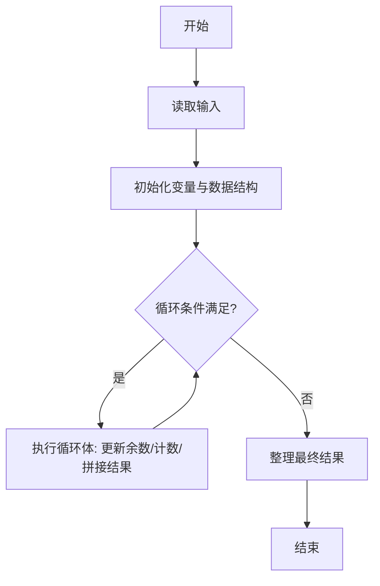
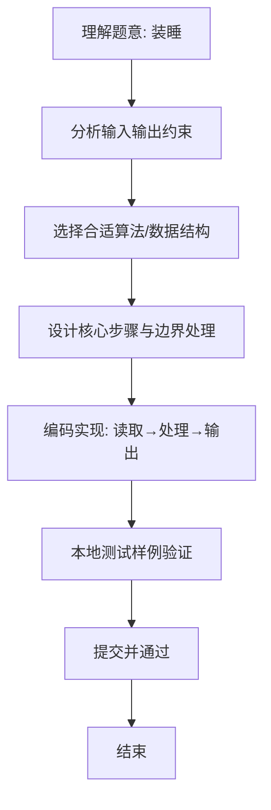

# L1-047 - 装睡（10 分）

- **时间限制**: 400 ms
- **内存限制**: 65536 KB
- **代码长度限制**: 16 KB

---

## 题目描述


你永远叫不醒一个装睡的人 —— 但是通过分析一个人的呼吸频率和脉搏，你可以发现谁在装睡！医生告诉我们，正常人睡眠时的呼吸频率是每分钟15-20次，脉搏是每分钟50-70次。下面给定一系列人的呼吸频率与脉搏，请你找出他们中间有可能在装睡的人，即至少一项指标不在正常范围内的人。

### 输入格式:

输入在第一行给出一个正整数$$N$$（$$\le 10$$）。随后$$N$$行，每行给出一个人的名字（仅由英文字母组成的、长度不超过3个字符的串）、其呼吸频率和脉搏（均为不超过100的正整数）。

### 输出格式:

按照输入顺序检查每个人，如果其至少一项指标不在正常范围内，则输出其名字，每个名字占一行。

### 输入样例:
```in
4
Amy 15 70
Tom 14 60
Joe 18 50
Zoe 21 71
```

### 输出样例:
```out
Tom
Zoe
```

## 示例

### 示例 1

**输入:**
```
4
Amy 15 70
Tom 14 60
Joe 18 50
Zoe 21 71
```

**输出:**
```
Tom
Zoe
```

### 解题思路
本题“装睡”的核心在于呼吸次数应在 [15,20]、脉搏应在 [50,70]；任一指标越界即输出姓名。 时间复杂度 O(N)，空间复杂度 O(1)。 代码选用 Scanner 处理输入输出，通过 `scanner`、`n`、`name`、`breath` 等变量维护状态，采用循环/模拟逐步推进，避免一次性构造超大结构，以增量方式得到结果。 满足题设 400ms/64KB 约束，且对边界（如空输入、维度不匹配、前导零）做了显式处理，鲁棒性与可读性兼顾。

### 代码流程说明
1. **输入读取**：使用 Scanner 读取题目参数，对应代码中的 `scanner.nextInt()` / `readLine()` / `readMatrix()` 等调用，变量如 `scanner`、`n`、`name`、`breath` 接收原始数据。
2. **初始化**：声明并初始化 `scanner`、`n`、`name`、`breath` 及辅助容器（如 `StringBuilder quotient/output`、`int[][] a/b`、`List sequence` 视题目而定），为后续计算准备状态。
3. **主循环**：进入 `while (n-- > 0)` 循环体，循环内按题意更新状态（如 `remainder = remainder*10+1`、`pressure` 比较、`sequence` 追加），并通过 `if` 分支决定是否拼接结果或跳过。
4. **数值/逻辑收尾**：完成剩余计算或映射，整理最终待输出的数值或字符串。
5. **格式化输出**：通过 `System.out.println/printf/print` 按题目要求输出，处理空格、换行及前缀（如 `AI: `、`#` 分组）等细节。

### 代码实现
```java
import java.util.Scanner;

/**
 * L1-047 装睡
 * 实现原理：呼吸次数应在 [15,20]、脉搏应在 [50,70]；任一指标越界即输出姓名。
 * 时间复杂度 O(N)，空间复杂度 O(1)。
 */
public class Main {
    public static void main(String[] args) {
        Scanner scanner = new Scanner(System.in);
        int n = scanner.nextInt();
        while (n-- > 0) {
            String name = scanner.next();
            int breath = scanner.nextInt(), pulse = scanner.nextInt();
            if (breath < 15 || breath > 20 || pulse < 50 || pulse > 70) System.out.println(name);
        }
    }
}
```

### 代码流程图


### 解题流程图

