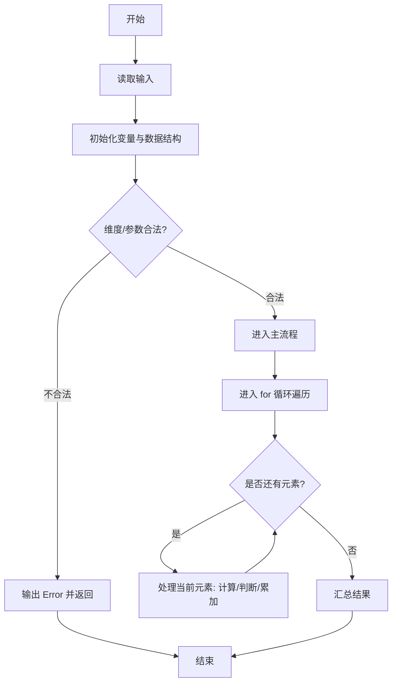
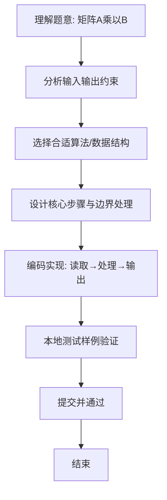

# L1-048 - 矩阵A乘以B（15 分）

- **时间限制**: 400 ms
- **内存限制**: 65536 KB
- **代码长度限制**: 16 KB

---

## 题目描述


给定两个矩阵$$A$$和$$B$$，要求你计算它们的乘积矩阵$$AB$$。需要注意的是，只有规模匹配的矩阵才可以相乘。即若$$A$$有$$R_a$$行、$$C_a$$列，$$B$$有$$R_b$$行、$$C_b$$列，则只有$$C_a$$与$$R_b$$相等时，两个矩阵才能相乘。

### 输入格式:

输入先后给出两个矩阵$$A$$和$$B$$。对于每个矩阵，首先在一行中给出其行数$$R$$和列数$$C$$，随后$$R$$行，每行给出$$C$$个整数，以1个空格分隔，且行首尾没有多余的空格。输入保证两个矩阵的$$R$$和$$C$$都是正数，并且所有整数的绝对值不超过100。

### 输出格式:

若输入的两个矩阵的规模是匹配的，则按照输入的格式输出乘积矩阵$$AB$$，否则输出`Error: Ca != Rb`，其中`Ca`是$$A$$的列数，`Rb`是$$B$$的行数。

### 输入样例 1：
```in
2 3
1 2 3
4 5 6
3 4
7 8 9 0
-1 -2 -3 -4
5 6 7 8
```

### 输出样例 1：
```out
2 4
20 22 24 16
53 58 63 28
```

### 输入样例 2：
```in
3 2
38 26
43 -5
0 17
3 2
-11 57
99 68
81 72
```

### 输出样例 2：
```out
Error: 2 != 3
```

## 示例

### 示例 1

**输入:**
```
2 3
1 2 3
4 5 6
3 4
7 8 9 0
-1 -2 -3 -4
5 6 7 8
```

**输出:**
```
2 4
20 22 24 16
53 58 63 28
```

### 示例 2

**输入:**
```
3 2
38 26
43 -5
0 17
3 2
-11 57
99 68
81 72
```

**输出:**
```
Error: 2 != 3
```

### 解题思路
本题“矩阵A乘以B”的核心在于读入两个矩阵后检查 A 的列数与 B 的行数；匹配时按定义计算 C[i][j]=sum(A[i][k]*B[k][j])，否则输出规模错误。 时间复杂度 O(Ra*Ca*Cb)，空间复杂度 O(Ra*Ca+Rb*Cb)。 代码选用 Scanner、二维数组 处理输入输出，通过 `scanner`、`ra`、`rb`、`i` 等变量维护状态，采用循环/模拟逐步推进，避免一次性构造超大结构，以增量方式得到结果。 满足题设 400ms/64KB 约束，且对边界（如空输入、维度不匹配、前导零）做了显式处理，鲁棒性与可读性兼顾。

### 代码流程说明
1. **输入读取**：使用 Scanner、二维数组 读取题目参数，对应代码中的 `scanner.nextInt()` / `readLine()` / `readMatrix()` 等调用，变量如 `scanner`、`ra`、`rb`、`i` 接收原始数据。
2. **初始化**：声明并初始化 `scanner`、`ra`、`rb`、`i` 及辅助容器（如 `StringBuilder quotient/output`、`int[][] a/b`、`List sequence` 视题目而定），为后续计算准备状态。
3. **遍历处理**：通过 `for (int i = 0; i < ra; i++)` 遍历输入元素，逐项执行核心逻辑（如矩阵三重循环 `sum += a[i][k]*b[k][j]`、字符串扫描 `text.charAt(i)`），并累加/判定。
4. **异常/边界处理**：若检测到非法情况（如 `ca != rb`），立即输出 `Error: ...` 并 `return`，避免后续无效运算。
5. **格式化输出**：通过 `System.out.println/printf/print` 按题目要求输出，处理空格、换行及前缀（如 `AI: `、`#` 分组）等细节。

### 代码实现
```java
import java.util.Scanner;

/**
 * L1-048 矩阵A乘以B
 * 实现原理：读入两个矩阵后检查 A 的列数与 B 的行数；匹配时按定义计算
 * C[i][j]=sum(A[i][k]*B[k][j])，否则输出规模错误。
 * 时间复杂度 O(Ra*Ca*Cb)，空间复杂度 O(Ra*Ca+Rb*Cb)。
 */
public class Main {
    public static void main(String[] args) {
        Scanner scanner = new Scanner(System.in);
        int ra = scanner.nextInt(), ca = scanner.nextInt();
        int[][] a = readMatrix(scanner, ra, ca);
        int rb = scanner.nextInt(), cb = scanner.nextInt();
        int[][] b = readMatrix(scanner, rb, cb);
        if (ca != rb) {
            System.out.println("Error: " + ca + " != " + rb);
            return;
        }
        System.out.println(ra + " " + cb);
        for (int i = 0; i < ra; i++) {
            for (int j = 0; j < cb; j++) {
                int sum = 0;
                for (int k = 0; k < ca; k++) sum += a[i][k] * b[k][j];
                if (j > 0) System.out.print(' ');
                System.out.print(sum);
            }
            System.out.println();
        }
    }

    private static int[][] readMatrix(Scanner scanner, int rows, int cols) {
        int[][] matrix = new int[rows][cols];
        for (int i = 0; i < rows; i++) for (int j = 0; j < cols; j++) matrix[i][j] = scanner.nextInt();
        return matrix;
    }
}
```

### 代码流程图


### 解题流程图

