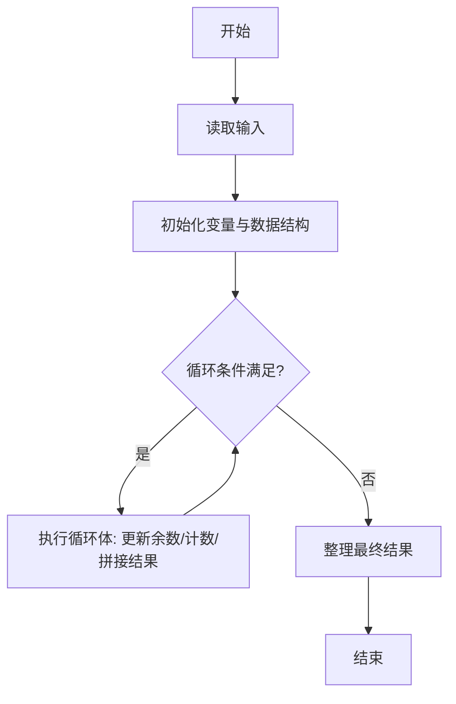
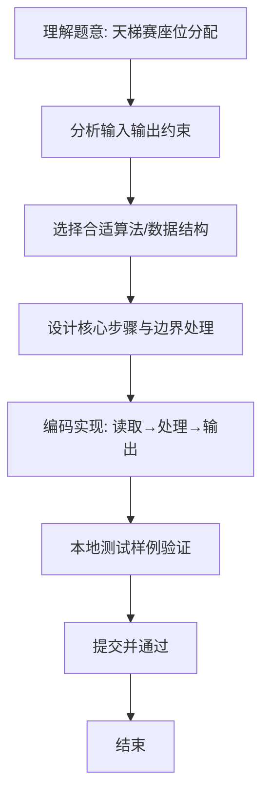

# L1-049 - 天梯赛座位分配（20 分）

- **时间限制**: 400 ms
- **内存限制**: 65536 KB
- **代码长度限制**: 16 KB

---

## 题目描述


天梯赛每年有大量参赛队员，要保证同一所学校的所有队员都不能相邻，分配座位就成为一件比较麻烦的事情。为此我们制定如下策略：假设某赛场有 N 所学校参赛，第 i 所学校有 M[i] 支队伍，每队 10 位参赛选手。令每校选手排成一列纵队，第 i+1 队的选手排在第 i 队选手之后。从第 1 所学校开始，各校的第 1 位队员顺次入座，然后是各校的第 2 位队员…… 以此类推。如果最后只剩下 1 所学校的队伍还没有分配座位，则需要安排他们的队员隔位就坐。本题就要求你编写程序，自动为各校生成队员的座位号，从 1 开始编号。

### 输入格式:

输入在一行中给出参赛的高校数 N （不超过100的正整数）；第二行给出 N 个不超过10的正整数，其中第 i 个数对应第 i 所高校的参赛队伍数，数字间以空格分隔。

### 输出格式:

从第 1 所高校的第 1 支队伍开始，顺次输出队员的座位号。每队占一行，座位号间以 1 个空格分隔，行首尾不得有多余空格。另外，每所高校的第一行按“#X”输出该校的编号X，从 1 开始。

### 输入样例:
```in
3
3 4 2
```

### 输出样例:
```out
#1
1 4 7 10 13 16 19 22 25 28
31 34 37 40 43 46 49 52 55 58
61 63 65 67 69 71 73 75 77 79
#2
2 5 8 11 14 17 20 23 26 29
32 35 38 41 44 47 50 53 56 59
62 64 66 68 70 72 74 76 78 80
82 84 86 88 90 92 94 96 98 100
#3
3 6 9 12 15 18 21 24 27 30
33 36 39 42 45 48 51 54 57 60
```

## 示例

### 示例 1

**输入:**
```
3
3 4 2
```

**输出:**
```
#1
1 4 7 10 13 16 19 22 25 28
31 34 37 40 43 46 49 52 55 58
61 63 65 67 69 71 73 75 77 79
#2
2 5 8 11 14 17 20 23 26 29
32 35 38 41 44 47 50 53 56 59
62 64 66 68 70 72 74 76 78 80
82 84 86 88 90 92 94 96 98 100
#3
3 6 9 12 15 18 21 24 27 30
33 36 39 42 45 48 51 54 57 60
```

### 解题思路
本题“天梯赛座位分配”的核心在于 每校队伍按 10 人一队顺序形成队列。座位分配分为两个阶段： 1) 多校共存阶段：仍有 >=2 所学校有未入座队员时，按学校编号轮流各入座 1 人，座位号每次 +1。 2) 单校隔位阶段：仅剩 1 所学校未坐满时，该校剩余队员需隔位就坐（座位号每次 +2）。 阶段切换时若最后一座恰好属于该单校，则需额外跳过一个座位以保证同校队员间距为 2， 否则… 代码选用 Scanner、二维数组 处理输入输出，通过 `scanner`、`n`、`total`、`assign。

### 代码流程说明
1. **输入读取**：使用 Scanner、二维数组 读取题目参数，对应代码中的 `scanner.nextInt()` / `readLine()` / `readMatrix()` 等调用，变量如 `scanner`、`n`、`total`、`assigned` 接收原始数据。
2. **初始化**：声明并初始化 `scanner`、`n`、`total`、`assigned` 及辅助容器（如 `StringBuilder quotient/output`、`int[][] a/b`、`List sequence` 视题目而定），为后续计算准备状态。
3. **主循环**：进入 `while (true)` 循环体，循环内按题意更新状态（如 `remainder = remainder*10+1`、`pressure` 比较、`sequence` 追加），并通过 `if` 分支决定是否拼接结果或跳过。
4. **数值/逻辑收尾**：完成剩余计算或映射，整理最终待输出的数值或字符串。
5. **格式化输出**：通过 `System.out.println/printf/print` 按题目要求输出，处理空格、换行及前缀（如 `AI: `、`#` 分组）等细节。

### 代码实现
```java
import java.util.Scanner;

/**
 * L1-049 天梯赛座位分配
 * 实现原理：
 * 每校队伍按 10 人一队顺序形成队列。座位分配分为两个阶段：
 * 1) 多校共存阶段：仍有 >=2 所学校有未入座队员时，按学校编号轮流各入座 1 人，座位号每次 +1。
 * 2) 单校隔位阶段：仅剩 1 所学校未坐满时，该校剩余队员需隔位就坐（座位号每次 +2）。
 * 阶段切换时若最后一座恰好属于该单校，则需额外跳过一个座位以保证同校队员间距为 2，
 * 否则直接从下一座开始隔位。此模型能保证同校队员互不相邻且隔位阶段间距最小。
 * 时间复杂度 O(总人数 + N*轮数)，空间复杂度 O(总人数)。
 */
public class Main {
    public static void main(String[] args) {
        Scanner scanner = new Scanner(System.in);
        int n = scanner.nextInt();
        int[] total = new int[n];
        int[] assigned = new int[n];
        int[][] seats = new int[n][];
        for (int i = 0; i < n; i++) {
            total[i] = scanner.nextInt() * 10;
            seats[i] = new int[total[i]];
        }

        int seatNumber = 1;
        int lastSchool = -1;

        // 阶段1：多校轮流，座位号连续
        while (true) {
            int active = 0;
            for (int i = 0; i < n; i++) if (assigned[i] < total[i]) active++;
            if (active <= 1) break;
            for (int i = 0; i < n; i++) {
                if (assigned[i] < total[i]) {
                    seats[i][assigned[i]++] = seatNumber++;
                    lastSchool = i;
                }
            }
        }

        // 阶段2：单校隔位
        int remaining = -1;
        for (int i = 0; i < n; i++) if (assigned[i] < total[i]) remaining = i;
        if (remaining != -1) {
            // 若最后一座即属于该单校，需额外空一座以保证间距为2
            if (lastSchool == remaining) seatNumber++;
            while (assigned[remaining] < total[remaining]) {
                seats[remaining][assigned[remaining]++] = seatNumber;
                seatNumber += 2;
            }
        }

        for (int school = 0; school < n; school++) {
            System.out.println("#" + (school + 1));
            for (int player = 0; player < total[school]; player += 10) {
                for (int j = 0; j < 10; j++) {
                    if (j > 0) System.out.print(' ');
                    System.out.print(seats[school][player + j]);
                }
                System.out.println();
            }
        }
    }
}
```

### 代码流程图


### 解题流程图

