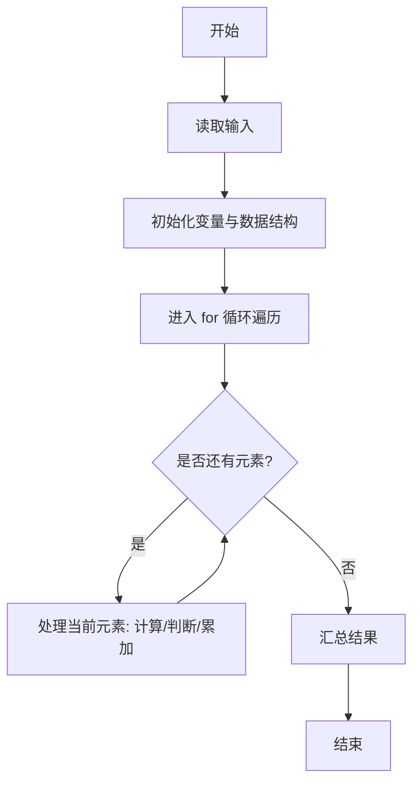
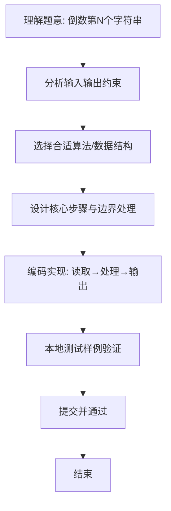

# L1-050 - 倒数第N个字符串（15 分）

- **时间限制**: 400 ms
- **内存限制**: 65536 KB
- **代码长度限制**: 16 KB

---

## 题目描述


给定一个完全由小写英文字母组成的字符串等差递增序列，该序列中的每个字符串的长度固定为 L，从 L 个 a 开始，以 1 为步长递增。例如当 L 为 3 时，序列为 { aaa, aab, aac, ..., aaz, aba, abb, ..., abz, ..., zzz }。这个序列的倒数第27个字符串就是 zyz。对于任意给定的 L，本题要求你给出对应序列倒数第 N 个字符串。

### 输入格式:

输入在一行中给出两个正整数 L（2 $$\le$$ L $$\le$$ 6）和 N（$$\le 10^5$$）。

### 输出格式:

在一行中输出对应序列倒数第 N 个字符串。题目保证这个字符串是存在的。

### 输入样例:
```in
3 7417
```

### 输出样例:
```out
pat
```

## 示例

### 示例 1

**输入:**
```
3 7417
```

**输出:**
```
pat
```

### 解题思路
本题“倒数第N个字符串”的核心在于长度 L 的字符串可视为 26 进制数（a 为 0）。倒数第 N 个对应从 0 起的 正序编号 26^L-N，将该编号转换为固定 L 位 26 进制即可。 时间复杂度 O(L)，空间复杂度 O(L)。 代码选用 Scanner 处理输入输出，通过 `scanner`、`length`、`n`、`total` 等变量维护状态，采用循环/模拟逐步推进，避免一次性构造超大结构，以增量方式得到结果。 满足题设 400ms/64KB 约束，且对边界（如空输入、维度不匹配、前导零）做了显式处理，鲁棒性与可读性兼顾。

### 代码流程说明
1. **输入读取**：使用 Scanner 读取题目参数，对应代码中的 `scanner.nextInt()` / `readLine()` / `readMatrix()` 等调用，变量如 `scanner`、`length`、`n`、`total` 接收原始数据。
2. **初始化**：声明并初始化 `scanner`、`length`、`n`、`total` 及辅助容器（如 `StringBuilder quotient/output`、`int[][] a/b`、`List sequence` 视题目而定），为后续计算准备状态。
3. **遍历处理**：通过 `for (int i = 0; i < length; i++)` 遍历输入元素，逐项执行核心逻辑（如矩阵三重循环 `sum += a[i][k]*b[k][j]`、字符串扫描 `text.charAt(i)`），并累加/判定。
4. **数值/逻辑收尾**：完成剩余计算或映射，整理最终待输出的数值或字符串。
5. **格式化输出**：通过 `System.out.println/printf/print` 按题目要求输出，处理空格、换行及前缀（如 `AI: `、`#` 分组）等细节。

### 代码实现
```java
import java.util.Scanner;

/**
 * L1-050 倒数第N个字符串
 * 实现原理：长度 L 的字符串可视为 26 进制数（a 为 0）。倒数第 N 个对应从 0 起的
 * 正序编号 26^L-N，将该编号转换为固定 L 位 26 进制即可。
 * 时间复杂度 O(L)，空间复杂度 O(L)。
 */
public class Main {
    public static void main(String[] args) {
        Scanner scanner = new Scanner(System.in);
        int length = scanner.nextInt();
        int n = scanner.nextInt();
        int total = 1;
        for (int i = 0; i < length; i++) total *= 26;
        int value = total - n;
        char[] result = new char[length];
        for (int i = length - 1; i >= 0; i--) {
            result[i] = (char) ('a' + value % 26);
            value /= 26;
        }
        System.out.println(result);
    }
}
```

### 代码流程图


### 解题流程图

