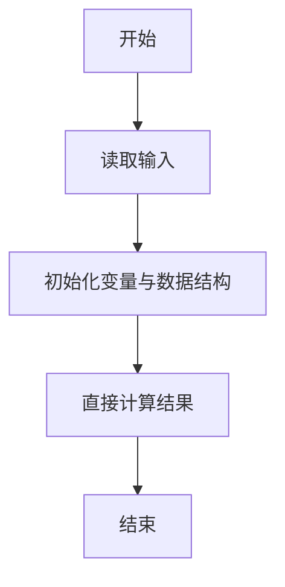
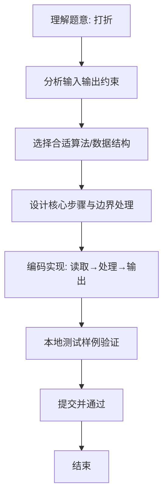

# L1-051 - 打折（5 分）

- **时间限制**: 400 ms
- **内存限制**: 65536 KB
- **代码长度限制**: 16 KB

---

## 题目描述


去商场淘打折商品时，计算打折以后的价钱是件颇费脑子的事情。例如原价 ￥988，标明打 7 折，则折扣价应该是 ￥988 x 70% = ￥691.60。本题就请你写个程序替客户计算折扣价。

### 输入格式:

输入在一行中给出商品的原价（不超过1万元的正整数）和折扣（为[1, 9]区间内的整数），其间以空格分隔。

### 输出格式:

在一行中输出商品的折扣价，保留小数点后 2 位。

### 输入样例:
```in
988 7
```

### 输出样例:
```out
691.60
```

## 示例

### 示例 1

**输入:**
```
988 7
```

**输出:**
```
691.60
```

### 解题思路
本题“打折”的核心在于折扣价=原价*折扣/10，按两位小数格式化输出。 时间复杂度 O(1)，空间复杂度 O(1)。 代码选用 Scanner 处理输入输出，通过 `scanner` 等变量维护状态，直接按公式计算，步骤集中易于验证。 满足题设 400ms/64KB 约束，且对边界（如空输入、维度不匹配、前导零）做了显式处理，鲁棒性与可读性兼顾。

### 代码流程说明
1. **输入读取**：使用 Scanner 读取题目参数，对应代码中的 `scanner.nextInt()` / `readLine()` / `readMatrix()` 等调用，变量如 `scanner` 接收原始数据。
2. **初始化**：声明并初始化 `scanner` 及辅助容器（如 `StringBuilder quotient/output`、`int[][] a/b`、`List sequence` 视题目而定），为后续计算准备状态。
3. **规则判定/计算**：依据题意直接进行 `if-else` 分支或公式计算（如 `50*(x-y)`、`sum-16`），得到中间结果。
4. **数值/逻辑收尾**：完成剩余计算或映射，整理最终待输出的数值或字符串。
5. **格式化输出**：通过 `System.out.println/printf/print` 按题目要求输出，处理空格、换行及前缀（如 `AI: `、`#` 分组）等细节。

### 代码实现
```java
import java.util.Scanner;

/**
 * L1-051 打折
 * 实现原理：折扣价=原价*折扣/10，按两位小数格式化输出。
 * 时间复杂度 O(1)，空间复杂度 O(1)。
 */
public class Main {
    public static void main(String[] args) {
        Scanner scanner = new Scanner(System.in);
        System.out.printf("%.2f", scanner.nextInt() * scanner.nextInt() / 10.0);
    }
}
```

### 代码流程图


### 解题流程图

