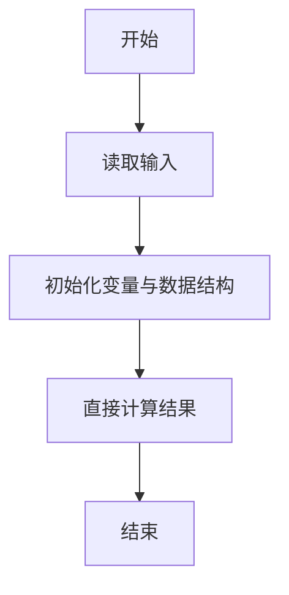
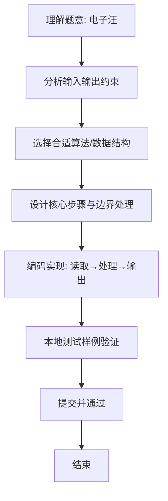

# L1-053 - 电子汪（10 分）

- **时间限制**: 400 ms
- **内存限制**: 65536 KB
- **代码长度限制**: 16 KB

---

## 题目描述


据说汪星人的智商能达到人类 4 岁儿童的水平，更有些聪明汪会做加法计算。比如你在地上放两堆小球，分别有 1 只球和 2 只球，聪明汪就会用“汪！汪！汪！”表示 1 加 2 的结果是 3。

本题要求你为电子宠物汪做一个模拟程序，根据电子眼识别出的两堆小球的个数，计算出和，并且用汪星人的叫声给出答案。

### 输入格式:

输入在一行中给出两个 [1, 9] 区间内的正整数 A 和 B，用空格分隔。

### 输出格式:

在一行中输出 A + B 个`Wang!`。

### 输入样例:
```in
2 1
```

### 输出样例:
```out
Wang!Wang!Wang!
```

## 示例

### 示例 1

**输入:**
```
2 1
```

**输出:**
```
Wang!Wang!Wang!
```

### 解题思路
本题“电子汪”的核心在于两堆小球总数即输出 Wang! 的次数，循环拼接即可。 时间复杂度 O(A+B)，空间复杂度 O(A+B)。 代码选用 Scanner 处理输入输出，通过 `scanner`、`count` 等变量维护状态，直接按公式计算，步骤集中易于验证。 满足题设 400ms/64KB 约束，且对边界（如空输入、维度不匹配、前导零）做了显式处理，鲁棒性与可读性兼顾。

### 代码流程说明
1. **输入读取**：使用 Scanner 读取题目参数，对应代码中的 `scanner.nextInt()` / `readLine()` / `readMatrix()` 等调用，变量如 `scanner`、`count` 接收原始数据。
2. **初始化**：声明并初始化 `scanner`、`count` 及辅助容器（如 `StringBuilder quotient/output`、`int[][] a/b`、`List sequence` 视题目而定），为后续计算准备状态。
3. **规则判定/计算**：依据题意直接进行 `if-else` 分支或公式计算（如 `50*(x-y)`、`sum-16`），得到中间结果。
4. **数值/逻辑收尾**：完成剩余计算或映射，整理最终待输出的数值或字符串。
5. **格式化输出**：通过 `System.out.println/printf/print` 按题目要求输出，处理空格、换行及前缀（如 `AI: `、`#` 分组）等细节。

### 代码实现
```java
import java.util.Scanner;

/**
 * L1-053 电子汪
 * 实现原理：两堆小球总数即输出 Wang! 的次数，循环拼接即可。
 * 时间复杂度 O(A+B)，空间复杂度 O(A+B)。
 */
public class Main {
    public static void main(String[] args) {
        Scanner scanner = new Scanner(System.in);
        int count = scanner.nextInt() + scanner.nextInt();
        System.out.println("Wang!".repeat(count));
    }
}
```

### 代码流程图


### 解题流程图

