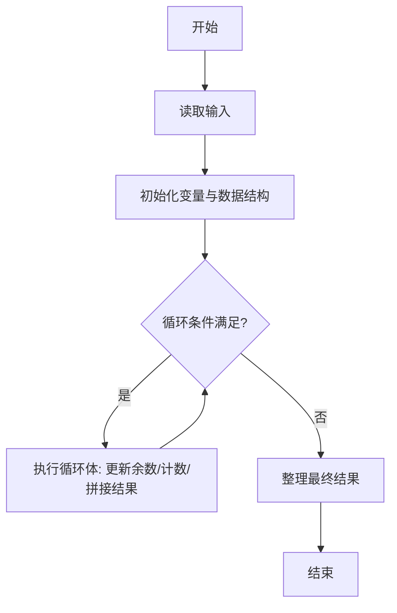
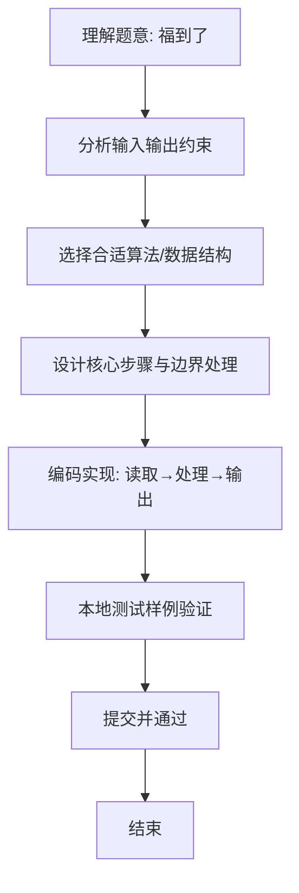

# L1-054 - 福到了（15 分）

- **时间限制**: 400 ms
- **内存限制**: 65536 KB
- **代码长度限制**: 16 KB

---

## 题目描述


“福”字倒着贴，寓意“福到”。不论到底算不算民俗，本题且请你编写程序，把各种汉字倒过来输出。这里要处理的每个汉字是由一个 N $$\times$$ N 的网格组成的，网格中的元素或者为字符 `@` 或者为空格。而倒过来的汉字所用的字符由裁判指定。

### 输入格式:

输入在第一行中给出倒过来的汉字所用的字符、以及网格的规模 N （不超过100的正整数），其间以 1 个空格分隔；随后 N 行，每行给出 N 个字符，或者为 `@` 或者为空格。

### 输出格式:

输出倒置的网格，如样例所示。但是，如果这个字正过来倒过去是一样的，就先输出`bu yong dao le`，然后再用输入指定的字符将其输出。

### 输入样例 1：
```in
$ 9
 @  @@@@@
@@@  @@@ 
 @   @ @ 
@@@  @@@ 
@@@ @@@@@
@@@ @ @ @
@@@ @@@@@
 @  @ @ @
 @  @@@@@
```

### 输出样例 1：
```out
$$$$$  $ 
$ $ $  $ 
$$$$$ $$$
$ $ $ $$$
$$$$$ $$$
 $$$  $$$
 $ $   $ 
 $$$  $$$
$$$$$  $
```

### 输入样例 2：
```in
& 3
@@@
 @ 
@@@
```

### 输出样例 2：
```out
bu yong dao le
&&&
 & 
&&&
```

## 示例

### 示例 1

**输入:**
```
$ 9
 @  @@@@@
@@@  @@@ 
 @   @ @ 
@@@  @@@ 
@@@ @@@@@
@@@ @ @ @
@@@ @@@@@
 @  @ @ @
 @  @@@@@
```

**输出:**
```
$$$$$  $ 
$ $ $  $ 
$$$$$ $$$
$ $ $ $$$
$$$$$ $$$
 $$$  $$$
 $ $   $ 
 $$$  $$$
$$$$$  $
```

### 示例 2

**输入:**
```
& 3
@@@
 @ 
@@@
```

**输出:**
```
bu yong dao le
&&&
 & 
&&&
```

### 解题思路
本题“福到了”的核心在于 将 N×N 网格绕中心旋转 180 度：目标位置 (i,j) 取原位置 (N-1-i, N-1-j)， 并将原字符 '@' 替换为裁判指定字符，空格保持不变。 先比较旋转前后图形是否完全一致（以 '@' 与空格判断形状），若一致则先输出 "bu yong dao le" 再输出旋转后的图形。为兼容输入行末尾空格被截断的情况， 读取每行后若长度不足… 代码选用 BufferedReader、StringBuilder 处理输入输出，通过 `reader`、`replace。

### 代码流程说明
1. **输入读取**：使用 BufferedReader、StringBuilder 读取题目参数，对应代码中的 `scanner.nextInt()` / `readLine()` / `readMatrix()` 等调用，变量如 `reader`、`replacement`、`n`、`i` 接收原始数据。
2. **初始化**：声明并初始化 `reader`、`replacement`、`n`、`i` 及辅助容器（如 `StringBuilder quotient/output`、`int[][] a/b`、`List sequence` 视题目而定），为后续计算准备状态。
3. **主循环**：进入 `while (sb.length()` 循环体，循环内按题意更新状态（如 `remainder = remainder*10+1`、`pressure` 比较、`sequence` 追加），并通过 `if` 分支决定是否拼接结果或跳过。
4. **结果拼接**：利用 `StringBuilder` 高效追加字符/数字，处理变长输出（如商位拼接、连续 6 替换），保证 O(n) 性能。
5. **格式化输出**：通过 `System.out.println/printf/print` 按题目要求输出，处理空格、换行及前缀（如 `AI: `、`#` 分组）等细节。

### 代码实现
```java
import java.io.BufferedReader;
import java.io.IOException;
import java.io.InputStreamReader;
import java.util.StringTokenizer;

/**
 * L1-054 福到了
 * 实现原理：
 * 将 N×N 网格绕中心旋转 180 度：目标位置 (i,j) 取原位置 (N-1-i, N-1-j)，
 * 并将原字符 '@' 替换为裁判指定字符，空格保持不变。
 * 先比较旋转前后图形是否完全一致（以 '@' 与空格判断形状），若一致则先输出
 * "bu yong dao le" 再输出旋转后的图形。为兼容输入行末尾空格被截断的情况，
 * 读取每行后若长度不足 N 则用空格补齐。
 * 时间复杂度 O(N^2)，空间复杂度 O(N^2)。
 */
public class Main {
    public static void main(String[] args) throws IOException {
        BufferedReader reader = new BufferedReader(new InputStreamReader(System.in));
        StringTokenizer tokenizer = new StringTokenizer(reader.readLine());
        char replacement = tokenizer.nextToken().charAt(0);
        int n = Integer.parseInt(tokenizer.nextToken());
        char[][] grid = new char[n][n];
        for (int i = 0; i < n; i++) {
            String line = reader.readLine();
            if (line == null) line = "";
            // 补齐因行末空格被省略而导致的长度不足
            if (line.length() < n) {
                StringBuilder sb = new StringBuilder(line);
                while (sb.length() < n) sb.append(' ');
                line = sb.toString();
            } else if (line.length() > n) {
                line = line.substring(0, n);
            }
            for (int j = 0; j < n; j++) {
                grid[i][j] = line.charAt(j);
            }
        }

        boolean same = true;
        for (int i = 0; i < n; i++) {
            for (int j = 0; j < n; j++) {
                if (grid[i][j] != grid[n - 1 - i][n - 1 - j]) {
                    same = false;
                }
            }
        }
        if (same) System.out.println("bu yong dao le");
        for (int i = n - 1; i >= 0; i--) {
            StringBuilder line = new StringBuilder();
            for (int j = n - 1; j >= 0; j--) {
                line.append(grid[i][j] == '@' ? replacement : ' ');
            }
            System.out.println(line);
        }
    }
}
```

### 代码流程图


### 解题流程图

