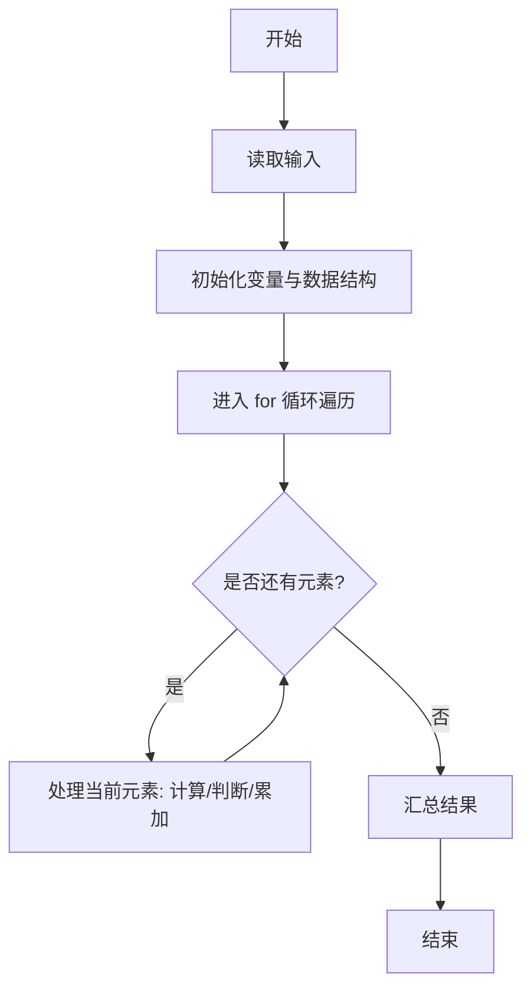
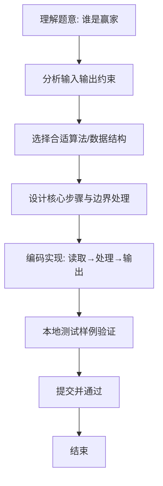

# L1-055 - 谁是赢家（10 分）

- **时间限制**: 400 ms
- **内存限制**: 65536 KB
- **代码长度限制**: 16 KB

---

## 题目描述


某电视台的娱乐节目有个表演评审环节，每次安排两位艺人表演，他们的胜负由观众投票和 3 名评委投票两部分共同决定。规则为：如果一位艺人的观众票数高，且得到至少 1 名评委的认可，该艺人就胜出；或艺人的观众票数低，但得到全部评委的认可，也可以胜出。节目保证投票的观众人数为奇数，所以不存在平票的情况。本题就请你用程序判断谁是赢家。

### 输入格式:

输入第一行给出 2 个不超过 1000 的正整数 Pa 和 Pb，分别是艺人 a 和艺人 b 得到的观众票数。题目保证这两个数字不相等。随后第二行给出 3 名评委的投票结果。数字 0 代表投票给 a，数字 1 代表投票给 b，其间以一个空格分隔。

### 输出格式:

按以下格式输出赢家：

```
The winner is x: P1 + P2
```

其中 `x` 是代表赢家的字母，`P1` 是赢家得到的观众票数，`P2` 是赢家得到的评委票数。

### 输入样例:
```in
327 129
1 0 1
```

### 输出样例:
```out
The winner is a: 327 + 1
```

## 示例

### 示例 1

**输入:**
```
327 129
1 0 1
```

**输出:**
```
The winner is a: 327 + 1
```

### 解题思路
本题“谁是赢家”的核心在于统计投给 a 的评委人数。a 在观众领先且至少一票评委支持，或观众落后 但三票评委全支持时胜出；否则 b 胜出。 时间复杂度 O(1)，空间复杂度 O(1)。 代码选用 Scanner 处理输入输出，通过 `scanner`、`pa`、`judgeA`、`i` 等变量维护状态，采用循环/模拟逐步推进，避免一次性构造超大结构，以增量方式得到结果。 满足题设 400ms/64KB 约束，且对边界（如空输入、维度不匹配、前导零）做了显式处理，鲁棒性与可读性兼顾。

### 代码流程说明
1. **输入读取**：使用 Scanner 读取题目参数，对应代码中的 `scanner.nextInt()` / `readLine()` / `readMatrix()` 等调用，变量如 `scanner`、`pa`、`judgeA`、`i` 接收原始数据。
2. **初始化**：声明并初始化 `scanner`、`pa`、`judgeA`、`i` 及辅助容器（如 `StringBuilder quotient/output`、`int[][] a/b`、`List sequence` 视题目而定），为后续计算准备状态。
3. **遍历处理**：通过 `for (int i = 0; i < 3; i++)` 遍历输入元素，逐项执行核心逻辑（如矩阵三重循环 `sum += a[i][k]*b[k][j]`、字符串扫描 `text.charAt(i)`），并累加/判定。
4. **数值/逻辑收尾**：完成剩余计算或映射，整理最终待输出的数值或字符串。
5. **格式化输出**：通过 `System.out.println/printf/print` 按题目要求输出，处理空格、换行及前缀（如 `AI: `、`#` 分组）等细节。

### 代码实现
```java
import java.util.Scanner;

/**
 * L1-055 谁是赢家
 * 实现原理：统计投给 a 的评委人数。a 在观众领先且至少一票评委支持，或观众落后
 * 但三票评委全支持时胜出；否则 b 胜出。
 * 时间复杂度 O(1)，空间复杂度 O(1)。
 */
public class Main {
    public static void main(String[] args) {
        Scanner scanner = new Scanner(System.in);
        int pa = scanner.nextInt(), pb = scanner.nextInt();
        int judgeA = 0;
        for (int i = 0; i < 3; i++) if (scanner.nextInt() == 0) judgeA++;
        int judgeB = 3 - judgeA;
        boolean aWins = (pa > pb && judgeA >= 1) || (pa < pb && judgeA == 3);
        if (aWins) System.out.println("The winner is a: " + pa + " + " + judgeA);
        else System.out.println("The winner is b: " + pb + " + " + judgeB);
    }
}
```

### 代码流程图


### 解题流程图

