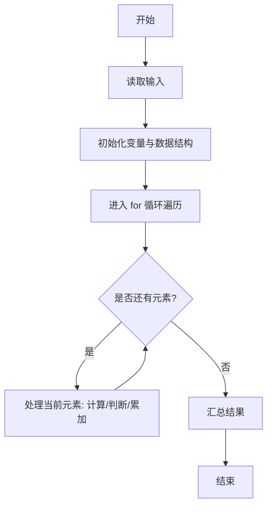
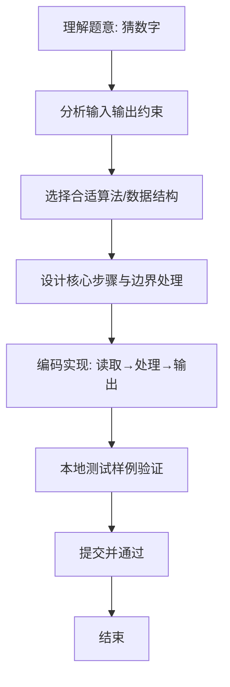

# L1-056 - 猜数字（20 分）

- **时间限制**: 400 ms
- **内存限制**: 65536 KB
- **代码长度限制**: 16 KB

---

## 题目描述


一群人坐在一起，每人猜一个 100 以内的数，谁的数字最接近大家平均数的一半就赢。本题就要求你找出其中的赢家。

### 输入格式:

输入在第一行给出一个正整数N（$$\le 10^4$$）。随后 N 行，每行给出一个玩家的名字（由不超过8个英文字母组成的字符串）和其猜的正整数（$$\le$$ 100）。

### 输出格式:

在一行中顺序输出：大家平均数的一半（只输出整数部分）、赢家的名字，其间以空格分隔。题目保证赢家是唯一的。

### 输入样例:
```in
7
Bob 35
Amy 28
James 98
Alice 11
Jack 45
Smith 33
Chris 62
```

### 输出样例:
```out
22 Amy
```

## 示例

### 示例 1

**输入:**
```
7
Bob 35
Amy 28
James 98
Alice 11
Jack 45
Smith 33
Chris 62
```

**输出:**
```
22 Amy
```

### 解题思路
本题“猜数字”的核心在于先保存所有猜测并求和，目标为 sum/N/2 的整数部分；再扫描所有猜测， 选择与目标绝对差最小的唯一玩家。 时间复杂度 O(N)，空间复杂度 O(N)。 代码选用 Scanner、数组 处理输入输出，通过 `scanner`、`n`、`guesses`、`sum` 等变量维护状态，采用循环/模拟逐步推进，避免一次性构造超大结构，以增量方式得到结果。 满足题设 400ms/64KB 约束，且对边界（如空输入、维度不匹配、前导零）做了显式处理，鲁棒性与可读性兼顾。

### 代码流程说明
1. **输入读取**：使用 Scanner、数组 读取题目参数，对应代码中的 `scanner.nextInt()` / `readLine()` / `readMatrix()` 等调用，变量如 `scanner`、`n`、`guesses`、`sum` 接收原始数据。
2. **初始化**：声明并初始化 `scanner`、`n`、`guesses`、`sum` 及辅助容器（如 `StringBuilder quotient/output`、`int[][] a/b`、`List sequence` 视题目而定），为后续计算准备状态。
3. **遍历处理**：通过 `for (int i = 0; i < n; i++)` 遍历输入元素，逐项执行核心逻辑（如矩阵三重循环 `sum += a[i][k]*b[k][j]`、字符串扫描 `text.charAt(i)`），并累加/判定。
4. **数值/逻辑收尾**：完成剩余计算或映射，整理最终待输出的数值或字符串。
5. **格式化输出**：通过 `System.out.println/printf/print` 按题目要求输出，处理空格、换行及前缀（如 `AI: `、`#` 分组）等细节。

### 代码实现
```java
import java.util.Scanner;

/**
 * L1-056 猜数字
 * 实现原理：先保存所有猜测并求和，目标为 sum/N/2 的整数部分；再扫描所有猜测，
 * 选择与目标绝对差最小的唯一玩家。
 * 时间复杂度 O(N)，空间复杂度 O(N)。
 */
public class Main {
    public static void main(String[] args) {
        Scanner scanner = new Scanner(System.in);
        int n = scanner.nextInt();
        String[] names = new String[n];
        int[] guesses = new int[n];
        int sum = 0;
        for (int i = 0; i < n; i++) {
            names[i] = scanner.next();
            guesses[i] = scanner.nextInt();
            sum += guesses[i];
        }
        int target = sum / n / 2;
        int winner = 0;
        for (int i = 1; i < n; i++) {
            if (Math.abs(guesses[i] - target) < Math.abs(guesses[winner] - target)) winner = i;
        }
        System.out.println(target + " " + names[winner]);
    }
}
```

### 代码流程图


### 解题流程图

