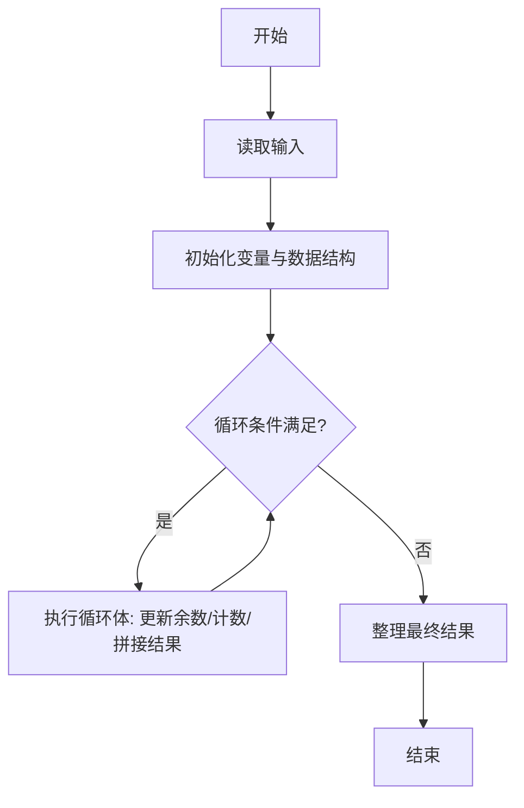
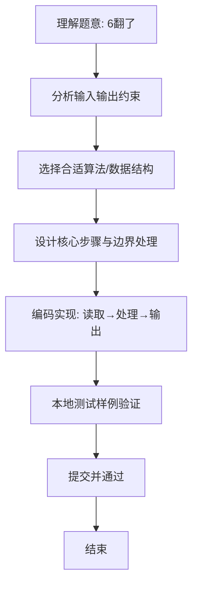

# L1-058 - 6翻了（15 分）

- **时间限制**: 400 ms
- **内存限制**: 65536 KB
- **代码长度限制**: 16 KB

---

## 题目描述


“666”是一种网络用语，大概是表示某人很厉害、我们很佩服的意思。最近又衍生出另一个数字“9”，意思是“6翻了”，实在太厉害的意思。如果你以为这就是厉害的最高境界，那就错啦 —— 目前的最高境界是数字“27”，因为这是 3 个 “9”！

本题就请你编写程序，将那些过时的、只会用一连串“6666……6”表达仰慕的句子，翻译成最新的高级表达。

### 输入格式:

输入在一行中给出一句话，即一个非空字符串，由不超过 1000 个英文字母、数字和空格组成，以回车结束。

### 输出格式:

从左到右扫描输入的句子：如果句子中有超过 3 个连续的 6，则将这串连续的 6 替换成 9；但如果有超过 9 个连续的 6，则将这串连续的 6 替换成 27。其他内容不受影响，原样输出。

### 输入样例:
```in
it is so 666 really 6666 what else can I say 6666666666
```

### 输出样例:
```out
it is so 666 really 9 what else can I say 27
```

## 示例

### 示例 1

**输入:**
```
it is so 666 really 6666 what else can I say 6666666666
```

**输出:**
```
it is so 666 really 9 what else can I say 27
```

### 解题思路
本题“6翻了”的核心在于从左到右识别每段连续的字符 6，根据长度决定保留原串、替换成 9 或 27， 其他字符直接追加。 时间复杂度 O(n)，空间复杂度 O(n)。 代码选用 BufferedReader、StringBuilder 处理输入输出，通过 `text`、`output`、`i`、`end` 等变量维护状态，采用循环/模拟逐步推进，避免一次性构造超大结构，以增量方式得到结果。 满足题设 400ms/64KB 约束，且对边界（如空输入、维度不匹配、前导零）做了显式处理，鲁棒性与可读性兼顾。

### 代码流程说明
1. **输入读取**：使用 BufferedReader、StringBuilder 读取题目参数，对应代码中的 `scanner.nextInt()` / `readLine()` / `readMatrix()` 等调用，变量如 `text`、`output`、`i`、`end` 接收原始数据。
2. **初始化**：声明并初始化 `text`、`output`、`i`、`end` 及辅助容器（如 `StringBuilder quotient/output`、`int[][] a/b`、`List sequence` 视题目而定），为后续计算准备状态。
3. **主循环**：进入 `while (end < text.length()` 循环体，循环内按题意更新状态（如 `remainder = remainder*10+1`、`pressure` 比较、`sequence` 追加），并通过 `if` 分支决定是否拼接结果或跳过。
4. **结果拼接**：利用 `StringBuilder` 高效追加字符/数字，处理变长输出（如商位拼接、连续 6 替换），保证 O(n) 性能。
5. **格式化输出**：通过 `System.out.println/printf/print` 按题目要求输出，处理空格、换行及前缀（如 `AI: `、`#` 分组）等细节。

### 代码实现
```java
import java.io.BufferedReader;
import java.io.IOException;
import java.io.InputStreamReader;

/**
 * L1-058 6翻了
 * 实现原理：从左到右识别每段连续的字符 6，根据长度决定保留原串、替换成 9 或 27，
 * 其他字符直接追加。
 * 时间复杂度 O(n)，空间复杂度 O(n)。
 */
public class Main {
    public static void main(String[] args) throws IOException {
        String text = new BufferedReader(new InputStreamReader(System.in)).readLine();
        StringBuilder output = new StringBuilder();
        for (int i = 0; i < text.length();) {
            if (text.charAt(i) != '6') {
                output.append(text.charAt(i++));
                continue;
            }
            int end = i;
            while (end < text.length() && text.charAt(end) == '6') end++;
            int count = end - i;
            if (count <= 3) output.append("6".repeat(count));
            else if (count <= 9) output.append('9');
            else output.append("27");
            i = end;
        }
        System.out.println(output);
    }
}
```

### 代码流程图


### 解题流程图

