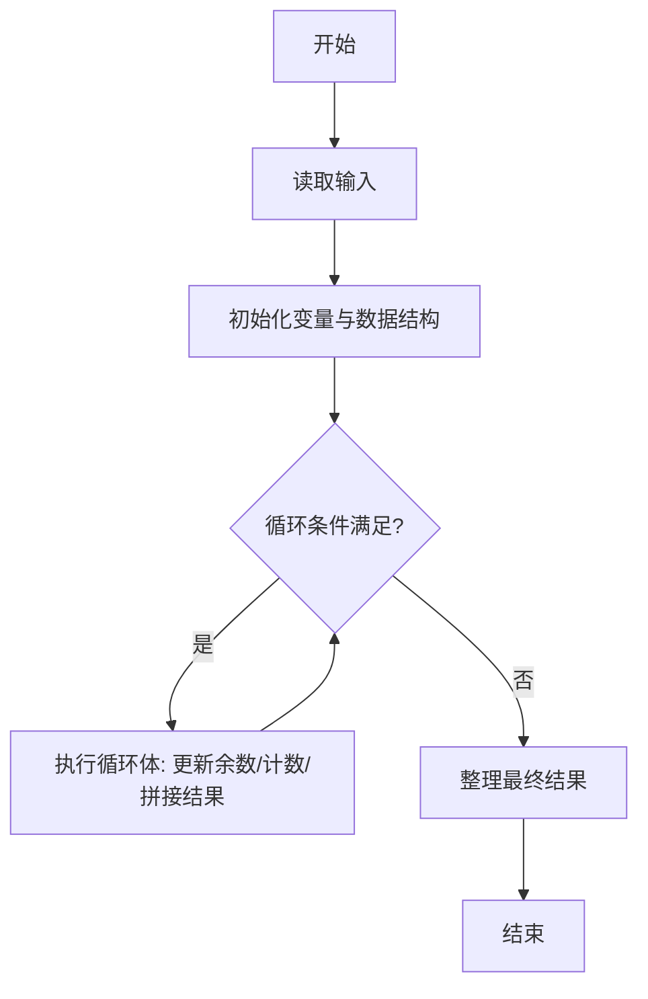
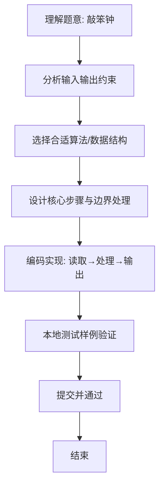

# L1-059 - 敲笨钟（20 分）

- **时间限制**: 400 ms
- **内存限制**: 65536 KB
- **代码长度限制**: 16 KB

---

## 题目描述


微博上有个自称“大笨钟V”的家伙，每天敲钟催促码农们爱惜身体早点睡觉。为了增加敲钟的趣味性，还会糟改几句古诗词。其糟改的方法为：去网上搜寻压“ong”韵的古诗词，把句尾的三个字换成“敲笨钟”。例如唐代诗人李贺有名句曰：“寻章摘句老雕虫，晓月当帘挂玉弓”，其中“虫”（chong）和“弓”（gong）都压了“ong”韵。于是这句诗就被糟改为“寻章摘句老雕虫，晓月当帘敲笨钟”。

现在给你一大堆古诗词句，要求你写个程序自动将压“ong”韵的句子糟改成“敲笨钟”。

### 输入格式:

输入首先在第一行给出一个不超过 20 的正整数 N。随后 N 行，每行用汉语拼音给出一句古诗词，分上下两半句，用逗号 `,` 分隔，句号 `.` 结尾。相邻两字的拼音之间用一个空格分隔。题目保证每个字的拼音不超过 6 个字符，每行字符的总长度不超过 100，并且下半句诗至少有 3 个字。

### 输出格式:

对每一行诗句，判断其是否压“ong”韵。即上下两句末尾的字都是“ong”结尾。如果是压此韵的，就按题面方法糟改之后输出，输出格式同输入；否则输出 `Skipped`，即跳过此句。

### 输入样例:
```in
5
xun zhang zhai ju lao diao chong, xiao yue dang lian gua yu gong.
tian sheng wo cai bi you yong, qian jin san jin huan fu lai.
xue zhui rou zhi leng wei rong, an xiao chen jing shu wei long.
zuo ye xing chen zuo ye feng, hua lou xi pan gui tang dong.
ren xian gui hua luo, ye jing chun shan kong.
```

### 输出样例:
```out
xun zhang zhai ju lao diao chong, xiao yue dang lian qiao ben zhong.
Skipped
xue zhui rou zhi leng wei rong, an xiao chen jing qiao ben zhong.
Skipped
Skipped
```

## 示例

### 示例 1

**输入:**
```
5
xun zhang zhai ju lao diao chong, xiao yue dang lian gua yu gong.
tian sheng wo cai bi you yong, qian jin san jin huan fu lai.
xue zhui rou zhi leng wei rong, an xiao chen jing shu wei long.
zuo ye xing chen zuo ye feng, hua lou xi pan gui tang dong.
ren xian gui hua luo, ye jing chun shan kong.
```

**输出:**
```
xun zhang zhai ju lao diao chong, xiao yue dang lian qiao ben zhong.
Skipped
xue zhui rou zhi leng wei rong, an xiao chen jing qiao ben zhong.
Skipped
Skipped
```

### 解题思路
本题“敲笨钟”的核心在于分别取上下半句的末个拼音（去掉末句句点）判断是否都以 ong 结尾。 合韵时保留上半句，并将下半句最后三个词替换成 qiao ben zhong. 时间复杂度 O(每行长度)，空间复杂度 O(每行长度)。 代码选用 BufferedReader、StringBuilder 处理输入输出，通过 `reader`、`n`、`line`、`comma` 等变量维护状态，采用循环/模拟逐步推进，避免一次性构造超大结构，以增量方式得到结果。 满足题设 400ms/64KB 约束，且对边界（如空输入、维度不匹配、前导零）做了显式处理，鲁棒性与可读性兼顾。

### 代码流程说明
1. **输入读取**：使用 BufferedReader、StringBuilder 读取题目参数，对应代码中的 `scanner.nextInt()` / `readLine()` / `readMatrix()` 等调用，变量如 `reader`、`n`、`line`、`comma` 接收原始数据。
2. **初始化**：声明并初始化 `reader`、`n`、`line`、`comma` 及辅助容器（如 `StringBuilder quotient/output`、`int[][] a/b`、`List sequence` 视题目而定），为后续计算准备状态。
3. **主循环**：进入 `while (n-- > 0)` 循环体，循环内按题意更新状态（如 `remainder = remainder*10+1`、`pressure` 比较、`sequence` 追加），并通过 `if` 分支决定是否拼接结果或跳过。
4. **结果拼接**：利用 `StringBuilder` 高效追加字符/数字，处理变长输出（如商位拼接、连续 6 替换），保证 O(n) 性能。
5. **格式化输出**：通过 `System.out.println/printf/print` 按题目要求输出，处理空格、换行及前缀（如 `AI: `、`#` 分组）等细节。

### 代码实现
```java
import java.io.BufferedReader;
import java.io.IOException;
import java.io.InputStreamReader;

/**
 * L1-059 敲笨钟
 * 实现原理：分别取上下半句的末个拼音（去掉末句句点）判断是否都以 ong 结尾。
 * 合韵时保留上半句，并将下半句最后三个词替换成 qiao ben zhong.
 * 时间复杂度 O(每行长度)，空间复杂度 O(每行长度)。
 */
public class Main {
    public static void main(String[] args) throws IOException {
        BufferedReader reader = new BufferedReader(new InputStreamReader(System.in));
        int n = Integer.parseInt(reader.readLine());
        while (n-- > 0) {
            String line = reader.readLine();
            int comma = line.indexOf(',');
            String first = line.substring(0, comma).trim();
            String second = line.substring(comma + 1).trim();
            String firstLast = lastWord(first);
            String secondLast = lastWord(second.substring(0, second.length() - 1));
            if (!firstLast.endsWith("ong") || !secondLast.endsWith("ong")) {
                System.out.println("Skipped");
                continue;
            }
            String[] words = second.substring(0, second.length() - 1).split(" ");
            StringBuilder changed = new StringBuilder(first).append(", ");
            for (int i = 0; i < words.length - 3; i++) changed.append(words[i]).append(' ');
            changed.append("qiao ben zhong.");
            System.out.println(changed);
        }
    }

    private static String lastWord(String sentence) {
        int space = sentence.lastIndexOf(' ');
        return sentence.substring(space + 1);
    }
}
```

### 代码流程图


### 解题流程图

